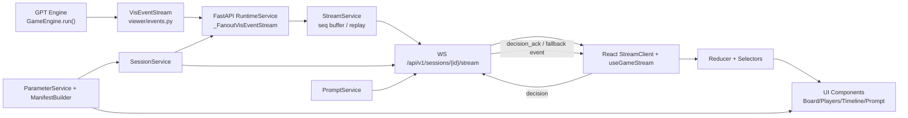

# [HANDOVER] MRN 전체 시스템 인수인계 가이드

## 0) 문서 목적/범위
- 목적: 신규 개발자(사람)가 이 저장소를 빠르게 이해하고, 기능 수정 시 어떤 파일/함수를 봐야 하는지 즉시 찾을 수 있도록 하는 실무 인수인계 문서.
- 기준 브랜치: `main` (2026-03-31 확인 기준).
- 범위: 게임 엔진(`GPT`), 온라인 서버(`apps/server`), React 프론트엔드(`apps/web`), 리플레이/로그 산출 파이프라인.
- 비범위: 테스트 바이너리(`__pycache__`), 임시 산출물, 과거 superseded 문서 상세 내용.

---

## 1) 전체 설계도 (레이어/연결)

핵심 원칙:
- 엔진은 `VisEvent`를 방출하고, 서버는 이를 스트림 메시지로 fan-out.
- 프론트는 WS 메시지를 reducer로 정렬/적용한 뒤 selector로 뷰모델 구성.
- 설정 파라미터는 `parameter_manifest`로 세션 시작 시점부터 프론트에 전달.

---

## 2) 디렉토리/파일별 용도

## 2.1 서버 (`apps/server/src`)

### 앱/DI/환경
| 파일 | 역할 |
|---|---|
| `app.py` | FastAPI 엔트리. 라우터 등록, 예외 핸들러, 표준 에러 envelope 생성. |
| `state.py` | 서버 전역 DI 조립 루트. `SessionService/StreamService/PromptService/RuntimeService` 싱글톤 생성. |
| `config/runtime_settings.py` | heartbeat/watchdog/store/log 관련 환경변수 로딩. |

### 계약/도메인/인프라
| 파일 | 역할 |
|---|---|
| `core/error_payload.py` | 표준 에러 payload (`code/category/message/retryable`) 생성. |
| `domain/session_models.py` | `Session`, `SeatConfig`, `SessionStatus`, `SeatType` 도메인 모델. |
| `infra/structured_log.py` | 구조화 JSON 로깅 설정/출력. |

### 라우트
| 파일 | 역할 |
|---|---|
| `routes/health.py` | `/health` 헬스체크. |
| `routes/sessions.py` | 세션 생성/조회/참가/시작/런타임 상태/리플레이 export API. |
| `routes/stream.py` | WS 스트리밍, resume, decision 수신, timeout fallback 처리. |
| `routes/prompts.py` | 디버그 prompt 생성 API (`/prompts/debug`). |

### 서비스
| 파일 | 역할 |
|---|---|
| `services/session_service.py` | 세션 라이프사이클, 토큰 검증, 좌석 join/start, persistence. |
| `services/stream_service.py` | seq 단조 증가 스트림 버퍼, subscriber queue, replay window/backpressure. |
| `services/prompt_service.py` | pending prompt 저장/결정 제출/timeout 처리. |
| `services/runtime_service.py` | 엔진 실행 스레드 오케스트레이션 + watchdog + stream fan-out 브리지. |
| `services/parameter_service.py` | 세션 설정 resolve/검증, source fingerprint, public manifest 생성. |
| `services/engine_config_factory.py` | manifest -> `GameConfig` 런타임 매핑 (player/dice/cash/shards). |
| `services/persistence.py` | 세션/스트림 JSON 파일 저장소 구현. |
| `services/auth_service.py` | 인증 보조(현재 흐름에서 핵심은 session token 검증). |

---

## 2.2 프론트 (`apps/web/src`)

### 루트/계약
| 파일 | 역할 |
|---|---|
| `main.tsx` | React 진입점. |
| `App.tsx` | 라우팅(`#lobby/#match`), 로비 동작, WS 연결, selector 합성, 전체 화면 조립. |
| `core/contracts/api.ts` | REST 응답/manifest 타입 계약. |
| `core/contracts/stream.ts` | WS inbound/outbound 메시지 타입 계약. |

### 인프라
| 파일 | 역할 |
|---|---|
| `infra/http/sessionApi.ts` | 세션 REST API 클라이언트. |
| `infra/ws/StreamClient.ts` | WS 연결/재연결/resume/decision 전송. |
| `hooks/useGameStream.ts` | `StreamClient` + reducer 결합 훅. |

### 상태/선택자/라벨
| 파일 | 역할 |
|---|---|
| `domain/store/gameStreamReducer.ts` | seq 정렬 적용, manifest hash 불일치 시 리셋, 메시지 cap(50). |
| `domain/selectors/streamSelectors.ts` | timeline/theater/snapshot/situation/manifest 뷰모델 변환. |
| `domain/selectors/promptSelectors.ts` | active prompt, decision ack 추출. |
| `domain/manifest/manifestRehydrate.ts` | 최신 manifest를 세션 상태에 병합. |
| `domain/labels/*` | 이벤트/프롬프트 라벨, 톤, 타일 kind 라벨 매핑. |

### UI 컴포넌트
| 파일 | 역할 |
|---|---|
| `features/lobby/LobbyView.tsx` | 세션 생성/참가/시작/연결 제어 UI. |
| `features/board/BoardPanel.tsx` | 보드 타일/말/최근 이동 표시. |
| `features/board/boardProjection.ts` | 링/라인 보드 좌표 투영. |
| `features/prompt/PromptOverlay.tsx` | 인간 입력 오버레이(선택지, busy, collapse). |
| `features/players/PlayersPanel.tsx` | 플레이어 카드 패널. |
| `features/status/ConnectionPanel.tsx` | WS/runtime 상태 표시. |
| `features/status/SituationPanel.tsx` | 현재 라운드/턴/행동자/날씨 + 경고 표시. |
| `features/timeline/TimelinePanel.tsx` | 최근 이벤트 목록. |
| `features/theater/IncidentCardStack.tsx` | 사건 카드형 최근 이벤트 피드. |
| `styles.css` | 전체 테마/레이아웃 스타일. |

---

## 2.3 엔진/정책/뷰어 (`GPT`)

### 엔진 코어
| 파일 | 역할 |
|---|---|
| `engine.py` | 게임 루프, 라운드/턴 진행, 이동/도착/경제/날씨/운수/징표/종료 판정, VisEvent 발행. |
| `state.py` | 게임 상태(`GameState`, `PlayerState`) 모델. |
| `config.py` | `GameConfig`, 셀 타입/경제/주사위/종료 조건 기본 설정. |
| `effect_handlers.py` | 이벤트 디스패치 기반 landing/payment/fortune/marker/lap/economy 처리 핸들러. |
| `event_system.py` | 엔진 내부 이벤트 디스패처. |
| `game_rules.py`, `game_rules_loader.py`, `rule_script_engine.py` | 룰셋/스크립트 로드 및 주입 실행. |

### 데이터 정의
| 파일 | 역할 |
|---|---|
| `characters.py` | 캐릭터/카드 매핑(`CARD_TO_NAMES`), 속성/우선권 등. |
| `trick_cards.py` | 잔꾀(트릭) 카드 정의. |
| `weather_cards.py` | 날씨 카드 정의. |
| `fortune_cards.py` | 운수 카드 정의. |
| `board_layout.json`, `ruleset.json`, `rule_scripts.json` | 보드/룰 파라미터 소스. |

### 정책(의사결정)
| 파일 | 역할 |
|---|---|
| `base_policy.py` | 엔진이 호출하는 정책 인터페이스(choose_* 계약). |
| `ai_policy.py` | 휴리스틱 정책 구현(캐릭터/이동/구매/트릭 등). |
| `policy/factory.py` | runtime/arena/multi-agent 정책 인스턴스 생성. |
| `policy/decision/runtime_bridge.py` | `choose_*_runtime` 함수군(의사결정 bridge). |
| `policy/context/*`, `policy/evaluator/*`, `policy/profile/*`, `policy/pipeline_trace.py` | AI 분석/스코어링/프로파일/추적 유틸. |

### 시각화/리플레이
| 파일 | 역할 |
|---|---|
| `viewer/events.py` | `VisEvent`, `Phase` 계약. |
| `viewer/stream.py` | `VisEventStream` 저장/요약/jsonl export. |
| `viewer/public_state.py` | 공개 상태 스냅샷 변환. |
| `viewer/replay.py` | flat 이벤트 -> session/round/turn projection. |
| `viewer/renderers/html_renderer.py` | 오프라인 HTML 리플레이 렌더러. |
| `viewer/renderers/markdown_renderer.py` | Markdown 리플레이 렌더러. |
| `generate_replay.py` | replay artifact 생성 CLI. |
| `viewer/live_server.py`, `run_live_spectator.py` | 레거시 실시간 spectator 서버/CLI. |
| `viewer/prompt_server.py`, `viewer/human_policy.py`, `run_human_play.py` | 레거시 인간 플레이 서버/정책/CLI. |

### 로그/분석 산출
| 파일 | 역할 |
|---|---|
| `simulate_with_logs.py` | 대량 시뮬레이션 + `games.jsonl`, `ai_decisions.jsonl`, `summary.json` 생성. |
| `run_chunked_batch.py` | 배치 분할 실행/병합. |
| `log_pipeline.py` | 게임 로그 피처 추출/요약/확률 모델 산출. |
| `analyze_ai_decisions.py`, `analyze_strategy_logs.py`, `turn_advantage.py`, `action_log_parser.py` | 의사결정/전략/우세도 분석. |
| `validate_vis_stream.py` | 시각화 이벤트 스트림 계약 검증. |

---

## 3) 백엔드-프론트 연결 페이지/파일

## 3.1 페이지 구조 (React)
- `#/lobby`: `App.tsx` + `LobbyView.tsx`
  - 세션 생성(`createSession`)
  - 좌석 참가(`joinSession`)
  - 호스트 시작(`startSession`)
  - 스트림 연결 설정(session/token)
- `#/match`: `App.tsx`에서 실시간 패널 조립
  - 보드: `BoardPanel`
  - 사건카드: `IncidentCardStack`
  - 프롬프트: `PromptOverlay`
  - 상태: `SituationPanel`, `ConnectionPanel`
  - 플레이어: `PlayersPanel`
  - 최근 이벤트: `TimelinePanel`

## 3.2 백엔드 REST/WS 엔드포인트
| 메서드 | 경로 | 서버 파일 | 프론트 사용 파일 |
|---|---|---|---|
| GET | `/health` | `routes/health.py` | 운영 점검용 |
| POST | `/api/v1/sessions` | `routes/sessions.py` | `sessionApi.createSession` |
| GET | `/api/v1/sessions` | `routes/sessions.py` | `sessionApi.listSessions` |
| GET | `/api/v1/sessions/{id}` | `routes/sessions.py` | `sessionApi.getSession` |
| POST | `/api/v1/sessions/{id}/join` | `routes/sessions.py` | `sessionApi.joinSession` |
| POST | `/api/v1/sessions/{id}/start` | `routes/sessions.py` | `sessionApi.startSession` |
| GET | `/api/v1/sessions/{id}/runtime-status` | `routes/sessions.py` | `sessionApi.getRuntimeStatus` |
| GET | `/api/v1/sessions/{id}/replay` | `routes/sessions.py` | 수동 export 용 |
| GET | `/api/v1/sessions/{id}/stream-capability` | `routes/stream.py` | 진단용 |
| WS | `/api/v1/sessions/{id}/stream` | `routes/stream.py` | `StreamClient.connect` |
| POST | `/api/v1/sessions/{id}/prompts/debug` | `routes/prompts.py` | 디버그 prompt 주입용 |

---

## 4) 엔진 ↔ 백엔드 연결 구간

핵심 브리지:
1. `RuntimeService.start_runtime()` (`apps/server/src/services/runtime_service.py`)
2. `_run_engine_sync()`에서 `GameEngine` 생성 시 `event_stream=_FanoutVisEventStream(...)` 주입
3. `_FanoutVisEventStream.append(event)`가 `event.to_dict()`를 `StreamService.publish(..., "event", ...)`로 즉시 송신
4. 프론트 WS는 이를 `InboundMessage(type="event")`로 수신

설정 브리지:
1. `SessionService.create_session()`에서 `GameParameterResolver.resolve()` 호출
2. `PublicManifestBuilder.build_public_manifest()`로 manifest/fingerprint/hash 생성
3. `start_session` 시 `parameter_manifest` 이벤트 발행
4. `RuntimeService`는 `EngineConfigFactory.create(resolved)`로 엔진 설정 적용

중요 제약(현재 구현):
- `routes/sessions.py::start_session()`에서 `session_service.is_all_ai(session_id)`일 때만 `runtime.start_runtime(...)` 자동 실행.
- 즉 FastAPI 경로는 현재 “all-AI baseline” 중심이며, mixed human+AI 완전 런타임 브리지는 별도 작업 대상.
- 인간 입력 기반 플레이는 현재 `GPT/viewer/prompt_server.py + HumanHttpPolicy` 레거시 경로가 별도로 존재.

---

## 5) 기능별 파이프라인 상세 (게임 기능 전수 매핑)

## 5.1 라운드/턴 핵심 플로우
1. `GameEngine.run()`
2. `_start_new_round()`:
   - 라운드 플래그 초기화
   - `_resolve_marker_flip()`
   - `round_start` VisEvent
   - `_run_draft()`
   - `_apply_round_weather()`
   - `weather_reveal` VisEvent
   - 우선권 기준 `state.current_round_order` 구성
3. `_take_turn()`:
   - pending mark 처리
   - 캐릭터 시작 효과
   - `turn_start`
   - `trick_window_open` -> `_use_trick_phase()` -> `trick_window_closed`
   - `policy.choose_movement()` -> `_resolve_move()` -> `dice_roll`
   - `_advance_player()` -> `_resolve_landing()`
   - `_apply_marker_management()`
   - `turn_end_snapshot`
4. 종료 체크 `_check_end()` -> `_build_result()` -> `game_end`

## 5.2 의사결정 기능별 연결 파일/모듈/함수

| 기능 | 엔진 호출부 | 정책 브리지/구현 | 인간 입력(레거시) | 스트림/프론트 소비 |
|---|---|---|---|---|
| 이동값 결정 | `engine._take_turn -> policy.choose_movement` | `policy/decision/runtime_bridge.choose_movement_runtime` | `human_policy.choose_movement`, `choose_runaway_slave_step` | `dice_roll`, `player_move` -> `streamSelectors.selectLastMove`, `BoardPanel`, `TimelinePanel` |
| 탈출 노비 1칸 선택 | `_resolve_move` 내부 분기 | movement decision 로직 | `human_policy.choose_runaway_slave_step` | `dice_roll` payload(`runaway_*`) |
| 드래프트 선택 | `engine._run_draft -> policy.choose_draft_card` | `choose_draft_card_runtime` | `human_policy.choose_draft_card` | `draft_pick` 이벤트 |
| 최종 캐릭터 선택 | `engine._run_draft -> choose_final_character` | `choose_final_character_runtime` | `human_policy.choose_final_character` | `final_character_choice` 이벤트 |
| 잔꾀 사용 | `engine._use_trick_phase -> choose_trick_to_use` | `choose_trick_to_use_runtime` | `human_policy.choose_trick_to_use` | `trick_used`, `trick_window_open/closed` |
| 히든 잔꾀 지정 | `engine._sync_trick_visibility -> choose_hidden_trick_card` | `choose_hidden_trick_card_runtime` | `human_policy.choose_hidden_trick_card` | 스냅샷(`hidden_trick_count`) |
| 토지 구매 여부 | `_try_purchase_tile -> policy.choose_purchase_tile` | `choose_purchase_tile_runtime` | `human_policy.choose_purchase_tile` | `tile_purchased`, `landing_resolved` |
| 지목 대상 선택 | mark 큐 처리 시 `choose_mark_target` | `choose_mark_target_runtime` | `human_policy.choose_mark_target` | `mark_resolved`, `marker_transferred` |
| 조각(코인) 배치 | `_place_hand_coins_if_possible -> choose_coin_placement_tile` | `choose_coin_placement_tile_runtime` | `human_policy.choose_coin_placement_tile` | turn snapshot 보드 코인 상태 |
| 지오 보너스 선택 | 캐릭터 효과에서 `choose_geo_bonus` | `choose_geo_bonus_runtime` | `human_policy.choose_geo_bonus` | 관련 resolution payload |
| 교리 구제 대상 | 캐릭터 효과에서 `choose_doctrine_relief_target` | `choose_doctrine_relief_target_runtime` | `human_policy.choose_doctrine_relief_target` | mark/효과 이벤트 |
| 액티브 카드 뒤집기 | 라운드 시작 전 marker owner 플립 구간 | `choose_active_flip_card_runtime` | `human_policy.choose_active_flip_card` | `marker_flip` |
| 특정 잔꾀 보상 선택 | 보상 선택 구간 | `choose_specific_trick_reward_runtime` | `human_policy.choose_specific_trick_reward` | `trick_used`/reward 결과 |
| 부담 카드 교환 | supply/cleanup 분기 | `choose_burden_exchange_on_supply_runtime` | `human_policy.choose_burden_exchange_on_supply` | timeout/결정 ack 포함 |
| 랩 보상 선택 | `_apply_lap_reward -> choose_lap_reward` | `choose_lap_reward_runtime` | `human_policy.choose_lap_reward` | `lap_reward_chosen` |

## 5.3 비결정형 게임 기능(자동 흐름) 매핑

| 기능 | 핵심 함수 |
|---|---|
| 날씨 공개/적용 | `engine._apply_round_weather`, `_draw_weather_card`, `weather_reveal` emit |
| 운수 카드 처리 | `_resolve_fortune_tile`, `_draw_fortune_card`, `_apply_fortune_card_impl` |
| 도착 칸 처리 | `_resolve_landing` + `effect_handlers.handle_*_landing` |
| 통행료/지불/파산 | `_effective_rent`, `_pay_or_bankrupt`, `_bankrupt`, `effect_handlers.handle_payment/handle_bankruptcy` |
| 징표 관리/이전/플립 | `_apply_marker_management`, `_resolve_marker_flip`, `_resolve_pending_marks` |
| 종료시간(F) 변화 | `_change_f` + `f_value_change` 이벤트 |
| 종료 판정 | `_check_end`, `_evaluate_end_rules`, `_determine_winners` |

---

## 6) 게임 전체 흐름별 연결 (파일/모듈/함수)

## 6.1 세션 생성~시작~실행
1. FE `LobbyView` -> `sessionApi.createSession`
2. BE `routes/sessions.create_session` -> `SessionService.create_session`
3. `GameParameterResolver.resolve` + `PublicManifestBuilder.build_public_manifest`
4. FE join: `sessionApi.joinSession` -> `SessionService.join_session`
5. FE host start: `sessionApi.startSession` -> `SessionService.start_session`
6. BE 이벤트 발행: `session_start`, `session_started`, `parameter_manifest`
7. 조건(all-AI) 충족 시 `RuntimeService.start_runtime`
8. 엔진 이벤트가 WS로 실시간 전달

## 6.2 프롬프트 의사결정(온라인 경로)
1. BE가 `prompt` 메시지 발행(`PromptService.create_prompt`)
2. FE `selectActivePrompt()`로 활성 프롬프트 추출
3. FE `PromptOverlay`에서 choice 클릭
4. WS outbound `decision`
5. BE `stream_ws`에서 `PromptService.submit_decision`
6. `decision_ack` 발행(accepted/rejected/stale)
7. timeout이면 heartbeat 루프에서 fallback 실행 + `decision_timeout_fallback` 이벤트 발행

## 6.3 리플레이 생성 흐름
1. 입력: `events.jsonl` 또는 실행 seed
2. `generate_replay.py` -> `ReplayProjection.from_*`
3. 출력 렌더러:
   - JSON: 원본 events
   - Markdown: `viewer/renderers/markdown_renderer.py`
   - HTML: `viewer/renderers/html_renderer.py`

## 6.4 배치 분석 흐름
1. `simulate_with_logs.run()` 다중 게임 생성
2. 산출물: `games.jsonl`, `ai_decisions.jsonl`, `errors.jsonl`, `summary.json`
3. 후처리:
   - `log_pipeline.py` 피처/확률/피벗 턴 산출
   - `analyze_ai_decisions.py`, `analyze_strategy_logs.py`, `turn_advantage.py`

---

## 7) 로그/산출물 생성 모듈/함수/결과물

| 용도 | 생성 모듈/함수 | 산출물 |
|---|---|---|
| 실시간 스트림 로그 | `StreamService.publish`, `StreamMessage.to_dict` | 메모리 버퍼 + (옵션) stream store JSON |
| 세션 상태 저장 | `SessionService._persist_sessions` | session store JSON |
| 엔진 시각화 이벤트 | `engine._emit_vis` + `VisEvent.to_dict` | WS event payload / replay 원본 |
| 리플레이 파일 생성 | `generate_replay.main` | `replay_*.json`, `replay_*.md`, `replay_*.html` |
| 대량 게임 시뮬레이션 | `simulate_with_logs.run` | `games.jsonl`, `ai_decisions.jsonl`, `errors.jsonl`, `summary.json` |
| 청크 배치 병합 | `run_chunked_batch.main` | 청크 결과 병합 JSON/manifest |
| AI 로그 분석 | `log_pipeline.run_pipeline`, `analyze_ai_decisions.py` | 요약 JSON/CSV/mermaid(옵션) |

---

## 8) UI 컴포넌트 상세 (파일/인자/렌더링 로직)

| 컴포넌트 | 파일 | 주요 Props | 최종 렌더링 로직 |
|---|---|---|---|
| App | `apps/web/src/App.tsx` | 내부 상태(`session/token/manifest/prompt/runtime`) | lobby/match 라우팅, 데이터 fetch+WS+selector 결합, 전체 화면 orchestration |
| LobbyView | `features/lobby/LobbyView.tsx` | session/seat/token 입력값 + on* 콜백들 | 세션 생성/시작/참가/연결 폼 + 세션 목록 |
| ConnectionPanel | `features/status/ConnectionPanel.tsx` | `status`, `lastSeq`, `runtime` | 연결상태/런타임/watchdog 표시 |
| BoardPanel | `features/board/BoardPanel.tsx` | `snapshot`, `manifestTiles`, `boardTopology`, `tileKindLabels`, `lastMove` | 보드 타일 그리드, 타일별 소유/비용/말 표시, 최근 이동 강조 |
| PlayersPanel | `features/players/PlayersPanel.tsx` | `snapshot` | 플레이어 카드(현금/조각/타일/히든잔꾀 등) |
| SituationPanel | `features/status/SituationPanel.tsx` | `model`, `alerts` | 현재 actor/round/turn/event/weather + 경고 카드 |
| TimelinePanel | `features/timeline/TimelinePanel.tsx` | `items` | 최근 이벤트 라벨/상세 역순 목록 |
| IncidentCardStack | `features/theater/IncidentCardStack.tsx` | `items` | 톤(move/economy/system/critical) 사건 카드형 피드 |
| PromptOverlay | `features/prompt/PromptOverlay.tsx` | `prompt`, `collapsed`, `busy`, `secondsLeft`, `onSelectChoice` 등 | 프롬프트 상세+선택지 카드, compact mode, busy/feedback 상태 |

추가 렌더링 유틸:
- `boardProjection.ts`: tile index -> grid 좌표 투영(`ring`/`line`).
- `streamSelectors.ts`: raw 메시지 -> 화면용 뷰모델 변환 핵심.
- `promptSelectors.ts`: 유효 프롬프트/ACK 상태 계산.

---

## 9) API/WS 계약 명세 요약

## 9.1 REST 응답 envelope
- 공통 형태: `{ ok: boolean, data: T | null, error: {code,message,retryable,...} | null }`
- 구현: `apps/server/src/app.py`, `apps/server/src/core/error_payload.py`

## 9.2 WS 메시지 타입
- Inbound(서버->클라이언트): `event`, `prompt`, `decision_ack`, `heartbeat`, `error`
- Outbound(클라이언트->서버): `resume`, `decision`
- 타입 선언: `apps/web/src/core/contracts/stream.ts`

## 9.3 이벤트 envelope(엔진)
- 필수 필드: `event_type`, `session_id`, `round_index`, `turn_index`, `step_index`, `acting_player_id`, `public_phase`
- 정의: `GPT/viewer/events.py::VisEvent`

---

## 10) 기능 디버깅 시 “어디부터 볼지” 빠른 경로

| 증상 | 1차 확인 파일 | 2차 확인 파일 |
|---|---|---|
| 세션 시작 안 됨 | `routes/sessions.py` | `services/session_service.py` |
| WS 연결만 되고 데이터 없음 | `routes/stream.py` | `services/stream_service.py`, `RuntimeService.runtime_status` |
| mixed human+AI 실행 안 됨 | `routes/sessions.py::is_all_ai` 분기 | `runtime_service.py`, `viewer/human_policy.py` |
| 프롬프트가 안 뜸 | `PromptService.create_prompt` | `promptSelectors.ts`, `PromptOverlay.tsx` |
| 클릭했는데 반응 없음 | `stream_ws decision 처리` | `PromptService.submit_decision`, `selectLatestDecisionAck` |
| 보드/플레이어 표시 불일치 | `streamSelectors.selectLatestSnapshot` | `BoardPanel.tsx`, `PlayersPanel.tsx` |
| 리플레이 이상 | `viewer/replay.py` | `viewer/renderers/html_renderer.py`, `generate_replay.py` |
| AI 판단 이상 | `policy/decision/runtime_bridge.py` | `ai_policy.py`, `analyze_ai_decisions.py` |

---

## 11) 현재 정합성/리스크 메모 (운영 참고)
- FastAPI 경로에서 런타임 자동 시작은 현재 all-AI 세션 기준.
- 레거시 인간 플레이(`run_human_play.py`)와 React/FastAPI 인간 플레이 경로가 공존하므로, 운영 모드 혼선 방지 필요.
- 문자열 리소스 일부 파일에서 인코딩 손상(깨진 한글) 흔적이 있으므로, 텍스트 수정 시 UTF-8 고정 점검 권장.
- `StreamClient`는 브라우저 host 기준 `/api`로 접속하므로, Vite proxy(`vite.config.ts`) 또는 동일 origin 배치가 필수.

---

## 12) 신규 개발자 시작 순서 (권장)
1. `apps/server/src/state.py` (DI 전체 구조 파악)
2. `apps/server/src/routes/sessions.py`, `routes/stream.py` (세션/실시간 경로)
3. `apps/web/src/App.tsx`, `hooks/useGameStream.ts`, `domain/store/gameStreamReducer.ts`
4. `GPT/engine.py` (`run`, `_start_new_round`, `_take_turn`, `_resolve_landing`)
5. `GPT/policy/decision/runtime_bridge.py` (AI 의사결정 노드)
6. `GPT/viewer/events.py`, `viewer/replay.py`, `generate_replay.py`

이 순서대로 보면 “세션 생성 -> 엔진 실행 -> 이벤트 전달 -> 화면 렌더링 -> 로그/리플레이” 전체를 한 번에 추적할 수 있음.

