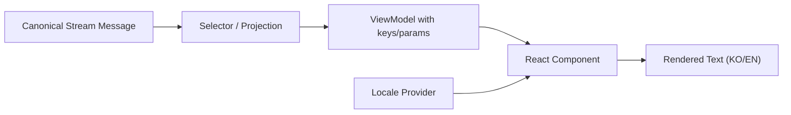

# [PLAN] Bilingual String Resource Architecture

Status: ACTIVE  
Updated: 2026-04-05  
Owner: GPT  
Scope: web / selectors / labels / shared runtime-facing text

## 1. Purpose

현재 React 매치 화면은 `uiText.ts` 중심의 문자열 카탈로그로 1차 안정화는 되었지만,

- 한국어/영어 전환이 구조적으로 설계되어 있지 않고
- selector/component가 여전히 일부 문자열을 직접 조합하며
- 문구 회귀나 인코딩 깨짐이 다시 발생할 여지가 남아 있습니다.

이 문서는 문자열을 컴포넌트와 분리 저장하고, locale 리소스를 주입하여 한국어/영어를 쉽게 전환할 수 있는 구조를 정의합니다.

## 2. Problem Statement

현재 상태의 한계:

1. `apps/web/src/domain/text/uiText.ts`는 단일 locale 카탈로그에 가깝다.
2. component가 import한 상수/함수는 편하지만, locale 스위칭 경로는 없다.
3. selector가 일부 문구를 직접 만들기 때문에, locale 변경 시 selector도 함께 수정해야 한다.
4. 테스트가 “문자열 존재”는 보장하지만 “locale별 동등 키 구조”까지는 보장하지 않는다.
5. 향후 Unity/다른 프런트엔드로 옮길 때도 문자열 소유권을 다시 정리해야 할 가능성이 있다.

## 3. Goals

1. 한국어/영어 리소스를 컴포넌트와 분리 저장한다.
2. 컴포넌트는 locale 데이터 자체가 아니라 `translator / message accessor`를 통해 문자열을 받는다.
3. selector는 가능하면 “완성 문장” 대신 “message key + params” 또는 “canonical payload”를 노출한다.
4. locale 전환은 React 전역 provider 수준에서 처리한다.
5. 테스트로 다음을 보장한다.
   - locale별 동일 키셋
   - 필수 키 누락 없음
   - interpolation 파라미터 정합성
   - 주요 화면의 locale 전환 동작
6. UTF-8/LF를 강제하고, CP-949 경로를 차단한다.

## 4. Non-Goals

1. 이번 계획은 i18n 라이브러리 도입 자체가 목적이 아니다.
2. 웹 외 모든 Python 로그 출력까지 즉시 다국어화하는 것은 범위 밖이다.
3. 사용자 번역 관리 도구(CMS) 도입은 이번 범위 밖이다.

## 5. Target Principles

### 5.1 Ownership

- 화면에 보이는 모든 문자열의 최종 소유자는 locale resource다.
- component는 resource key를 직접 알 수는 있지만, 임의의 inline literal을 새로 만들지 않는다.
- selector는 가능한 한 문자열을 만들지 않고:
  - canonical event code
  - payload fields
  - message key
  - interpolation params
  를 반환한다.

### 5.2 DI / Low Coupling

- locale 선택은 전역 provider로 주입한다.
- component는 `useI18n()` 또는 translator prop을 통해 문자열을 읽는다.
- feature component는 특정 locale 파일 경로를 직접 import하지 않는다.

### 5.3 UTF-8 Safety

- locale file은 모두 UTF-8 + LF
- 한국어/영어 파일 구조는 동일
- PowerShell 출력이 깨져 보여도 원본 파일 인코딩을 변경하지 않는다

## 6. Target Architecture

### 6.1 Directory Layout

권장 구조:

```text
apps/web/src/i18n/
  index.ts
  I18nProvider.tsx
  useI18n.ts
  types.ts
  format.ts
  locales/
    ko/
      app.ts
      lobby.ts
      board.ts
      players.ts
      timeline.ts
      situation.ts
      prompt.ts
      theater.ts
      turnStage.ts
      labels.ts
      stream.ts
    en/
      app.ts
      lobby.ts
      board.ts
      players.ts
      timeline.ts
      situation.ts
      prompt.ts
      theater.ts
      turnStage.ts
      labels.ts
      stream.ts
```

보조 구조:

```text
apps/web/src/domain/i18n/
  messageKeys.ts
  messageShapes.ts
```

### 6.2 Resource Composition

locale resource는 파일별로 나누고 최종 조립:

```ts
export type AppLocale = {
  app: AppMessages;
  lobby: LobbyMessages;
  board: BoardMessages;
  players: PlayersMessages;
  timeline: TimelineMessages;
  situation: SituationMessages;
  prompt: PromptMessages;
  theater: TheaterMessages;
  turnStage: TurnStageMessages;
  labels: LabelMessages;
  stream: StreamMessages;
};
```

`index.ts`는:

- `koLocale`
- `enLocale`
- `SUPPORTED_LOCALES`
- `DEFAULT_LOCALE`

를 export한다.

### 6.3 Translator Surface

React에서는 다음 둘 중 하나를 사용:

1. 단순 translator

```ts
t("prompt.movement.rollButton")
t("board.owner", { playerId: 3 })
```

2. typed grouped accessor

```ts
const { prompt, board, theater } = useI18n();
prompt.movement.rollButton
board.owner(3)
```

현재 코드베이스와의 마찰을 줄이려면 2번이 더 적합합니다.

## 7. Recommended Integration Model

### 7.1 Phase 1: `uiText.ts` -> locale split

현재 `uiText.ts`가 가진 그룹을 다음처럼 locale pack으로 분리:

- `APP_TEXT` -> `locales/ko/app.ts`, `locales/en/app.ts`
- `LOBBY_TEXT` -> `locales/*/lobby.ts`
- `CONNECTION_TEXT`, `SITUATION_TEXT` -> `locales/*/situation.ts`
- `BOARD_TEXT` -> `locales/*/board.ts`
- `PLAYERS_TEXT` -> `locales/*/players.ts`
- `PROMPT_TEXT` / `PROMPT_TYPE_TEXT` / `PROMPT_HELPER_TEXT` -> `locales/*/prompt.ts`
- `THEATER_TEXT` -> `locales/*/theater.ts`
- `TURN_STAGE_TEXT` -> `locales/*/turnStage.ts`
- `EVENT_LABEL_TEXT` / `STREAM_TEXT` -> `locales/*/labels.ts`, `locales/*/stream.ts`

그리고 `uiText.ts`는 deprecated compatibility adapter로 축소:

- 내부에서 현재 locale bundle을 읽어와 legacy export 모양을 임시 제공
- 새 component는 `useI18n()`으로만 접근

이 방식으로 big bang rewrite를 피한다.

### 7.2 Phase 2: Component injection

component는 아래처럼 변경:

- before:
  - `import { PROMPT_TEXT } from "../../domain/text/uiText";`
- after:
  - `const { prompt } = useI18n();`

우선순위:

1. `App.tsx`
2. `PromptOverlay.tsx`
3. `TurnStagePanel.tsx`
4. `CoreActionPanel.tsx`
5. `IncidentCardStack.tsx`
6. `BoardPanel.tsx`
7. `PlayersPanel.tsx`
8. `SituationPanel.tsx`
9. `LobbyView.tsx`
10. `TimelinePanel.tsx`

### 7.3 Phase 3: Selector detachment

현재 일부 selector는 완성 문구를 직접 반환한다.

목표:

- before:
  - `detail: "P1 -> P2 / 5냥 / 6번 칸"`
- after:
  - `detailKey: "stream.rentPaid"`
  - `detailParams: { payer: 1, owner: 2, amount: 5, tileDisplay: "6" }`

또는 더 낮은 결합으로:

- selector는 canonical payload만 유지
- render layer가 locale translator로 문구 조립

권장 원칙:

1. timeline/theater처럼 문장형 요약이 많은 곳은
   - `message key + params`
   - 또는 `summary builder`를 locale layer에 둔다.
2. domain selector는 사람 문장을 가능한 한 만들지 않는다.

## 8. Data Flow

권장 흐름:



세부:

1. engine/server는 canonical payload를 제공
2. selector는 event code, actor, tile, amount 같은 의미 데이터만 정리
3. component는 현재 locale translator를 통해 최종 문구 생성

## 9. Locale Switching Policy

### 9.1 Runtime source

locale source 우선순위:

1. URL query/hash override
2. localStorage/sessionStorage saved preference
3. browser locale
4. default locale = `ko`

### 9.2 UX

초기 단계에서는 간단한 전환기:

- `한국어 / English`

위치는:

- match 상단 command strip
- lobby 상단

### 9.3 Scope of switch

locale 전환 시 다음이 함께 바뀌어야 한다.

1. static chrome labels
2. prompt labels
3. theater/timeline labels
4. weather/effect fallback text
5. event labels

다음은 locale 전환 대상에서 제외 가능:

- raw JSON panel
- canonical event code

## 10. Testing Plan

### 10.1 Resource parity tests

파일:

- `apps/web/src/i18n/__tests__/localeParity.spec.ts`

검증:

1. `ko`와 `en`의 key tree 동일
2. function-valued message signatures 동일
3. critical groups 누락 없음

### 10.2 Rendering tests

파일:

- component-level tests

검증:

1. locale provider가 `ko`일 때 한국어 렌더
2. locale provider가 `en`일 때 영어 렌더
3. prompt / board / theater / lobby 최소 스모크

### 10.3 Selector boundary tests

검증:

1. selector가 literal sentence를 직접 반환하지 않는 방향으로 점진 이행
2. 적어도 새 코드에서는 `key + params` 또는 canonical-only 원칙 준수

### 10.4 Browser E2E

파일:

- `apps/web/e2e/parity.spec.ts`
- locale toggle용 별도 e2e 추가 권장

검증:

1. 로비에서 locale 전환
2. match 진입 후 같은 화면이 locale에 따라 바뀜
3. prompt/theater/weather가 동시에 전환됨

## 11. Migration Strategy

### Step 1. Foundation

1. `apps/web/src/i18n/` 디렉토리 생성
2. locale 타입과 provider 생성
3. `ko` 리소스를 현재 `uiText.ts` 기준으로 이관
4. `en` 리소스는 최소 동등 키셋으로 생성

### Step 2. Compatibility bridge

1. `uiText.ts`를 compatibility layer로 축소
2. 기존 import가 모두 깨지지 않도록 임시 bridge 유지

### Step 3. Component migration

우선순위대로 component를 `useI18n()`으로 이동

### Step 4. Selector cleanup

1. selector에서 visible sentence 직접 생성 금지
2. 새 selector는 key/params 기반
3. 기존 selector는 점진 이행

### Step 5. Remove compatibility layer

모든 주요 component 이동 후:

- `uiText.ts` 제거 또는 thin re-export only

## 12. Coupling Review

현재 높은 결합:

1. `streamSelectors.ts` <-> `STREAM_TEXT`
2. `promptTypeCatalog.ts` / `promptHelperCatalog.ts` <-> visible Korean copy
3. `PromptOverlay.tsx` 내부 직접 문자열

개선 방향:

1. label catalog는 locale bundle을 바라보는 thin accessor로 변경
2. selector는 locale-free projection으로 이동
3. component만 translator에 의존

## 13. Server / Engine Boundary Consideration

이 계획은 기본적으로 web UI 중심이지만, 장기적으로는 서버/Unity 이식에도 유리합니다.

원칙:

1. engine/server payload는 locale-neutral이어야 한다.
2. weather/fortune/trick/event name은 stable id를 갖는다.
3. 프런트엔드만 locale resource를 적용한다.

즉:

- engine: `weather_id = "cold_winter"`
- web ko: `추운 겨울날`
- web en: `Cold Winter Day`

이 구조가 최종적으로 맞습니다.

## 14. Naming / Key Policy

권장:

- message key는 영어 stable id
- 표시 문자열만 locale file에서 번역

예시:

```ts
prompt.movement.rollButton
board.owner
theater.lane.core
stream.rentPaid
weather.cold_winter.name
weather.cold_winter.effect
```

금지:

1. key에 한국어 사용
2. component 내부에 한국어/영어 literal 직접 작성
3. selector 내부에 locale-specific sentence hardcode

## 15. Immediate Deliverables

이 계획 기준 다음 구현 묶음:

1. `apps/web/src/i18n/` foundation 생성
2. `ko/en` locale skeleton 생성
3. `uiText.ts`를 compatibility bridge로 축소
4. `App.tsx`, `PromptOverlay.tsx`, `TurnStagePanel.tsx` 1차 이관
5. locale parity tests 추가

## 16. Definition of Done

다음이 모두 만족되면 완료:

1. 한국어/영어 locale bundle이 존재한다.
2. 상단/로비/프롬프트/보드/극장/상황/플레이어 패널이 locale 전환을 반영한다.
3. 새 user-facing 문자열이 component inline literal로 들어가지 않는다.
4. locale parity test가 존재한다.
5. browser e2e에서 locale toggle smoke가 통과한다.
6. `uiText.ts`는 제거되거나 compatibility adapter로만 남는다.
