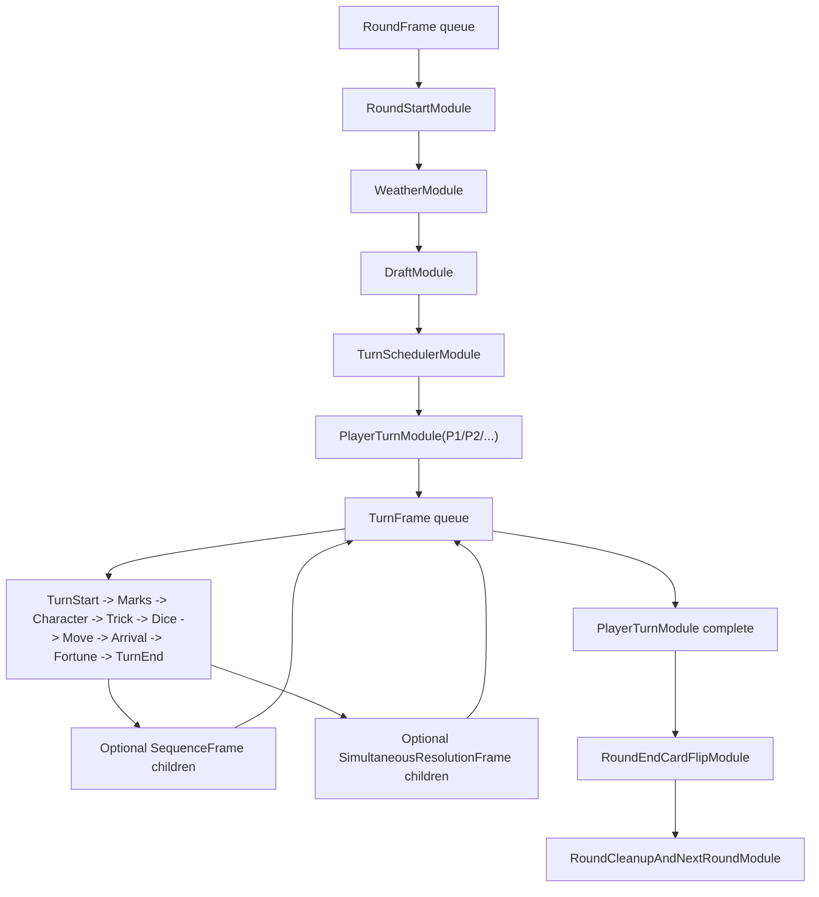

# Modular Game Runtime Migration Part 1 - Overview, Goals, Verification, Structure

> **For agentic workers:** REQUIRED SUB-SKILL: Use `superpowers:executing-plans` or `superpowers:subagent-driven-development` before implementing this migration. This document is Part 1 of 3 and defines the migration envelope. Read Part 2 for module contracts and Part 3 for implementation tasks.

**Goal:** Migrate the current implicit turn runtime into an explicit module/frame runtime without regressing game rules, prompts, stream replay, or frontend rendering.

**Architecture:** The engine remains the only gameplay source of truth. Round, turn, and nested sequence work become persisted frame queues. Backend services persist, project, and transport frame/module state. WebSocket replay stays transport-only. Frontend selectors render backend projection first and use raw events for display and animation only.

**Tech Stack:** Python engine under `GPT/`, FastAPI backend under `apps/server/`, in-memory/persistent `StreamService`, WebSocket route under `apps/server/src/routes/stream.py`, React/TypeScript frontend under `apps/web/`, JSON Schema runtime contracts under `packages/runtime-contracts/ws/`.

---

## 1-1. Reading Order

Use these files as the source bundle for implementation:

1. `docs/Game-Rules.md`
2. `docs/engineering/1_HUMAN_GAME_PIPELINES_AND_RUNTIME_REFERENCE.md`
3. `docs/backend/turn-structure-and-order-source-map.md`
4. `packages/runtime-contracts/ws/README.md`
5. `docs/superpowers/plans/2026-05-02-modular-game-runtime-draft-1.md`
6. `docs/superpowers/plans/2026-05-02-modular-game-runtime-bug-1.md`
7. `docs/superpowers/plans/2026-05-02-modular-game-runtime-result-1.md`
8. `docs/superpowers/plans/2026-05-02-modular-game-runtime-migration-part-1.md`
9. `docs/superpowers/plans/2026-05-02-modular-game-runtime-migration-part-2.md`
10. `docs/superpowers/plans/2026-05-02-modular-game-runtime-migration-part-3.md`

The existing Draft#1 is the target architecture. Bug#1 is the failure set. Result#1 is the structural review. This migration plan turns those into an ordered delivery path.

## 1-2. Current Rule Baseline

The migration must preserve these gameplay rules:

1. A round begins with weather reveal, then character draft, then turn scheduling by final selected character priority.
2. Draft order starts from the marker owner and follows marker direction. The second draft pass is reversed.
3. Each player finally chooses 1 character from their 2 drafted candidates.
4. Targeting effects such as bandit, hunter, baksu, and manshin are chosen by character identity, not direct player identity, and resolve at the target player's turn start.
5. Targeted effects resolve before normal turn start ability, trick, dice, movement, landing, fortune, and turn-end handling.
6. Trick cards may be used once per turn between character ability and dice roll.
7. Fortune cards resolve immediately on fortune tile arrival and can add follow-up movement/arrival work.
8. Doctrine supervisor/researcher marker transfer takes effect immediately when the character ability says the marker has moved. "Has marker" effects observe the new owner from that point.
9. Card face flip is not immediate marker transfer. It is legal only after every scheduled turn in the round has completed.
10. The card flip event belongs to the just-finished round's last turn-end boundary, before the next round's weather/draft.
11. Skipped, dead, or exceptional turns must still produce a clear terminal event or a game-end event so the frontend cannot remain in a phantom active turn.

## 1-3. Current Implementation Baseline

Current engine ownership is concentrated in `GPT/engine.py`:

1. `run_next_transition` chooses the next action using `pending_actions`, `pending_turn_completion`, `current_round_order`, and `turn_index`.
2. `_start_new_round` currently performs round reset, `round_start`, weather, initial tricks, draft, hidden trick refresh, and round-order emission in one function.
3. `_take_turn` currently performs target mark resolution, character start ability, `turn_start`, trick window, trick phase, movement, standard move action enqueue, and pending turn completion setup.
4. `_use_trick_phase` currently resolves trick choice, trick card application, discard, supply threshold deferral, hidden trick visibility sync, and may enqueue `continue_after_trick_phase`.
5. `_complete_pending_turn_transition` currently emits `turn_end_snapshot`, checks game end, and advances the cursor.
6. `_apply_round_end_marker_management` and `_resolve_marker_flip` currently run at round boundary.
7. `ActionEnvelope`, `pending_actions`, and `scheduled_actions` in `GPT/state.py` are the main existing queue-like constructs.

Current backend ownership:

1. `apps/server/src/services/runtime_service.py::_run_engine_transition_once_sync` hydrates state, constructs policy/engine, runs one transition, stores status, and fans out events.
2. `_FanoutVisEventStream.append` publishes engine events to `StreamService` and writes committed debug logs.
3. `apps/server/src/services/stream_service.py::publish` assigns `seq`, deduplicates some current event classes, projects `view_state`, notifies subscribers, and persists stream/checkpoint side effects.

Current frontend ownership:

1. `apps/web/src/infra/ws/StreamClient.ts` opens the socket, sends `resume`, and emits parsed inbound messages.
2. `apps/web/src/domain/store/gameStreamReducer.ts` orders and buffers `seq` messages and handles replay gaps.
3. `apps/web/src/domain/selectors/streamSelectors.ts` and `promptSelectors.ts` derive board, scene, prompt, players, active slots, and hand tray models.

## 1-4. Migration Goals

The migration is successful when:

1. The next engine work item is explicit in checkpoint state as a frame/module path or an active suspended prompt.
2. Draft is impossible inside `TurnFrame` or nested `SequenceFrame`.
3. Card flip is impossible until every `PlayerTurnModule` in the current `RoundFrame` is complete.
4. Trick resolution cannot skip movement unless a typed module explicitly ends the turn or game.
5. Prompt decisions resume the exact suspended module by `resume_token`, `frame_id`, and `module_id`.
6. Backend projection exposes `latest_module_path`, `round_stage`, `turn_stage`, and `active_sequence`.
7. WebSocket `resume` only replays messages and never advances engine state.
8. Frontend stage visibility is projection-first and cannot be reopened by stale replayed events.
9. Legacy and module runners never both advance gameplay for the same session.
10. All existing rule tests and runtime stream tests continue to pass during migration.

## 1-5. Non-Negotiable Invariants

These are blockers for every implementation slice:

1. A session has one runtime owner: `legacy_runner` or `module_runner`.
2. Compatibility metadata may be added to legacy events, but it must not change gameplay order.
3. `RoundFrame` owns weather, draft, turn scheduling, player turn modules, round-end card flip, and round cleanup.
4. `TurnFrame` owns one player's turn from turn start through `TurnEndSnapshotModule`.
5. `SequenceFrame` owns nested single-actor work such as trick, fortune extra roll, purchase/rent chains, and zone chains.
6. `SimultaneousResolutionFrame` owns synchronized multi-player work such as resupply: every required participant responds against one captured snapshot, then the frame commits once.
7. Every module has a stable `module_id` and `idempotency_key`.
8. Every single-player prompt-producing module suspends itself and stores a `PromptContinuation`.
9. Every simultaneous prompt-producing module suspends its frame and stores a `SimultaneousPromptBatchContinuation`.
10. Every queue mutation goes through typed `QueueOp`; modules do not mutate another frame queue directly.
11. Simultaneous resolution is explicit module work, not an ambient pending queue.
12. Modifiers are structured and scoped. Ad hoc turn flags remain only behind adapters until removed.
13. Stream dedupe uses stable keys. Debug logs record committed messages, not attempted messages.

## 1-6. Known Bug Coverage

| Bug | Migration guard |
| --- | --- |
| BUG-001 first turn not executed | `TurnSchedulerModule` persists concrete `PlayerTurnModule` entries before round setup completes. |
| BUG-002 draft repeats mid-turn | `DraftModule` is `RoundFrame`-only and idempotent per round. |
| BUG-003 card flip mid-turn | `RoundEndCardFlipModule` asserts all player turn modules are complete. |
| BUG-004 marker transfer/card flip confusion | `ImmediateMarkerTransferModule` and `RoundEndCardFlipModule` are separate modules. |
| BUG-005 trick boundary missing | `TrickWindowModule` spawns `TrickSequenceFrame` and resumes parent after completion. |
| BUG-006 wrong prompt continuation | `PromptContinuation` binds request to frame/module/resume token. |
| BUG-007 untyped pending action leaks | `QueueOp` targets an active frame and rejects completed frames; synchronized multi-player work must use `SimultaneousResolutionFrame`. |
| BUG-008 modifier scope leaks | `ModifierRegistry` defines scope, propagation, priority, and expiry. |
| BUG-009 stream duplicate/suppression | `idempotency_key` is required for module-originated domain events. |
| BUG-010 frontend stage inference | Backend projection is canonical; event text is display-only. |
| BUG-011 replay/live interleaving | Reducer orders by `seq`; projection carries active module path. |
| BUG-012 prompt status lag | Checkpoint-owned `active_prompt` is the truth; prompt service is an index. |
| BUG-013 missing turn-end snapshot | `TurnEndSnapshotModule` is a required close module for every turn frame. |
| BUG-014 projection lacks causality | Events carry frame/module causality metadata. |
| BUG-015 mixed migration truth | Runtime flag selects one runner at session start and persists that selection. |

## 1-7. Target Runtime Structure



The important boundary is ownership:

1. Round frame decides which player turns exist.
2. Player turn module owns exactly one child turn frame.
3. Turn frame owns the actor's turn work.
4. Sequence frame owns nested, temporary single-actor work and returns to its parent frame.
5. Simultaneous resolution frame owns all-player or multi-player prompt batches and commits after all required responses/defaults are collected.
6. Backend and frontend observe these frames; they do not create gameplay truth.

## 1-8. Migration Phases

Use these milestones in order:

1. M0 Baseline lock: freeze tests and add diagnostics for current order.
2. M1 Legacy module metadata: add read-only module metadata to existing engine events.
3. M2 Backend projection: project module path and active stage from metadata/checkpoint.
4. M3 Frontend projection-first: make draft/trick/card-flip/prompt UI respect projected active module state.
5. M4 Engine contracts: add frame/module dataclasses, journal, queue ops, prompt continuation, and modifier registry without enabling module runner.
6. M5 Round module runner: implement `RoundFrame` modules behind a session-start flag.
7. M6 Turn and sequence modules: implement `TurnFrame`, `TrickSequenceFrame`, and first nested follow-ups behind the same runner flag.
8. M7 Prompt continuation: move prompt production to module suspension/resume.
9. M8 Stream/WebSocket hardening: idempotency-key dedupe, replay-only resume tests, heartbeat module diagnostics.
10. M9 Parallel validation: run legacy and module runner on deterministic AI fixtures and compare event/rule outcomes.
11. M10 Cutover and cleanup: enable module runner by default for new sessions, then remove legacy-only scheduling paths after parity is proven.

## 1-9. Feature Flags

Persist flags in session resolved runtime config and checkpoint metadata:

1. `runtime.module_metadata_v1`: emit synthetic module metadata from legacy paths.
2. `runtime.backend_module_projection_v1`: project module path/stage fields in backend `view_state`.
3. `frontend.module_view_state_v1`: selectors use projected module state as first source.
4. `runtime.module_contracts_v1`: persist frame/module dataclasses and journal, runner disabled.
5. `runtime.module_runner_round_v1`: execute `RoundFrame` modules.
6. `runtime.module_runner_turn_v1`: execute `TurnFrame` and core `SequenceFrame` modules.
7. `runtime.module_prompt_resume_v1`: require frame/module prompt continuation for all prompts.
8. `runtime.stream_idempotency_v1`: require/persist event `idempotency_key`.

Session-start rule:

```text
runner_kind = "module" only when all required module-runner flags are enabled.
runner_kind = "legacy" otherwise.
runner_kind cannot change after session creation.
```

## 1-10. Checkpoint Strategy

Version checkpoints explicitly:

1. `checkpoint_schema_version=1`: current legacy checkpoint.
2. `checkpoint_schema_version=2`: legacy checkpoint plus read-only `runtime_module_projection`.
3. `checkpoint_schema_version=3`: module runner checkpoint with `frame_stack`, `module_journal`, `active_prompt`, `modifier_registry`, and `runner_kind`.

Compatibility rules:

1. Version 1 checkpoints hydrate into legacy runner only.
2. Version 2 checkpoints hydrate into legacy runner only, but backend/frontend may use module projection.
3. Version 3 checkpoints hydrate into module runner only.
4. A version 3 checkpoint must not be downgraded into legacy runner.
5. Recovery must reject a checkpoint whose `runner_kind` conflicts with session resolved runtime config.

## 1-11. Event Compatibility Strategy

Add module metadata additively:

```json
{
  "runtime_module": {
    "schema_version": 1,
    "runner_kind": "legacy",
    "frame_id": "turn:1:p2",
    "frame_type": "turn",
    "module_id": "legacy:turn:1:p2:trick_window",
    "module_type": "TrickWindowModule",
    "module_status": "completed",
    "module_path": ["round:1", "turn:1:p2", "legacy:turn:1:p2:trick_window"],
    "idempotency_key": "legacy:session:s1:round:1:turn:2:trick_window_closed"
  }
}
```

Compatibility rules:

1. Existing payload fields stay unchanged unless a later cleanup phase explicitly removes them.
2. `runtime_module` is additive and optional in M1.
3. It becomes required for module-runner events in M5.
4. Event `idempotency_key` may live at payload top level and be duplicated inside `runtime_module` for selector convenience.
5. Frontend must treat missing metadata as legacy compatibility, not as permission to infer a newer active stage over projected `view_state`.

## 1-12. Verification Matrix

| Layer | Required checks |
| --- | --- |
| Engine order | First turn after draft, trick continuation, skipped/dead turn closure, card flip after all turns, marker transfer timing. |
| Engine contracts | Frame queue operations reject illegal frame types, completed-frame insertion, duplicate module id, and wrong prompt resume token. |
| Backend runtime | Runner kind persists, checkpoint version is enforced, prompt waiting mirrors checkpoint `active_prompt`. |
| Stream service | Same idempotency key publishes once; repeated event type with different module id publishes twice. |
| WebSocket | `resume` replays only; decision validates request and does not accept stale token. |
| Frontend reducer | Replay/live interleaving converges by `seq`; latest projection remains visible. |
| Frontend selectors | Draft, trick, card flip, and prompt visibility depend on backend projection/module metadata first. |
| End-to-end | Human prompt session reaches first turn; reconnect during draft/trick/fortune does not reopen stale UI. |

## 1-13. Acceptance Commands

Run these throughout the migration:

```bash
PYTHONPATH=$PWD .venv/bin/python -m pytest GPT/test_rule_fixes.py -q
PYTHONPATH=$PWD .venv/bin/python -m pytest apps/server/tests/test_runtime_service.py apps/server/tests/test_stream_api.py -q
npm --prefix apps/web test -- streamSelectors.spec.ts promptSelectors.spec.ts gameStreamReducer.spec.ts StreamClient.spec.ts
npm --prefix apps/web run build
```

Add module-specific tests in Part 3 and include them in the first command group as they are created.

## 1-14. Rollout Policy

Rollout order:

1. Land M0-M3 with `runner_kind=legacy` only. This gives observability and frontend safety without changing engine order.
2. Land M4 with contracts and tests but no module execution.
3. Enable M5-M6 only for deterministic AI smoke sessions.
4. Enable M7-M8 for human prompt sessions after stale/duplicate decision tests pass.
5. Run M9 parity before defaulting new sessions to module runner.
6. Keep legacy runner available until the module runner has covered draft, trick, movement, arrival, fortune, marker/card flip, and prompt recovery.

Rollback:

1. If M1-M3 fail, disable projection/frontend flags; gameplay is unchanged.
2. If M5-M8 fail, disable module runner for new sessions. Existing module-runner sessions must continue on module runner or be marked recovery-required; do not hydrate them into legacy runner.
3. If stream idempotency fails, disable `runtime.stream_idempotency_v1` only after confirming old dedupe paths still protect existing prompt and round setup messages.

## 1-15. Completion Criteria

The migration is complete when:

1. `run_next_transition` delegates to module runner for new sessions by default.
2. `pending_actions` and `pending_turn_completion` are no longer gameplay-order owners in module sessions.
3. Every single-player prompt payload includes frame/module continuation fields.
4. Every simultaneous prompt batch includes `batch_id`, participant ids, per-player request ids, missing participant ids, and the owning frame/module ids.
5. Resupply and other synchronized multi-player prompts are handled by `SimultaneousProcessingModule` plus a typed `SimultaneousResolutionFrame`, not by sequential turn prompts.
6. Every engine event includes module causality metadata.
7. Card flip events always have `module_type=RoundEndCardFlipModule`.
8. Draft events always have `module_type=DraftModule`.
9. Trick events inside the trick window carry `SequenceFrame` identity.
10. Backend `view_state` includes stable active module/stage fields.
11. Frontend tests prove stale replay cannot reopen draft/trick/card-flip/resupply UI.
12. Legacy runner cleanup has an explicit final diff and all acceptance commands pass.
