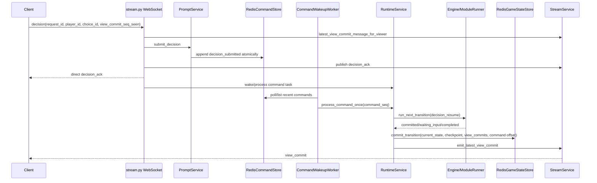

# 현재 게임 서버 구조 상세 문서

작성일: 2026-05-12

목적: 현재 워킹트리에 존재하는 게임 진행 구조, WebSocket 규약, Redis/런타임/프롬프트/커맨드/뷰 커밋 구조를 처음부터 끝까지 한 문서에 고정한다. 이 문서는 이상적인 설계안이 아니다. 현재 구현이 실제로 어떤 식으로 동작하는지와 어떤 결합을 만들었는지를 그대로 적는다.

주요 근거 파일:

- `docs/current/Game-Rules.md`
- `docs/current/backend/online-game-interface-spec.md`
- `packages/runtime-contracts/ws/README.md`
- `docs/current/engineering/[PLAN]_REDIS_AUTHORITATIVE_GAME_STATE.md`
- `apps/server/src/state.py`
- `apps/server/src/app.py`
- `apps/server/src/routes/sessions.py`
- `apps/server/src/routes/stream.py`
- `apps/server/src/services/session_service.py`
- `apps/server/src/services/prompt_service.py`
- `apps/server/src/services/stream_service.py`
- `apps/server/src/services/runtime_service.py`
- `apps/server/src/services/command_wakeup_worker.py`
- `apps/server/src/services/realtime_persistence.py`
- `apps/server/src/config/runtime_settings.py`
- `engine/runtime_modules/runner.py`

## 1. 게임 규칙의 큰 흐름

게임은 4인 보드게임이다. 서버/엔진이 권위자이며, 프론트엔드는 권위 상태를 표시하고 플레이어 결정을 제출하는 클라이언트다.

### 1.1 라운드 시작

라운드는 날씨 공개로 시작한다. 날씨는 현재 라운드의 이동, 보상, 효과 해석에 영향을 줄 수 있다.

그 다음 캐릭터 드래프트가 진행된다.

1. 드래프트 패스 1
2. 드래프트 패스 2
3. 최종 캐릭터 선택
4. 선택된 캐릭터의 우선순위로 턴 순서 결정

캐릭터 우선순위가 낮을수록 먼저 행동한다.

### 1.2 플레이어 턴

각 플레이어 턴은 대략 아래 순서로 진행된다.

1. 턴 시작 전 예약 효과 처리
2. 자신을 대상으로 걸린 마크 효과 처리
3. 캐릭터 능력 처리
4. 트릭 카드 사용 여부 결정
5. 이동 결정
6. 주사위 또는 주사위 카드 기반 이동
7. 도착 타일 효과 처리
8. 랩 통과/도착 보상 처리
9. 타일 구매, 통행료, 인수, 행운, 점수 코인 배치 등 후속 선택 처리
10. 턴 종료 스냅샷/커밋

마크 능력은 캐릭터를 대상으로 예약된다. 발동 시점은 해당 캐릭터를 실제로 선택한 플레이어의 턴 시작이다. 대상 캐릭터가 없거나 아직 공개되지 않으면 효과가 지연되거나 실패할 수 있다.

트릭 카드는 플레이어가 손패 5장을 가진다. 1장은 숨김이다. 턴당 최대 1장을 쓴다. 종료 시간이 3의 배수인 빈 슬롯은 라운드 종료에 보충된다. 부담 카드는 비용을 내고 제거할 수 있다.

이동은 주사위 또는 주사위 카드로 결정된다. 도착 이후 행운, 구매, 통행료, 인수, 랩 보상, 점수 코인 배치 같은 후속 행동이 연결된다.

자원은 현금, 조각, 점수 토큰이다. 기본 시작은 현금 20, 조각 2, 점수 토큰 0이며, 시작 선택 보상은 20PT, 랩 보상은 10PT다. 지불 불능이면 파산 처리되고 보유지는 적대 상태가 되며 은행에 3배 통행료를 낸다.

### 1.3 라운드 종료

모든 플레이어 턴이 끝나면 라운드 종료 처리가 진행된다. 현재 규칙 문서와 런타임 모듈 기준으로 라운드 종료에는 다음 성격의 일이 포함된다.

- 교리/조사자/연구자 토큰 소유자 및 방향 처리
- 활성 캐릭터 면 전환
- 트릭 카드 재보충 조건 처리
- 다음 라운드 프레임 설치

## 2. 서버 프로세스 구성

`apps/server/src/app.py`가 FastAPI 애플리케이션을 만든다. 등록 라우터는 health, admin, debug, sessions, rooms, stream, prompts다.

`apps/server/src/state.py`가 런타임 전역 서비스를 만든다. 현재 구조는 의존성 주입 컨테이너라기보다 프로세스 시작 시 전역 싱글턴을 조립하는 방식이다.

### 2.1 설정

`apps/server/src/config/runtime_settings.py`는 환경변수로 런타임 설정을 읽는다.

주요 설정:

- `MRN_STREAM_HEARTBEAT_INTERVAL_MS`
- `MRN_STREAM_SENDER_POLL_TIMEOUT_MS`
- `MRN_RUNTIME_WATCHDOG_TIMEOUT_MS`
- `MRN_REDIS_URL`
- `MRN_REDIS_KEY_PREFIX`
- `MRN_REDIS_SOCKET_TIMEOUT_MS`
- `MRN_PROMPT_TIMEOUT_WORKER_POLL_INTERVAL_MS`
- `MRN_COMMAND_WAKEUP_WORKER_POLL_INTERVAL_MS`
- `MRN_RUNTIME_ENGINE_WORKERS`
- `MRN_RUNTIME_CHECKPOINT_V3`
- `MRN_RUNTIME_PROMPT_CONTINUATION_V1`
- `MRN_RUNTIME_SIMULTANEOUS_RESOLUTION_V1`
- `MRN_RUNTIME_MODULE_RUNNER_ROUND_V1`
- `MRN_RUNTIME_MODULE_RUNNER_TURN_V1`
- `MRN_RUNTIME_MODULE_RUNNER_SEQUENCE_V1`
- `MRN_RUNTIME_FRONTEND_PROJECTION_V1`

중요한 현재 제약: Redis 주소는 프로세스 전역의 `MRN_REDIS_URL` 하나다. 별도 코드 변경 없이 같은 서버 프로세스 안에서 게임 세션별 Redis를 다르게 붙이는 구조가 아니다.

### 2.2 저장소 선택

`state.py`는 `MRN_REDIS_URL`이 있으면 Redis 기반 저장소를 사용한다.

Redis 사용 시 생성되는 주요 저장소:

- `RedisSessionStore`
- `RedisRoomStore`
- `RedisStreamStore`
- `RedisPromptStore`
- `RedisRuntimeStateStore`
- `RedisGameStateStore`
- `RedisCommandStore`

Redis가 없으면 세션/스트림은 JSON 파일 또는 인메모리 대체 저장소를 사용한다. 하지만 현재 Redis 권위 구조는 RedisGameStateStore, RedisPromptStore, RedisCommandStore, RedisRuntimeStateStore가 함께 있을 때 가장 완성된 흐름이다.

### 2.3 주요 서비스

- `SessionService`: 세션 생성, 참가, 시작, 토큰 검증, 연결 상태, 세션 종료를 담당한다.
- `PromptService`: pending/resolved/decision/lifecycle 프롬프트 상태를 관리한다.
- `StreamService`: WebSocket 송신 대상에게 stream event, prompt, ack, view_commit, heartbeat를 배포한다.
- `RuntimeService`: 엔진 실행, 체크포인트, 런타임 lease, 커맨드 처리, view_commit 생성을 담당한다.
- `CommandStreamWakeupWorker`: Redis command stream을 보고 waiting/running runtime을 깨운다.
- `PromptTimeoutWorker`: pending prompt timeout 및 fallback decision을 처리한다.

## 3. 세션 생명주기

세션 REST 라우트는 `apps/server/src/routes/sessions.py`에 있다.

### 3.1 세션 생성

`POST /api/v1/sessions`

입력:

- `seats`: 좌석 목록
- `config`: 게임/런타임 설정

동작:

1. `SessionService.create_session` 호출
2. `GameParameterResolver.resolve`로 설정 정규화
3. 좌석, host token, join token, parameter manifest 생성
4. 세션 상태를 `waiting`으로 저장
5. stream에 `session_created` 이벤트 publish

응답에는 `host_token`, `join_tokens`, public session payload가 포함된다.

### 3.2 참가

`POST /api/v1/sessions/{session_id}/join`

입력:

- `seat`
- `join_token`
- `display_name`

동작:

1. 세션이 `waiting`인지 확인
2. join token 검증
3. human seat인지, 이미 참가하지 않았는지 확인
4. `session_token` 발급
5. stream에 `seat_joined` 이벤트 publish

이 `session_token`은 이후 WebSocket 접속 및 runtime-status/view-commit 조회 권한에 쓰인다.

### 3.3 시작

`POST /api/v1/sessions/{session_id}/start`

입력:

- `host_token`

동작:

1. host token 검증
2. 모든 필수 human seat 참가 여부 확인
3. 세션 상태를 `in_progress`로 변경
4. `session_start`, `session_started`, `parameter_manifest` 이벤트 publish
5. `RuntimeService.start_runtime` 호출

시작 이벤트의 snapshot은 `_initial_public_snapshot`로 만든 초기 표시용 스냅샷이다. 이후 권위 상태는 RuntimeService가 만든 checkpoint/view_commit 흐름으로 넘어간다.

### 3.4 runtime-status

`GET /api/v1/sessions/{session_id}/runtime-status?token=...`

동작:

1. token으로 seat/spectator 인증
2. seat이면 `recovery_required` 또는 `waiting_input` 상태를 복구할지 판단
3. waiting input checkpoint가 있으면 임의 재시작하지 않는다
4. pending command가 있으면 복구를 보류한다
5. 필요한 경우 `RuntimeService.start_runtime`으로 복구 시작
6. `runtime.public_runtime_status` 반환

### 3.5 최신 view_commit

`GET /api/v1/sessions/{session_id}/view-commit?token=...`

동작:

1. 세션과 token 검증
2. 인증 컨텍스트를 ViewerContext로 변환
3. `StreamService.latest_view_commit_message_for_viewer` 호출
4. 해당 viewer에게 허용된 최신 view_commit payload 반환

### 3.6 replay

`GET /api/v1/sessions/{session_id}/replay?token=...`

동작:

1. 세션과 token 검증
2. stream snapshot을 가져온다
3. 각 stream message를 viewer별 projection으로 필터링한다
4. 브라우저 안전 redacted replay export를 반환한다

## 4. WebSocket 규약

WebSocket 엔드포인트는 `GET /api/v1/sessions/{session_id}/stream`이다. 실제 라우트는 `apps/server/src/routes/stream.py`에 있다.

### 4.1 인증

Query parameter:

- `token`: seat token. 비공개 세션에서 token이 없으면 spectator 거부. 공개 세션은 token 없이 spectator 가능.

접속 시:

1. `SessionService.verify_session_token`으로 role/seat/player_id를 만든다.
2. FastAPI WebSocket accept.
3. `StreamService.subscribe`로 subscriber queue 등록.
4. seat이면 `SessionService.mark_connected(..., connected=True)`.
5. heartbeat task와 sender task 생성.
6. 접속 직후 해당 viewer의 최신 view_commit을 강제 송신한다.

### 4.2 서버에서 클라이언트로 가는 타입

현재 문서화된 v1 inbound 타입:

- `event`
- `prompt`
- `decision_ack`
- `error`
- `heartbeat`

현재 구현에서 핵심이 된 추가 타입:

- `view_commit`
- `snapshot_pulse`

공통 필드:

- `type`
- `seq`
- `session_id`
- `server_time_ms`
- `payload`

`view_commit` payload에는 최소 다음 성격의 필드가 포함된다.

- `schema_version`
- `commit_seq`
- `source_event_seq`
- `round_index`
- `turn_index`
- `turn_label`
- `viewer`
- `runtime`
- `view_state`
- `server_time_ms`

`runtime`에는 status, round/turn, active frame/module 정보가 포함된다.

`view_state`에는 board, players, player_cards, active_slots, active_by_card, turn_stage, scene, runtime, parameter_manifest, prompt, hand_tray, turn_history 등이 viewer 권한에 맞게 들어간다.

### 4.3 클라이언트에서 서버로 가는 타입

현재 문서화된 v1 outbound 타입:

- `resume`
- `decision`

`resume` 동작:

- 서버가 현재 viewer용 최신 view_commit을 다시 보낸다.

`decision` 필수 성격:

- `request_id`
- `player_id`
- `choice_id`
- `client_seq`

현재 구현에서 검증에 쓰는 추가 필드:

- `session_id`
- `choice_payload`
- `provider`
- `prompt_fingerprint`
- `prompt_instance_id`
- `view_commit_seq_seen`
- `frame_id`
- `module_id`
- `module_type`
- `module_cursor`
- `resume_token`

서버는 player mismatch, stale prompt, future prompt, prompt instance mismatch, resume token mismatch, legal choice mismatch, module identity mismatch를 거부 또는 stale 처리한다.

### 4.4 WebSocket 송신 구조

각 subscriber는 queue를 가진다. `StreamService` 기본 subscriber queue size는 256이다. queue가 꽉 차면 오래된 항목을 drop하고 drop count를 증가시킨다.

송신 task는 queue에서 stream message를 꺼낸 뒤 viewer projection을 적용한다. `view_commit`은 중복/오래된 commit을 억제한다. message별 projection이 끝나면 WebSocket send lock 아래에서 JSON을 보낸다.

heartbeat task는 주기적으로 다음을 한다.

- 최신 stream seq 확인
- backpressure 통계 확인
- runtime status 확인
- subscriber queue가 비어 있으면 최신 view_commit을 다시 찾을 수 있음
- heartbeat message 송신

현재 구조의 중요한 결합: heartbeat도 최신 view_commit 조회와 송신 경로에 관여한다. heartbeat가 단순 ping이 아니라 상태 복구/repair 성격까지 일부 갖는다.

### 4.5 decision_ack 흐름

decision이 들어오면 서버는 먼저 최신 view_commit의 active prompt와 제출된 decision을 비교한다.

정상 accepted path:

1. `PromptService.submit_decision`
2. pending prompt 삭제
3. decision/resolved 기록
4. Redis command stream에 `decision_submitted` append
5. stream에 `decision_ack` publish
6. direct ack를 viewer projection 후 WebSocket으로 즉시 송신
7. runtime wakeup task 예약

stale/rejected path:

1. prompt lifecycle에 rejected/stale 기록
2. `decision_ack` publish
3. direct ack 송신
4. 필요하면 최신 view_commit repair 송신

`decision_ack`는 게임 상태를 진행시키는 권위 이벤트가 아니다. 상태 진행은 command stream에 들어간 command를 RuntimeService가 처리한 뒤 checkpoint/view_commit을 커밋할 때 발생한다.

## 5. Redis 데이터 구조

Redis key prefix는 `MRN_REDIS_KEY_PREFIX` 기본값 `mrn`이다. 아래 key 이름은 `RedisConnection.key(...)`로 prefix가 붙는다.

### 5.1 stream

`RedisStreamStore`가 관리한다.

주요 key:

- `stream:{session_id}:events`
- `stream:{session_id}:source_events`
- `stream:{session_id}:seq`
- `stream:{session_id}:event_index`
- `stream:{session_id}:viewer_outbox`
- `stream:drop_counts`

`events`는 view_commit과 snapshot_pulse까지 포함한 송신용 stream이다. `source_events`는 view_commit/snapshot_pulse를 제외한 원천 이벤트 stream이다.

`view_commit`은 Redis stream payload에 전체 view_state를 넣지 않고 compact pointer payload로 저장된다. 실제 viewer별 view_commit payload는 `RedisGameStateStore`의 view_commit key에 저장된다.

### 5.2 prompts

`RedisPromptStore`가 관리한다.

주요 key:

- `prompts:pending`
- `prompts:resolved`
- `prompts:decisions`
- `prompts:lifecycle`
- `prompts:{session_id}:debug_index`

field는 기본적으로 `{session_id}\x1f{request_id}` 형식이다. request_id만으로 충돌하지 않게 session scope를 붙인다.

`accept_decision_with_command`는 가능한 경우 Lua로 다음을 원자 처리한다.

- pending 삭제
- decision 저장
- resolved 저장
- command seen 기록
- command seq 증가
- command stream append

### 5.3 commands

`RedisCommandStore`가 관리한다.

주요 key:

- `commands:{session_id}:stream`
- `commands:{session_id}:seq`
- `commands:seen`
- `commands:{session_id}:seen`
- `commands:offsets:{consumer_name}`
- `commands:offset_indexes`

command type:

- `decision_submitted`: RuntimeService가 실제로 재개해야 하는 외부 입력 command
- `decision_resolved`: observation 성격의 stream-derived command. 현재 wakeup worker에서는 runtime observation command로 취급한다.

중복 방지는 request_id 기반 seen key로 한다.

### 5.4 runtime

`RedisRuntimeStateStore`가 관리한다.

주요 key:

- `runtime:status`
- `runtime:{session_id}:fallbacks`
- `runtime:{session_id}:lease`

lease는 한 세션의 runtime transition을 여러 서버 프로세스가 동시에 처리하지 못하게 막는다. lease owner가 현재 worker가 아니면 commit 직전 stale로 빠진다.

### 5.5 game_state

`RedisGameStateStore`가 관리한다.

주요 key:

- `game_state:{session_id}:checkpoint`
- `game_state:{session_id}:current_state`
- `game_state:{session_id}:view_state`
- `game_state:{session_id}:view_commit_index`
- viewer별 `view_commit`
- viewer별 cached view_state
- `game_state:{session_id}:debug_snapshot`

`commit_transition`은 가능한 경우 Lua로 다음을 원자 처리한다.

- current_state 저장
- checkpoint 저장
- public view_state 저장
- viewer별 view_commit 저장
- view_commit_index 저장
- command consumer offset 저장
- runtime event stream append

view_commit_seq는 양수여야 하며, 이전 commit_seq와 맞지 않으면 `ViewCommitSequenceConflict`가 발생한다.

## 6. 런타임 진행 구조

### 6.1 엔진 실행 주체

게임 룰 실행은 engine 패키지와 `RuntimeService`가 담당한다. `RuntimeService.start_runtime` 또는 `RuntimeService.process_command_once`가 엔진을 thread pool executor에서 실행한다. worker 수는 `MRN_RUNTIME_ENGINE_WORKERS`다.

`RuntimeService`는 세션별 status를 관리한다.

주요 status:

- `idle`
- `running`
- `waiting_input`
- `completed`
- `failed`
- `recovery_required`
- `running_elsewhere`
- `rejected`
- `stale`

### 6.2 module runner

`engine/runtime_modules/runner.py`의 `ModuleRunner`는 명시적 frame/module queue로 게임 진행을 단계화한다.

주요 frame/module 개념:

- Round frame
- PlayerTurnModule
- Turn frame
- Sequence frame
- SimultaneousResolutionFrame
- TrickSequenceFrame
- NativeActionFrame
- FortuneResolveFrame

Round frame은 라운드 단위 작업을 담는다. PlayerTurnModule은 각 플레이어 턴을 자식 turn frame으로 위임한다. turn/sequence/simultaneous frame은 trick, movement, arrival, burden exchange 같은 후속 흐름을 소유한다.

핵심 원칙은 pending action을 아무 곳에서나 처리하지 않고, 특정 frame/module의 소유로 복원하는 것이다. 예를 들어 orphan `pending_turn_completion`은 현재 runner에서 오류로 본다.

### 6.3 prompt boundary

엔진이 외부 입력이 필요하면 `PromptRequired`를 던진다. `RuntimeService`는 이를 잡아 `waiting_input` step으로 바꾼다.

이때 checkpoint에는 다음 정보가 들어간다.

- `pending_prompt_request_id`
- `pending_prompt_type`
- `pending_prompt_player_id`
- `pending_prompt_instance_id`
- `runtime_active_prompt`
- `runtime_active_prompt_batch`
- active frame/module id/type/cursor
- prompt_sequence
- resume_token

prompt boundary는 Redis authoritative checkpoint와 view_commit을 만들어야 하는 외부 경계다.

### 6.4 command boundary

현재 구조는 내부 module transition마다 Redis authoritative commit을 바로 공개하지 않고, command boundary에서 묶어 커밋하려는 구조가 들어가 있다.

`RuntimeService._run_engine_command_boundary_loop_sync`는 `_CommandBoundaryGameStateStore`를 사용해 내부 transition을 stage한다. terminal status에 도달하면 마지막 deferred commit만 원본 `RedisGameStateStore.commit_transition`으로 반영한다.

terminal status 예:

- `waiting_input`
- `completed`
- `rejected`
- `stale`
- `failed`

이 구조의 의도는 내부 module step을 외부 state commit으로 남발하지 않고, 사용자 command 하나가 의미 있는 외부 경계에 도달했을 때만 checkpoint/view_commit을 쓰는 것이다.

## 7. 프롬프트와 결정 수명주기

### 7.1 prompt 생성

`PromptService.create_prompt`는 prompt payload에 fingerprint를 붙이고 pending으로 저장한다.

검증:

- request_id 필수
- 중복 pending request_id 거부
- 최근 resolved request_id 재사용 거부
- module prompt면 continuation field 필수
- 같은 player의 기존 pending prompt는 supersede

생성 후 lifecycle state는 `created`가 된다.

### 7.2 prompt 전달

prompt는 두 경로로 클라이언트에 나타난다.

1. stream `prompt` message
2. viewer별 `view_commit.view_state.prompt.active`

현재 구조에서는 view_commit 안의 prompt.active가 더 권위 있는 repair surface가 되었다. WebSocket decision 검증도 최신 view_commit의 active prompt와 submitted decision을 비교한다.

### 7.3 decision 제출

`PromptService.submit_decision` 검증:

- request_id 존재
- choice_id 존재
- pending prompt 존재
- timeout 미초과
- player_id 일치
- prompt fingerprint 일치
- legal_choices 포함
- module continuation identity 일치

accepted면:

- pending 삭제
- decision 저장
- resolved 저장
- lifecycle accepted 기록
- command stream에 `decision_submitted` append
- waiter 깨움

거부면:

- lifecycle rejected/stale/expired 기록
- 필요하면 pending 삭제
- decision_ack는 rejected/stale로 간다

### 7.4 timeout fallback

timeout worker는 pending prompt가 timeout되면 fallback choice를 legal choice 중에서 기록하고 command stream에 `decision_submitted`를 넣을 수 있다.

fallback decision의 provider/source는 `timeout_fallback`이다.

## 8. 커맨드 wakeup 구조

`CommandStreamWakeupWorker`는 Redis command stream을 주기적으로 폴링한다. 기본 poll interval은 250ms다.

동작:

1. active session 목록 갱신
2. 각 in_progress session의 consumer offset 로드
3. command stream latest seq 확인
4. 최근 command 32개 조회
5. runtime status 확인
6. `decision_submitted`이고 runtime이 `waiting_input`, `recovery_required`, `idle`, `running_elsewhere` 또는 특정 조건의 `running`이면 RuntimeService를 깨움
7. 처리 후 consumer offset 저장

특이점:

- latest seq가 offset보다 크지 않아도, waiting input 상태이면 주기적으로 최근 consumed command를 재검사한다.
- 이것은 이미 소비된 command가 실제 runtime resume에 반영되지 못한 경우를 복구하기 위한 보정이다.
- 이 보정은 correctness에는 유리하지만, 많은 session에서 `recent_commands` 조회가 반복되면 Redis/서버 비용이 커진다.

## 9. view_commit 구조

view_commit은 현재 구조의 핵심 출력이다. 프론트엔드는 stream event를 직접 조합해 권위 상태를 만들기보다, 서버가 만든 view_commit을 받아 화면 상태로 쓴다.

### 9.1 생성

`RuntimeService._build_authoritative_view_commits`가 viewer별 commit을 만든다.

viewer scope:

- `spectator`
- `public`
- `admin`
- `player:{external_player_id}`

각 commit은 같은 `commit_seq`를 공유한다. player viewer에는 자기 손패/프롬프트 등 private view가 들어갈 수 있다.

### 9.2 view_state 구성

`_build_authoritative_view_state`는 다음 하위 구조를 만든다.

- `board`
- `players`
- `player_cards`
- `active_slots`
- `active_by_card`
- `turn_stage`
- `scene`
- `runtime`
- `parameter_manifest`
- `prompt`
- `hand_tray`
- `turn_history`

board/players 일부는 `viewer.public_state.build_turn_end_snapshot` 결과와 checkpoint payload를 합쳐 만든다. replay source projection도 scene/turn_history에 병합된다.

### 9.3 저장과 송신

`RedisGameStateStore.commit_transition`이 viewer별 view_commit을 저장하고 `view_commit_index`를 갱신한다. 이후 `RuntimeService._emit_latest_view_commit_sync`가 `StreamService.emit_latest_view_commit`을 호출한다.

`StreamService`는 Redis stream에는 compact pointer 형태의 `view_commit`을 넣고, 실제 payload는 RedisGameStateStore에서 viewer별로 다시 읽어 송신한다.

### 9.4 중복/오래된 commit 억제

WebSocket sender는 viewer별 마지막 delivered commit seq를 추적한다. 이미 보낸 commit이거나 더 낮은 commit은 억제한다. heartbeat/resume/repair 경로에서는 강제 송신이 가능하다.

## 10. stream projection과 visibility

`StreamService.project_message_for_viewer`는 message를 viewer별로 필터링한다.

권한:

- seat/player는 자기 private prompt/hand 정보를 볼 수 있다.
- spectator/public은 공개 정보만 본다.
- admin/backend는 더 넓은 정보를 볼 수 있다.

현재 구조에서는 두 종류의 projection이 섞여 있다.

1. stream event projection
2. authoritative view_commit projection

stream event는 과거 로그/리플레이/연출에 가깝고, view_commit은 현재 화면 상태에 가깝다. 둘이 완전히 분리된 것이 아니라 view_state 생성 시 source projection 결과를 scene/turn_history에 병합한다.

## 11. 복구 구조

### 11.1 서버 재시작

SessionService는 session store에서 세션을 로드하고 restart recovery policy를 적용한다. runtime state는 RedisRuntimeStateStore와 RedisGameStateStore checkpoint에서 복구한다.

### 11.2 waiting input 복구

checkpoint에 `runtime_active_prompt` 또는 `runtime_active_prompt_batch`가 있으면 `RuntimeService.recovery_state_has_waiting_input`이 true가 된다.

이 경우 서버는 무작정 runtime을 새로 달리지 않고 `waiting_input` 상태를 유지한다. 클라이언트가 접속하면 latest view_commit을 받고, 같은 prompt에 대한 decision을 제출할 수 있다.

### 11.3 command 복구

command stream에 처리되지 않은 `decision_submitted`가 있으면 CommandStreamWakeupWorker 또는 WebSocket decision handler의 wake task가 RuntimeService를 깨운다.

RuntimeService는 command consumer offset을 checkpoint commit과 같이 저장한다. commit이 성공해야 offset도 같이 전진한다.

### 11.4 commit conflict

view_commit seq가 예상과 다르면 `ViewCommitSequenceConflict`가 발생한다. RuntimeService는 이를 `commit_conflict` 또는 `recovery_required`로 기록한다. waiting input checkpoint가 살아 있으면 waiting 상태로 회복하려 한다.

## 12. 현재 만들어진 병목/결합 지점

이 섹션은 비난이 아니라 구조적 사실이다. 현재 구현은 기능을 붙이며 여러 방어막이 생겼고, 그 방어막 자체가 비용과 복잡도를 만든다.

### 12.1 단일 서버 내부 병목

서버 1개 조건에서 여러 게임을 돌리면 다음이 같은 프로세스 안에서 경쟁한다.

- WebSocket receive/send
- viewer projection
- direct decision_ack
- heartbeat
- latest view_commit 조회
- RuntimeService executor
- command wakeup polling
- Redis Lua/write/read
- debug logging

따라서 Redis를 게임별로 분리해도 서버 프로세스가 하나이면 Python event loop, thread pool, projection, wakeup worker 경쟁은 남는다.

### 12.2 서버 인스턴스와 Redis 매칭

현재 설정은 `MRN_REDIS_URL` 전역 1개다. 서버 프로세스를 5개 띄우고 각 프로세스마다 다른 `MRN_REDIS_URL`을 주면 "서버 1개 + Redis 1개" 매칭이 된다. 그러나 서버 1개 안에서 세션별 Redis를 자동 선택하지는 않는다.

### 12.3 view_commit 의존 decision 검증

decision handler는 latest view_commit의 active prompt를 읽어 request_id, player_id, prompt_instance_id, resume_token, view_commit_seq_seen을 검증한다. 이는 stale decision 방어에는 좋지만, decision accept path가 view_commit 저장/조회 품질에 의존하게 된다.

### 12.4 heartbeat의 상태 보정 역할

heartbeat는 단순 연결 유지가 아니라 최신 view_commit 재전송/repair 역할까지 한다. 이 때문에 heartbeat 주기, latest view_commit lookup, WebSocket lock이 게임 진행 체감에 영향을 줄 수 있다.

### 12.5 CommandStreamWakeupWorker의 재스캔

worker는 waiting/running 상태에서 이미 소비된 command도 주기적으로 재검사한다. 누락 복구에는 필요하지만, active session 수가 많으면 최근 command 조회가 계속 발생한다.

### 12.6 source event와 view_commit의 이중 구조

현재 stream에는 source event와 view_commit pointer가 같이 있고, RedisGameStateStore에는 authoritative current_state/checkpoint/view_commit이 따로 있다. 상태 권위는 checkpoint/view_commit 쪽으로 이동했지만, replay/source projection도 여전히 view_state에 병합된다.

### 12.7 내부 module step과 외부 commit 경계

Command boundary 구조는 내부 step을 묶어 최종 외부 경계에서만 commit하려 한다. 방향은 맞지만, `_CommandBoundaryGameStateStore`, deferred commit, terminal status, prompt materialize, view_commit emit, command offset 저장이 한 경로에 몰려 있어 디버깅 표면이 커졌다.

## 13. 전체 진행 시퀀스

아래는 human player decision 하나가 실제 상태 변경으로 이어지는 경로다.

## 14. 현재 구조의 판단

현재 구현은 게임 룰 자체보다 서버 경계와 복구 경계가 더 복잡해졌다. 특히 아래 네 가지가 구조 복잡도의 핵심이다.

1. prompt pending/resolved/decision/lifecycle
2. command stream과 consumer offset
3. runtime checkpoint와 lease
4. viewer별 view_commit과 WebSocket repair

이 네 가지는 각각 필요한 이유가 있다. 문제는 서로의 책임 경계가 선명하지 않다는 점이다. decision handler가 view_commit을 읽고, heartbeat가 repair를 수행하며, stream service가 view_commit cache를 들고, runtime service가 prompt materialize와 view commit emit까지 수행한다. 즉 "권위 상태 전이"와 "클라이언트 전송/복구"가 강하게 얽혀 있다.

장기적으로는 게임 인스턴스 단위의 단일 command owner, 명확한 event log/checkpoint/view projection 분리, WebSocket outbox의 독립화가 필요하다.
