# Game Flow And Module Visualization

Status: ACTIVE  
Audience: non-specialists, designers, PMs, QA, engineers  
Updated: 2026-05-07

## Purpose

이 문서는 MRN 게임이 어떤 순서로 진행되고, 그 진행을 어떤 코드 모듈이 담당하는지 시각적으로 설명한다.

전문 용어를 최소화하면 구조는 이렇다.

1. 플레이어가 로비에서 게임을 만든다.
2. 서버가 세션과 좌석을 만든다.
3. 엔진이 규칙에 따라 게임을 한 단계씩 진행한다.
4. 플레이어 선택이 필요하면 엔진이 멈추고, 서버가 선택창을 보낸다.
5. 프론트엔드가 선택지를 보여주고, 플레이어가 고른다.
6. 서버가 선택이 유효한지 확인하고, 엔진이 멈춘 지점에서 다시 이어간다.
7. 이 과정을 라운드와 턴이 끝날 때까지 반복한다.

핵심 원칙:

- 게임 규칙의 최종 권한은 `engine/`에 있다.
- `apps/server/`는 엔진 상태를 저장하고, 검증하고, 클라이언트로 전달한다.
- `apps/web/`은 보여주고 입력받는다. 게임 규칙을 새로 판단하지 않는다.
- Redis는 이어하기와 재시도를 위한 저장소다. Redis가 게임 규칙을 결정하지 않는다.

## 1. One-Screen Summary

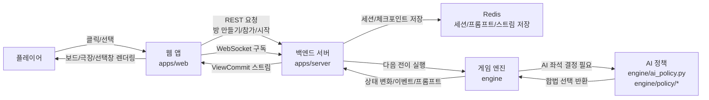
```mermaid
flowchart LR
  Player["플레이어"]
  Web["웹 앱<br/>apps/web"]
  Server["백엔드 서버<br/>apps/server"]
  Redis["Redis<br/>세션/프롬프트/스트림 저장"]
  Engine["게임 엔진<br/>engine"]
  AI["AI 정책<br/>engine/ai_policy.py<br/>engine/policy/*"]

  Player -->|"클릭/선택"| Web
  Web -->|"REST 요청<br/>방 만들기/참가/시작"| Server
  Web -->|"WebSocket 구독"| Server
  Server -->|"세션/체크포인트 저장"| Redis
  Server -->|"다음 전이 실행"| Engine
  Engine -->|"AI 좌석 결정 필요"| AI
  AI -->|"합법 선택 반환"| Engine
  Engine -->|"상태 변화/이벤트/프롬프트"| Server
  Server -->|"ViewCommit 스트림"| Web
  Web -->|"보드/극장/선택창 렌더링"| Player
```

비전문가용 해석:

- 웹 앱은 화면과 버튼이다.
- 서버는 교통정리와 저장 담당이다.
- 엔진은 심판이다.
- AI 정책은 사람이 아닌 좌석의 선택 담당이다.
- Redis는 게임을 중간에 멈췄다가 다시 이어가기 위한 기록장이다.

## 2. Product-Level User Flow

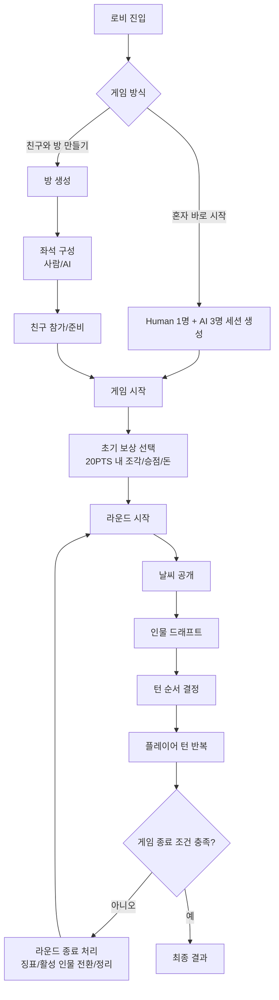
```mermaid
flowchart TD
  A["로비 진입"] --> B{"게임 방식"}
  B -->|"혼자 바로 시작"| C["Human 1명 + AI 3명 세션 생성"]
  B -->|"친구와 방 만들기"| D["방 생성"]
  D --> E["좌석 구성<br/>사람/AI"]
  E --> F["친구 참가/준비"]
  C --> G["게임 시작"]
  F --> G
  G --> H["초기 보상 선택<br/>20PTS 내 조각/승점/돈"]
  H --> I["라운드 시작"]
  I --> J["날씨 공개"]
  J --> K["인물 드래프트"]
  K --> L["턴 순서 결정"]
  L --> M["플레이어 턴 반복"]
  M --> N{"게임 종료 조건 충족?"}
  N -->|"아니오"| O["라운드 종료 처리<br/>징표/활성 인물 전환/정리"]
  O --> I
  N -->|"예"| P["최종 결과"]
```

주의:

- 초기 보상은 최근 규칙 기준으로 LAP 보상과 비슷한 선택 UI를 재사용한다.
- 날씨는 라운드 시작 후 드래프트 전에 공개되어야 한다.
- 드래프트가 시작됐는데 날씨가 아직 pending이면 흐름상 오류다.

## 3. Runtime Process Topology

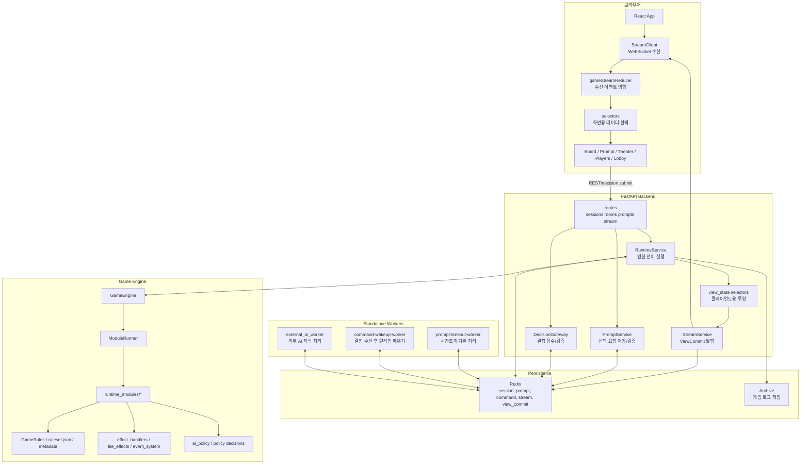
```mermaid
flowchart TB
  subgraph Browser["브라우저"]
    WebApp["React App"]
    StreamClient["StreamClient<br/>WebSocket 수신"]
    Reducer["gameStreamReducer<br/>수신 이벤트 병합"]
    Selectors["selectors<br/>화면용 데이터 선택"]
    UI["Board / Prompt / Theater / Players / Lobby"]
  end

  subgraph Server["FastAPI Backend"]
    Routes["routes<br/>sessions rooms prompts stream"]
    RuntimeService["RuntimeService<br/>엔진 전이 실행"]
    PromptService["PromptService<br/>선택 요청 저장/검증"]
    StreamService["StreamService<br/>ViewCommit 발행"]
    DecisionGateway["DecisionGateway<br/>결정 접수/검증"]
    ViewState["view_state selectors<br/>클라이언트용 투영"]
  end

  subgraph Workers["Standalone Workers"]
    TimeoutWorker["prompt-timeout-worker<br/>시간초과 기본 처리"]
    WakeupWorker["command-wakeup-worker<br/>결정 수신 후 런타임 깨우기"]
    ExternalAIWorker["external_ai_worker<br/>외부 AI 좌석 처리"]
  end

  subgraph Persistence["Persistence"]
    Redis["Redis<br/>session, prompt, command, stream, view_commit"]
    Archive["Archive<br/>게임 로그 저장"]
  end

  subgraph Engine["Game Engine"]
    GameEngine["GameEngine"]
    ModuleRunner["ModuleRunner"]
    RuntimeModules["runtime_modules/*"]
    Rules["GameRules / ruleset.json / metadata"]
    Effects["effect_handlers / tile_effects / event_system"]
    Policy["ai_policy / policy decisions"]
  end

  WebApp --> StreamClient
  StreamClient --> Reducer
  Reducer --> Selectors
  Selectors --> UI

  UI -->|"REST/decision submit"| Routes
  Routes --> RuntimeService
  Routes --> PromptService
  Routes --> DecisionGateway
  RuntimeService --> GameEngine
  GameEngine --> ModuleRunner
  ModuleRunner --> RuntimeModules
  RuntimeModules --> Rules
  RuntimeModules --> Effects
  RuntimeModules --> Policy
  RuntimeService --> ViewState
  ViewState --> StreamService
  StreamService --> Redis
  StreamService --> StreamClient

  PromptService <--> Redis
  DecisionGateway <--> Redis
  RuntimeService <--> Redis
  TimeoutWorker <--> Redis
  WakeupWorker <--> Redis
  ExternalAIWorker <--> Redis
  RuntimeService --> Archive
```

## 4. Session Lifecycle

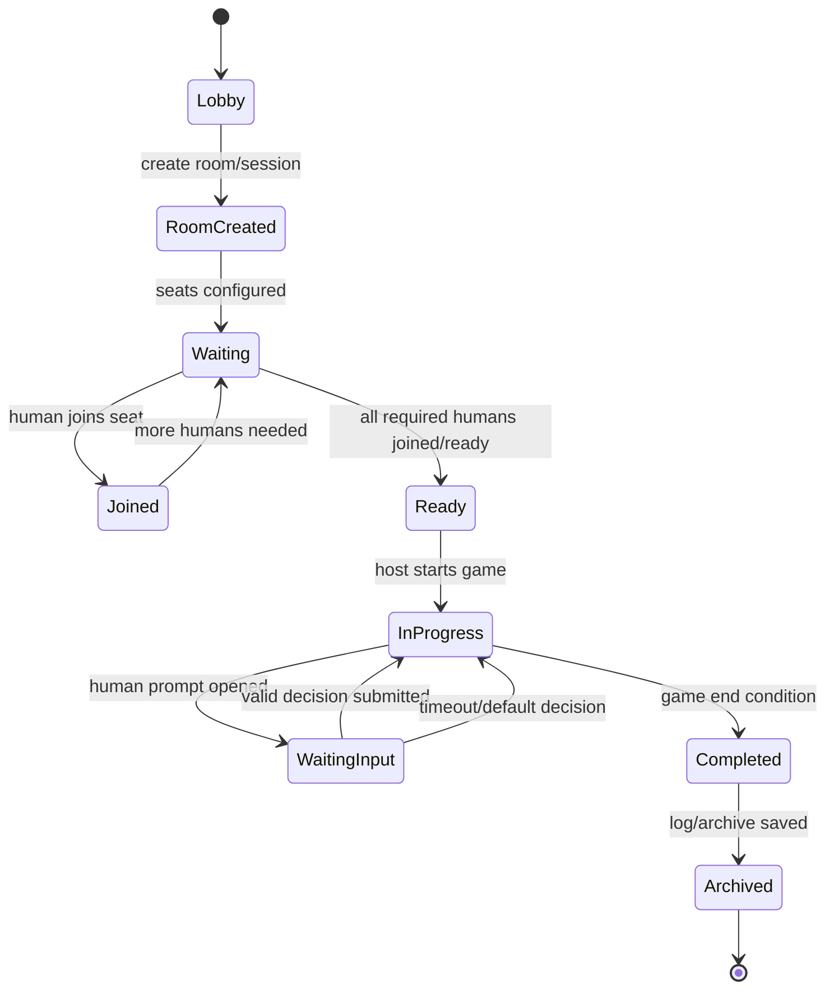
```mermaid
stateDiagram-v2
  [*] --> Lobby
  Lobby --> RoomCreated: create room/session
  RoomCreated --> Waiting: seats configured
  Waiting --> Joined: human joins seat
  Joined --> Waiting: more humans needed
  Waiting --> Ready: all required humans joined/ready
  Ready --> InProgress: host starts game
  InProgress --> WaitingInput: human prompt opened
  WaitingInput --> InProgress: valid decision submitted
  WaitingInput --> InProgress: timeout/default decision
  InProgress --> Completed: game end condition
  Completed --> Archived: log/archive saved
  Archived --> [*]
```

운영 관점:

- `waiting`: 아직 시작 전이다.
- `in_progress`: 엔진이 진행 중이다.
- `waiting_input`: 사람 선택 때문에 멈춰 있다.
- `completed`: 게임 종료다.

## 5. Engine Authority Model

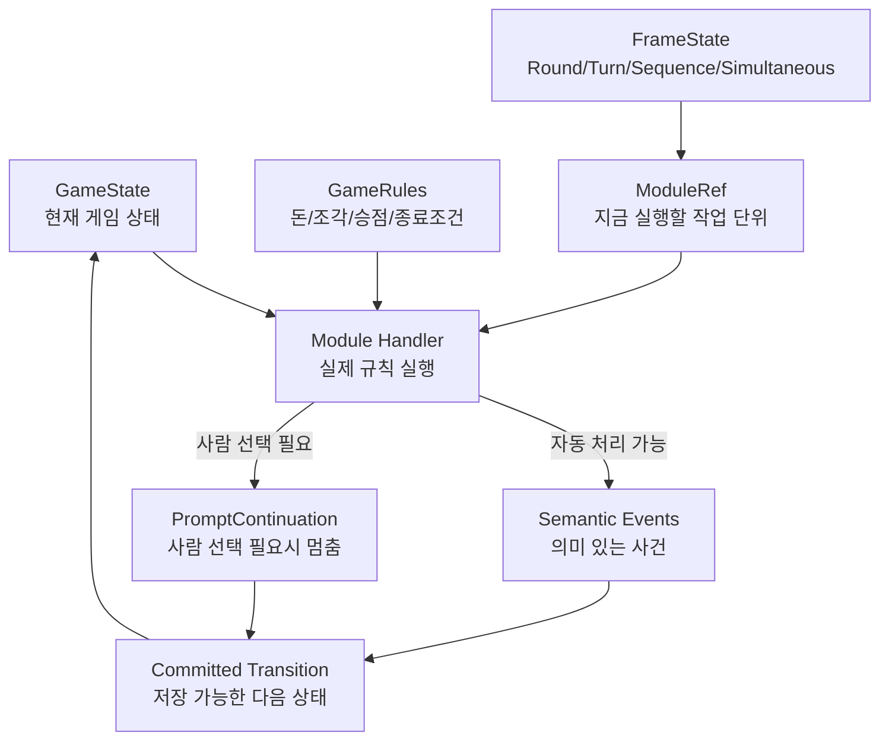
```mermaid
flowchart TD
  State["GameState<br/>현재 게임 상태"]
  Rules["GameRules<br/>돈/조각/승점/종료조건"]
  Frame["FrameState<br/>Round/Turn/Sequence/Simultaneous"]
  Module["ModuleRef<br/>지금 실행할 작업 단위"]
  Handler["Module Handler<br/>실제 규칙 실행"]
  Events["Semantic Events<br/>의미 있는 사건"]
  Prompt["PromptContinuation<br/>사람 선택 필요시 멈춤"]
  Result["Committed Transition<br/>저장 가능한 다음 상태"]

  State --> Handler
  Rules --> Handler
  Frame --> Module
  Module --> Handler
  Handler -->|"자동 처리 가능"| Events
  Handler -->|"사람 선택 필요"| Prompt
  Events --> Result
  Prompt --> Result
  Result --> State
```

핵심:

- 엔진은 한 번에 모든 게임을 끝까지 밀지 않는다.
- 저장 가능한 작은 단계로 나눠서 진행한다.
- 사람이 골라야 하는 선택지가 나오면 `PromptContinuation`을 만들고 멈춘다.
- 나중에 선택이 들어오면 같은 frame/module/cursor에서 다시 시작한다.

## 6. Frame Types

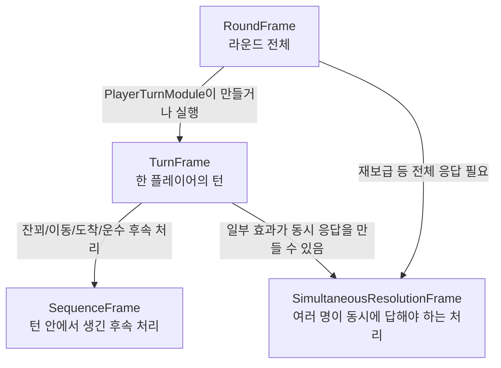
```mermaid
flowchart TD
  RoundFrame["RoundFrame<br/>라운드 전체"]
  TurnFrame["TurnFrame<br/>한 플레이어의 턴"]
  SequenceFrame["SequenceFrame<br/>턴 안에서 생긴 후속 처리"]
  SimFrame["SimultaneousResolutionFrame<br/>여러 명이 동시에 답해야 하는 처리"]

  RoundFrame -->|"PlayerTurnModule이 만들거나 실행"| TurnFrame
  TurnFrame -->|"잔꾀/이동/도착/운수 후속 처리"| SequenceFrame
  RoundFrame -->|"재보급 등 전체 응답 필요"| SimFrame
  TurnFrame -->|"일부 효과가 동시 응답을 만들 수 있음"| SimFrame
```

비유:

- `RoundFrame`: 한 챕터.
- `TurnFrame`: 챕터 안의 한 사람 차례.
- `SequenceFrame`: 그 차례 안에서 꼬리처럼 이어진 사건 묶음.
- `SimultaneousResolutionFrame`: 여러 사람이 동시에 답해야 끝나는 회의실.

## 7. Round Pipeline

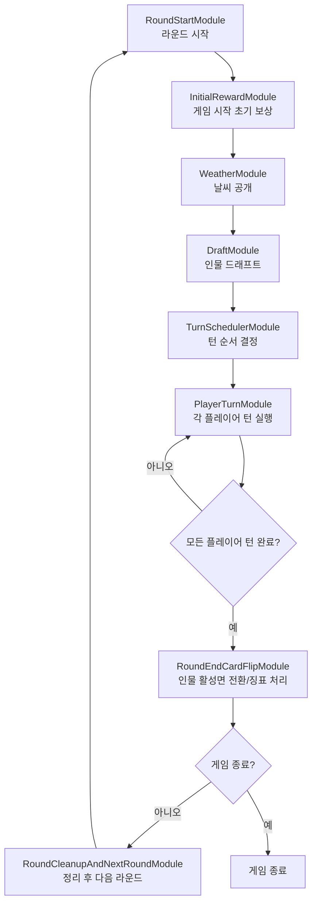
```mermaid
flowchart TD
  R0["RoundStartModule<br/>라운드 시작"]
  R1["InitialRewardModule<br/>게임 시작 초기 보상"]
  R2["WeatherModule<br/>날씨 공개"]
  R3["DraftModule<br/>인물 드래프트"]
  R4["TurnSchedulerModule<br/>턴 순서 결정"]
  R5["PlayerTurnModule<br/>각 플레이어 턴 실행"]
  R6{"모든 플레이어 턴 완료?"}
  R7["RoundEndCardFlipModule<br/>인물 활성면 전환/징표 처리"]
  R8["RoundCleanupAndNextRoundModule<br/>정리 후 다음 라운드"]
  End{"게임 종료?"}

  R0 --> R1 --> R2 --> R3 --> R4 --> R5 --> R6
  R6 -->|"아니오"| R5
  R6 -->|"예"| R7 --> End
  End -->|"아니오"| R8 --> R0
  End -->|"예"| GameEnd["게임 종료"]
```

중요한 순서:

1. 초기 보상은 게임 시작 시에 먼저 처리된다.
2. 날씨는 라운드 시작에 공개된다.
3. 드래프트는 날씨 이후다.
4. 카드 플립과 징표 처리는 라운드 끝이다.
5. 카드 플립은 아직 플레이어 턴이 남아 있으면 절대 실행되면 안 된다.

## 8. Draft Flow

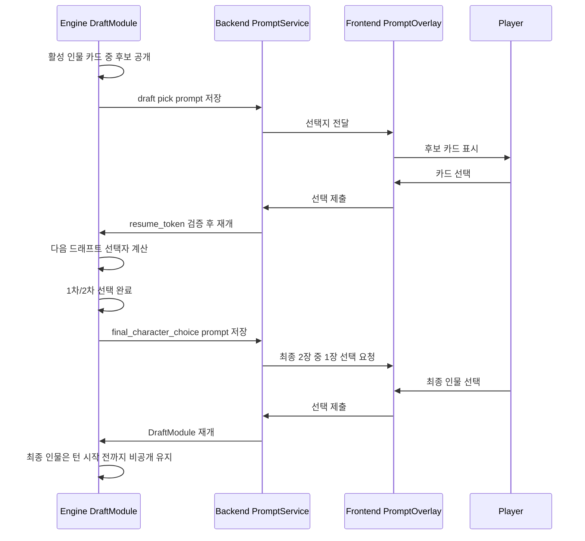
```mermaid
sequenceDiagram
  participant Engine as Engine DraftModule
  participant Server as Backend PromptService
  participant Web as Frontend PromptOverlay
  participant P as Player

  Engine->>Engine: 활성 인물 카드 중 후보 공개
  Engine->>Server: draft pick prompt 저장
  Server->>Web: 선택지 전달
  Web->>P: 후보 카드 표시
  P->>Web: 카드 선택
  Web->>Server: 선택 제출
  Server->>Engine: resume_token 검증 후 재개
  Engine->>Engine: 다음 드래프트 선택자 계산
  Engine->>Engine: 1차/2차 선택 완료
  Engine->>Server: final_character_choice prompt 저장
  Server->>Web: 최종 2장 중 1장 선택 요청
  P->>Web: 최종 인물 선택
  Web->>Server: 선택 제출
  Server->>Engine: DraftModule 재개
  Engine->>Engine: 최종 인물은 턴 시작 전까지 비공개 유지
```

비전문가용 해석:

- 드래프트는 라운드의 준비 단계다.
- 이때 아직 특정 플레이어의 턴이 아니다.
- 그래서 드래프트 이벤트가 현재 턴 진행바를 바꾸면 안 된다.

## 9. Player Turn Pipeline

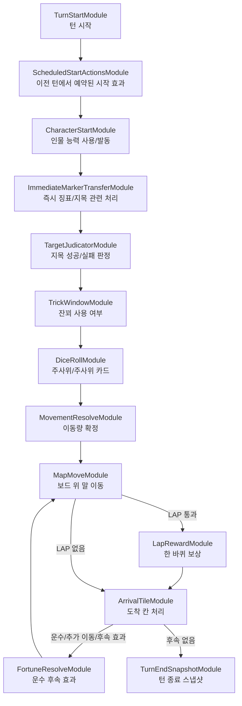
```mermaid
flowchart TD
  T0["TurnStartModule<br/>턴 시작"]
  T1["ScheduledStartActionsModule<br/>이전 턴에서 예약된 시작 효과"]
  T2["CharacterStartModule<br/>인물 능력 사용/발동"]
  T3["ImmediateMarkerTransferModule<br/>즉시 징표/지목 관련 처리"]
  T4["TargetJudicatorModule<br/>지목 성공/실패 판정"]
  T5["TrickWindowModule<br/>잔꾀 사용 여부"]
  T6["DiceRollModule<br/>주사위/주사위 카드"]
  T7["MovementResolveModule<br/>이동량 확정"]
  T8["MapMoveModule<br/>보드 위 말 이동"]
  T9["LapRewardModule<br/>한 바퀴 보상"]
  T10["ArrivalTileModule<br/>도착 칸 처리"]
  T11["FortuneResolveModule<br/>운수 후속 효과"]
  T12["TurnEndSnapshotModule<br/>턴 종료 스냅샷"]

  T0 --> T1 --> T2 --> T3 --> T4 --> T5 --> T6 --> T7 --> T8
  T8 -->|"LAP 통과"| T9 --> T10
  T8 -->|"LAP 없음"| T10
  T10 -->|"운수/추가 이동/후속 효과"| T11 --> T8
  T10 -->|"후속 없음"| T12
```

주의:

- 인물에게 지목당한 효과는 턴 시작 맨 앞에서 처리된다.
- 잔꾀는 인물 능력 후, 주사위 전이다.
- LAP 보상은 이동 중 시작점을 통과했을 때 생긴다.
- 운수 카드가 추가 이동을 만들면 다시 이동/도착 처리가 이어질 수 있다.

## 10. Arrival Flow

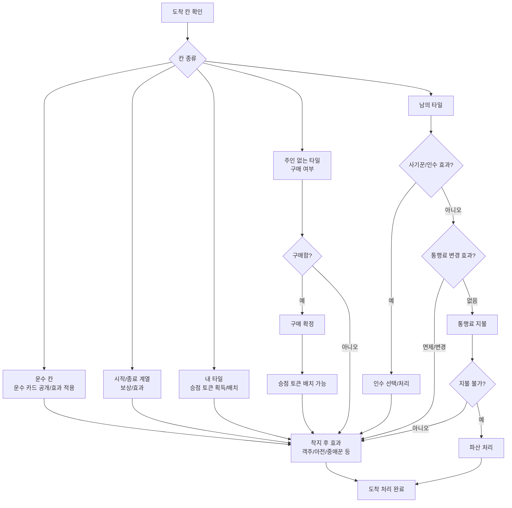
```mermaid
flowchart TD
  A["도착 칸 확인"]
  Type{"칸 종류"}
  Fortune["운수 칸<br/>운수 카드 공개/효과 적용"]
  Start["시작/종료 계열<br/>보상/효과"]
  Own["내 타일<br/>승점 토큰 획득/배치"]
  Empty["주인 없는 타일<br/>구매 여부"]
  Other["남의 타일"]
  Swindler{"사기꾼/인수 효과?"}
  Takeover["인수 선택/처리"]
  RentMod{"통행료 변경 효과?"}
  Rent["통행료 지불"]
  Post["착지 후 효과<br/>객주/아전/중매꾼 등"]
  Done["도착 처리 완료"]

  A --> Type
  Type --> Fortune --> Post
  Type --> Start --> Post
  Type --> Own --> Post
  Type --> Empty --> Buy{"구매함?"}
  Buy -->|"예"| Purchase["구매 확정"] --> Coin["승점 토큰 배치 가능"] --> Post
  Buy -->|"아니오"| Post
  Type --> Other --> Swindler
  Swindler -->|"예"| Takeover --> Post
  Swindler -->|"아니오"| RentMod
  RentMod -->|"면제/변경"| Post
  RentMod -->|"없음"| Rent --> Bankrupt{"지불 불가?"}
  Bankrupt -->|"예"| Bankruptcy["파산 처리"]
  Bankrupt -->|"아니오"| Post
  Post --> Done
  Bankruptcy --> Done
```

비전문가용 해석:

- 같은 칸에 도착해도 결과는 다를 수 있다.
- 인물, 날씨, 운수, 잔꾀, 타일 소유자가 모두 영향을 준다.
- 그래서 프론트엔드가 “이 칸이면 이 효과”처럼 단순 추론하면 위험하다.

## 11. Prompt And Resume Flow

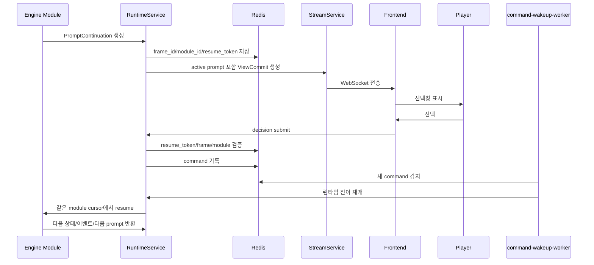
```mermaid
sequenceDiagram
  participant Engine as Engine Module
  participant Runtime as RuntimeService
  participant Redis as Redis
  participant Stream as StreamService
  participant Web as Frontend
  participant Player as Player
  participant Wakeup as command-wakeup-worker

  Engine->>Runtime: PromptContinuation 생성
  Runtime->>Redis: frame_id/module_id/resume_token 저장
  Runtime->>Stream: active prompt 포함 ViewCommit 생성
  Stream->>Web: WebSocket 전송
  Web->>Player: 선택창 표시
  Player->>Web: 선택
  Web->>Runtime: decision submit
  Runtime->>Redis: resume_token/frame/module 검증
  Runtime->>Redis: command 기록
  Wakeup->>Redis: 새 command 감지
  Wakeup->>Runtime: 런타임 전이 재개
  Runtime->>Engine: 같은 module cursor에서 resume
  Engine->>Runtime: 다음 상태/이벤트/다음 prompt 반환
```

중요한 검증값:

- `request_id`
- `resume_token`
- `frame_id`
- `module_id`
- `module_type`
- `module_cursor`
- `request_type`

이 값들이 맞지 않으면 stale decision, 중복 제출, 잘못된 재개가 된다.

## 12. Simultaneous Response Flow

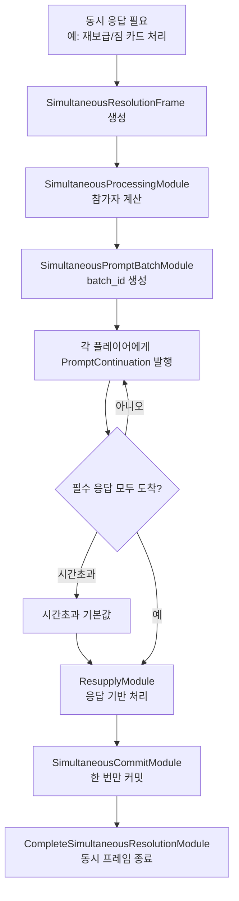
```mermaid
flowchart TD
  S0["동시 응답 필요<br/>예: 재보급/짐 카드 처리"]
  S1["SimultaneousResolutionFrame 생성"]
  S2["SimultaneousProcessingModule<br/>참가자 계산"]
  S3["SimultaneousPromptBatchModule<br/>batch_id 생성"]
  S4["각 플레이어에게 PromptContinuation 발행"]
  S5{"필수 응답 모두 도착?"}
  S6["ResupplyModule<br/>응답 기반 처리"]
  S7["SimultaneousCommitModule<br/>한 번만 커밋"]
  S8["CompleteSimultaneousResolutionModule<br/>동시 프레임 종료"]
  Timeout["시간초과 기본값"]

  S0 --> S1 --> S2 --> S3 --> S4 --> S5
  S5 -->|"아니오"| S4
  S5 -->|"시간초과"| Timeout --> S6
  S5 -->|"예"| S6 --> S7 --> S8
```

동시 응답은 한 명씩 바로 처리하면 안 된다. 모든 필수 응답이 모인 뒤 한 번에 처리해야 공정하고 재시도에도 안전하다.

## 13. Web Frontend Flow

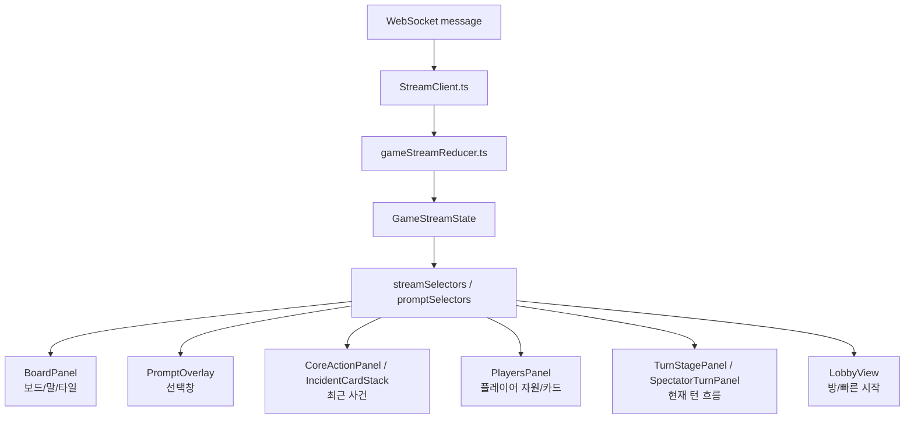
```mermaid
flowchart TD
  WS["WebSocket message"]
  Client["StreamClient.ts"]
  Reducer["gameStreamReducer.ts"]
  State["GameStreamState"]
  Selectors["streamSelectors / promptSelectors"]
  Board["BoardPanel<br/>보드/말/타일"]
  Prompt["PromptOverlay<br/>선택창"]
  Theater["CoreActionPanel / IncidentCardStack<br/>최근 사건"]
  Players["PlayersPanel<br/>플레이어 자원/카드"]
  Stage["TurnStagePanel / SpectatorTurnPanel<br/>현재 턴 흐름"]
  Lobby["LobbyView<br/>방/빠른 시작"]

  WS --> Client --> Reducer --> State --> Selectors
  Selectors --> Board
  Selectors --> Prompt
  Selectors --> Theater
  Selectors --> Players
  Selectors --> Stage
  Selectors --> Lobby
```

프론트엔드의 역할:

- 서버가 준 `view_state`를 우선 믿는다.
- 원시 이벤트 로그를 보고 규칙을 재구성하지 않는다.
- prompt가 있으면 선택지를 보여준다.
- 선택 제출 시 request/resume 정보를 그대로 돌려준다.

## 14. Backend Services Map

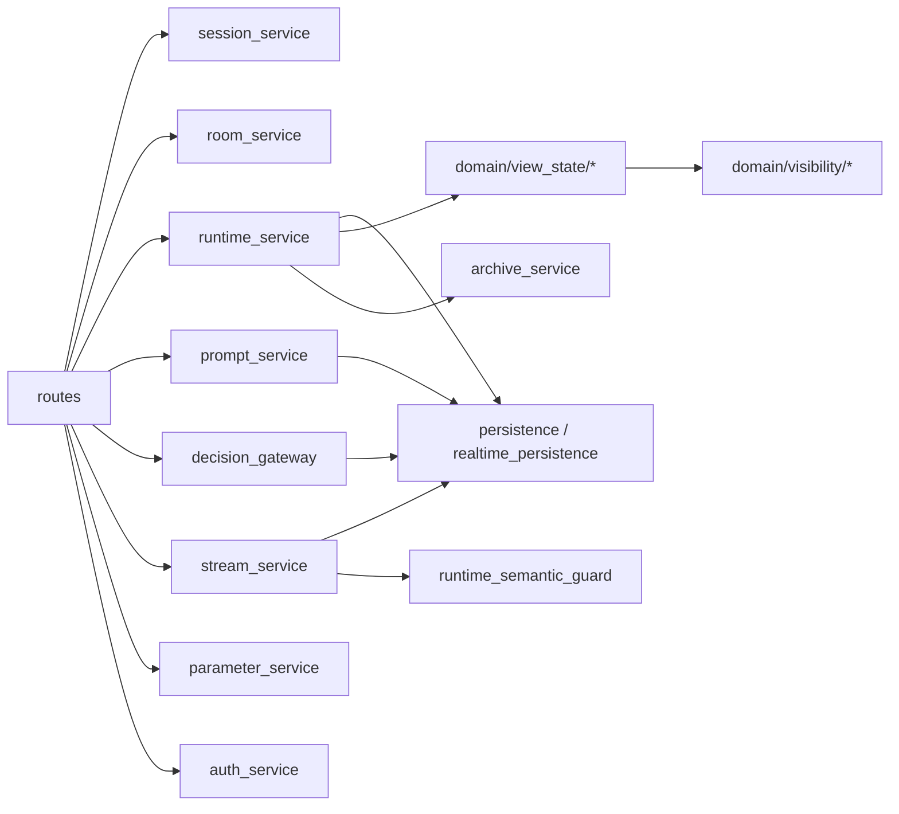
```mermaid
flowchart LR
  Routes["routes"]
  Sessions["session_service"]
  Rooms["room_service"]
  Runtime["runtime_service"]
  Prompt["prompt_service"]
  Decision["decision_gateway"]
  Stream["stream_service"]
  Params["parameter_service"]
  Auth["auth_service"]
  Archive["archive_service"]
  Persistence["persistence / realtime_persistence"]
  ViewState["domain/view_state/*"]
  Visibility["domain/visibility/*"]
  Guard["runtime_semantic_guard"]

  Routes --> Sessions
  Routes --> Rooms
  Routes --> Runtime
  Routes --> Prompt
  Routes --> Decision
  Routes --> Stream
  Routes --> Params
  Routes --> Auth

  Runtime --> Persistence
  Prompt --> Persistence
  Decision --> Persistence
  Stream --> Persistence
  Runtime --> ViewState
  ViewState --> Visibility
  Stream --> Guard
  Runtime --> Archive
```

주요 책임:

| 영역 | 책임 |
| --- | --- |
| `routes/*` | HTTP/WebSocket 입구 |
| `runtime_service.py` | 엔진을 한 단계씩 실행하고 결과를 저장 |
| `prompt_service.py` | prompt continuation 저장/조회 |
| `decision_gateway.py` | 플레이어 선택 제출 검증 |
| `stream_service.py` | ViewCommit을 WebSocket으로 배포 |
| `room_service.py` | 친구방/좌석/준비 상태 |
| `session_service.py` | 게임 세션 생성/조회/시작 |
| `parameter_service.py` | 룰/파라미터 manifest 생성 |
| `domain/view_state/*` | 엔진 상태를 UI가 보기 쉬운 형태로 변환 |
| `runtime_semantic_guard.py` | 말이 안 되는 runtime stream 차단 |

## 15. Engine Module Inventory

이 목록은 `engine/runtime_modules/catalog.py` 기준이다.

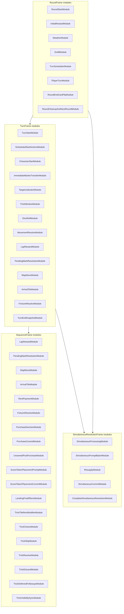
```mermaid
flowchart TB
  subgraph RoundFrame["RoundFrame modules"]
    RoundStartModule
    InitialRewardModule
    WeatherModule
    DraftModule
    TurnSchedulerModule
    PlayerTurnModule
    RoundEndCardFlipModule
    RoundCleanupAndNextRoundModule
  end

  subgraph TurnFrame["TurnFrame modules"]
    TurnStartModule
    ScheduledStartActionsModule
    CharacterStartModule
    ImmediateMarkerTransferModule
    TargetJudicatorModule
    TrickWindowModule
    DiceRollModule
    MovementResolveModule
    LapRewardModule_Turn["LapRewardModule"]
    PendingMarkResolutionModule_Turn["PendingMarkResolutionModule"]
    MapMoveModule_Turn["MapMoveModule"]
    ArrivalTileModule_Turn["ArrivalTileModule"]
    FortuneResolveModule_Turn["FortuneResolveModule"]
    TurnEndSnapshotModule
  end

  subgraph SequenceFrame["SequenceFrame modules"]
    LapRewardModule_Seq["LapRewardModule"]
    PendingMarkResolutionModule_Seq["PendingMarkResolutionModule"]
    MapMoveModule_Seq["MapMoveModule"]
    ArrivalTileModule_Seq["ArrivalTileModule"]
    RentPaymentModule
    FortuneResolveModule_Seq["FortuneResolveModule"]
    PurchaseDecisionModule
    PurchaseCommitModule
    UnownedPostPurchaseModule
    ScoreTokenPlacementPromptModule
    ScoreTokenPlacementCommitModule
    LandingPostEffectsModule
    TrickTileRentModifierModule
    TrickChoiceModule
    TrickSkipModule
    TrickResolveModule
    TrickDiscardModule
    TrickDeferredFollowupsModule
    TrickVisibilitySyncModule
  end

  subgraph SimultaneousFrame["SimultaneousResolutionFrame modules"]
    SimultaneousProcessingModule
    SimultaneousPromptBatchModule
    ResupplyModule
    SimultaneousCommitModule
    CompleteSimultaneousResolutionModule
  end

  RoundFrame --> TurnFrame
  TurnFrame --> SequenceFrame
  RoundFrame --> SimultaneousFrame
  TurnFrame --> SimultaneousFrame
```

### 15.1 RoundFrame Modules

| Module | 쉬운 설명 | 주요 책임 |
| --- | --- | --- |
| `RoundStartModule` | 라운드 문 열기 | 새 라운드 상태를 시작 |
| `InitialRewardModule` | 게임 시작 보상 | 시작 시 20PTS 내 조각/승점/돈 선택 처리 |
| `WeatherModule` | 날씨 공개 | 라운드 공용 날씨 카드 공개 |
| `DraftModule` | 인물 고르기 | 1차/2차 드래프트와 최종 인물 선택 |
| `TurnSchedulerModule` | 순서표 만들기 | 인물 우선권 기준 턴 순서 계산 |
| `PlayerTurnModule` | 한 사람 턴 실행 | 각 플레이어 턴 frame을 실행 |
| `RoundEndCardFlipModule` | 라운드 끝 카드/징표 처리 | 교리 인물에 따른 징표/활성면 전환 |
| `RoundCleanupAndNextRoundModule` | 다음 라운드 준비 | 정리 후 다음 round frame 준비 |

### 15.2 TurnFrame Modules

| Module | 쉬운 설명 | 주요 책임 |
| --- | --- | --- |
| `TurnStartModule` | 턴 시작 | 현재 actor와 턴 context 시작 |
| `ScheduledStartActionsModule` | 예약 효과 | 이전 턴에서 예약된 시작 효과 처리 |
| `CharacterStartModule` | 인물 능력 | 선택한 인물 능력 발동 또는 prompt |
| `ImmediateMarkerTransferModule` | 즉시 지목/징표 처리 | 즉시 반영할 mark/marker 관련 처리 |
| `TargetJudicatorModule` | 지목 판정 | 지목이 맞았는지, 누구에게 적용되는지 결정 |
| `TrickWindowModule` | 잔꾀 사용창 | 잔꾀를 쓸지 묻고 trick sequence 시작 |
| `DiceRollModule` | 주사위 | 주사위 카드/추가 주사위/이동량 계산 |
| `MovementResolveModule` | 이동 확정 | 이동 명령을 action sequence로 넘김 |
| `LapRewardModule` | LAP 보상 | 시작점 통과 보상 선택/적용 |
| `PendingMarkResolutionModule` | 지목 후속 처리 | 피지목자 턴 시작 효과 등 |
| `MapMoveModule` | 말 이동 | 보드 좌표 이동 |
| `ArrivalTileModule` | 도착 칸 | 운수/타일/시작칸/남의 땅 분기 |
| `FortuneResolveModule` | 운수 효과 | 운수 카드 효과와 후속 이동/효과 |
| `TurnEndSnapshotModule` | 턴 닫기 | 턴 종료 상태를 확정 |

### 15.3 SequenceFrame Modules

| Module | 쉬운 설명 | 주요 책임 |
| --- | --- | --- |
| `RentPaymentModule` | 통행료 | 남의 타일 통행료와 파산 가능성 처리 |
| `PurchaseDecisionModule` | 구매 질문 | 살 수 있는 타일 구매 여부 prompt |
| `PurchaseCommitModule` | 구매 확정 | 돈 차감, 소유권 변경 |
| `UnownedPostPurchaseModule` | 미구매 후 처리 | 사지 않았거나 살 수 없을 때 후속 처리 |
| `ScoreTokenPlacementPromptModule` | 승점 토큰 배치 질문 | 내 타일 등에 토큰을 놓을지 묻기 |
| `ScoreTokenPlacementCommitModule` | 승점 토큰 배치 확정 | 실제 토큰 배치 |
| `LandingPostEffectsModule` | 도착 후 효과 | 객주/아전/중매꾼 등 후처리 |
| `TrickTileRentModifierModule` | 잔꾀 통행료 변경 | 통행료 면제/변경 잔꾀 처리 |
| `TrickChoiceModule` | 잔꾀 선택 | 공개/비공개 잔꾀 선택 |
| `TrickSkipModule` | 잔꾀 건너뛰기 | 사용하지 않음 처리 |
| `TrickResolveModule` | 잔꾀 효과 | 잔꾀 카드 효과 적용 |
| `TrickDiscardModule` | 잔꾀 버림 | 사용한 카드 제거 |
| `TrickDeferredFollowupsModule` | 잔꾀 후속 | 잔꾀가 만든 추가 처리 |
| `TrickVisibilitySyncModule` | 잔꾀 공개상태 동기화 | 히든/공개 카드 상태 정리 |

일부 모듈은 TurnFrame과 SequenceFrame 양쪽에 들어갈 수 있다. 예를 들면 `MapMoveModule`, `ArrivalTileModule`, `FortuneResolveModule`은 기본 이동에도 쓰이고, 운수/잔꾀가 만든 후속 이동에도 쓰인다.

### 15.4 SimultaneousResolutionFrame Modules

| Module | 쉬운 설명 | 주요 책임 |
| --- | --- | --- |
| `SimultaneousProcessingModule` | 동시 처리 준비 | 응답 대상자와 조건 계산 |
| `SimultaneousPromptBatchModule` | 일괄 prompt | batch_id로 여러 명 prompt 생성 |
| `ResupplyModule` | 보급/짐 처리 | 모든 응답을 모아 재보급 처리 |
| `SimultaneousCommitModule` | 일괄 확정 | 결과를 한 번만 커밋 |
| `CompleteSimultaneousResolutionModule` | 동시 처리 종료 | simultaneous frame 닫기 |

## 16. Action Type To Module Map

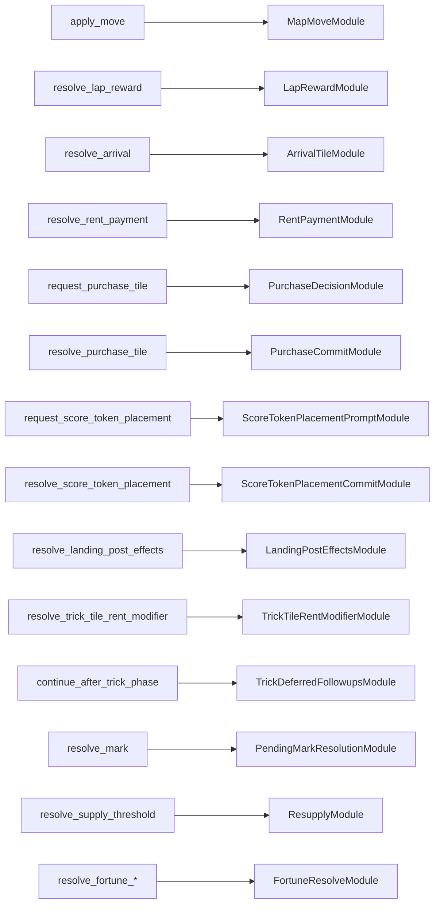
```mermaid
flowchart LR
  apply_move["apply_move"] --> MapMoveModule
  resolve_lap_reward["resolve_lap_reward"] --> LapRewardModule
  resolve_arrival["resolve_arrival"] --> ArrivalTileModule
  resolve_rent_payment["resolve_rent_payment"] --> RentPaymentModule
  request_purchase_tile["request_purchase_tile"] --> PurchaseDecisionModule
  resolve_purchase_tile["resolve_purchase_tile"] --> PurchaseCommitModule
  request_score_token_placement["request_score_token_placement"] --> ScoreTokenPlacementPromptModule
  resolve_score_token_placement["resolve_score_token_placement"] --> ScoreTokenPlacementCommitModule
  resolve_landing_post_effects["resolve_landing_post_effects"] --> LandingPostEffectsModule
  resolve_trick_tile_rent_modifier["resolve_trick_tile_rent_modifier"] --> TrickTileRentModifierModule
  continue_after_trick_phase["continue_after_trick_phase"] --> TrickDeferredFollowupsModule
  resolve_mark["resolve_mark"] --> PendingMarkResolutionModule
  resolve_supply_threshold["resolve_supply_threshold"] --> ResupplyModule
  resolve_fortune["resolve_fortune_*"] --> FortuneResolveModule
```

설명:

- action type은 “해야 할 일의 이름”이다.
- runtime module은 “그 일을 안전하게 실행하는 담당자”다.
- 모르는 action type은 실행하면 안 된다. 먼저 catalog와 계약 문서에 추가해야 한다.

## 17. Prompt Type To Owner Module Map

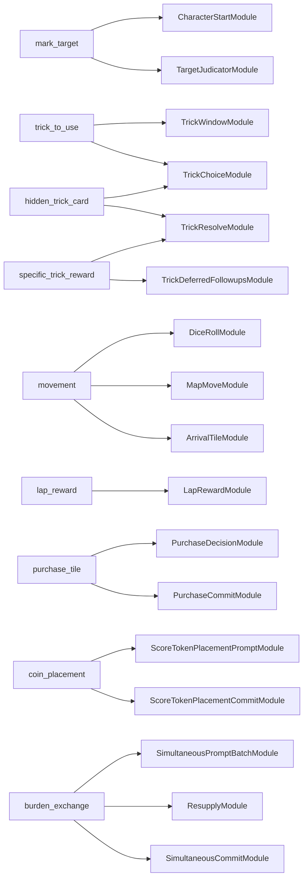
```mermaid
flowchart LR
  mark_target["mark_target"] --> CharacterStartModule
  mark_target --> TargetJudicatorModule

  trick_to_use["trick_to_use"] --> TrickWindowModule
  trick_to_use --> TrickChoiceModule

  hidden_trick_card["hidden_trick_card"] --> TrickChoiceModule
  hidden_trick_card --> TrickResolveModule

  specific_trick_reward["specific_trick_reward"] --> TrickResolveModule
  specific_trick_reward --> TrickDeferredFollowupsModule

  movement["movement"] --> DiceRollModule
  movement --> MapMoveModule
  movement --> ArrivalTileModule

  lap_reward["lap_reward"] --> LapRewardModule
  purchase_tile["purchase_tile"] --> PurchaseDecisionModule
  purchase_tile --> PurchaseCommitModule
  coin_placement["coin_placement"] --> ScoreTokenPlacementPromptModule
  coin_placement --> ScoreTokenPlacementCommitModule
  burden_exchange["burden_exchange"] --> SimultaneousPromptBatchModule
  burden_exchange --> ResupplyModule
  burden_exchange --> SimultaneousCommitModule
```

프론트엔드가 prompt를 볼 때 알아야 하는 것:

- `request_type`은 화면 종류다.
- `module_type`은 실제 규칙 담당자다.
- 같은 `request_type`이라도 어느 module에서 왔는지에 따라 의미가 다를 수 있다.
- 그래서 decision submit에는 module identity를 반드시 돌려줘야 한다.

## 18. Rule And Effect Data Flow

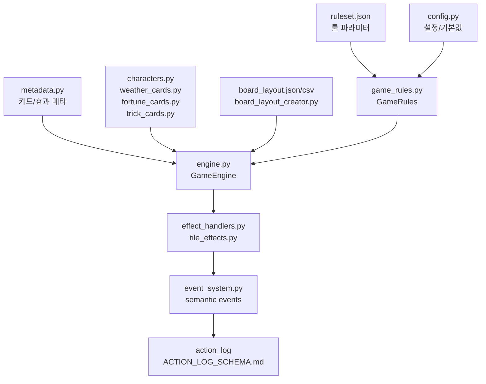
```mermaid
flowchart TD
  Ruleset["ruleset.json<br/>룰 파라미터"]
  GameRules["game_rules.py<br/>GameRules"]
  Config["config.py<br/>설정/기본값"]
  Metadata["metadata.py<br/>카드/효과 메타"]
  Cards["characters.py<br/>weather_cards.py<br/>fortune_cards.py<br/>trick_cards.py"]
  Board["board_layout.json/csv<br/>board_layout_creator.py"]
  Engine["engine.py<br/>GameEngine"]
  Effects["effect_handlers.py<br/>tile_effects.py"]
  Events["event_system.py<br/>semantic events"]
  Logs["action_log<br/>ACTION_LOG_SCHEMA.md"]

  Ruleset --> GameRules
  Config --> GameRules
  Metadata --> Engine
  Cards --> Engine
  Board --> Engine
  GameRules --> Engine
  Engine --> Effects
  Effects --> Events
  Events --> Logs
```

비전문가용 해석:

- `ruleset.json`: 숫자와 설정의 원천.
- `GameRules`: 설정을 코드에서 쓰기 좋은 형태로 만든 규칙 묶음.
- 카드/보드/메타데이터: 게임 세계의 재료.
- effect handlers: 실제로 돈을 주고 빼고, 이동시키고, 카드를 처리하는 손.
- action log: 나중에 왜 그런 일이 벌어졌는지 확인하는 기록.

## 19. AI Decision Flow

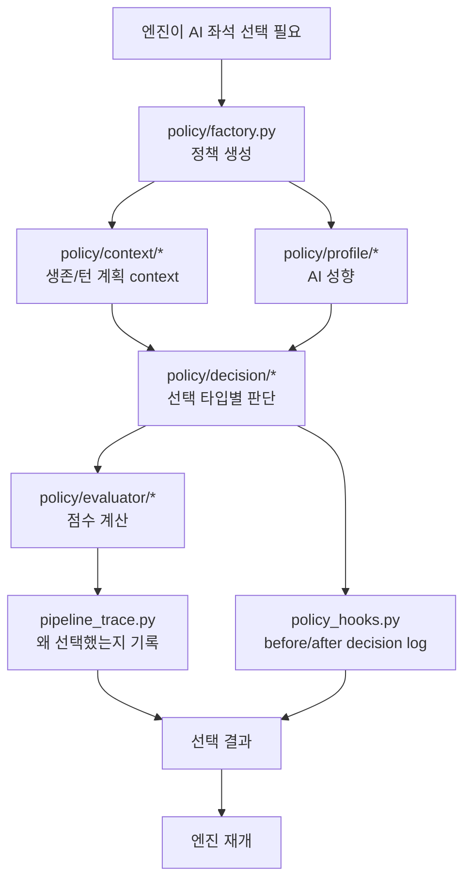
```mermaid
flowchart TD
  PromptNeed["엔진이 AI 좌석 선택 필요"]
  PolicyFactory["policy/factory.py<br/>정책 생성"]
  Profile["policy/profile/*<br/>AI 성향"]
  Context["policy/context/*<br/>생존/턴 계획 context"]
  DecisionModules["policy/decision/*<br/>선택 타입별 판단"]
  Evaluators["policy/evaluator/*<br/>점수 계산"]
  Trace["pipeline_trace.py<br/>왜 선택했는지 기록"]
  Hook["policy_hooks.py<br/>before/after decision log"]
  Choice["선택 결과"]
  Engine["엔진 재개"]

  PromptNeed --> PolicyFactory
  PolicyFactory --> Profile
  PolicyFactory --> Context
  Context --> DecisionModules
  Profile --> DecisionModules
  DecisionModules --> Evaluators
  Evaluators --> Trace
  DecisionModules --> Hook
  Trace --> Choice
  Hook --> Choice
  Choice --> Engine
```

현재 AI는 규칙 기반 휴리스틱 정책이 중심이다. 강화학습 계획은 이 흐름을 바로 갈아엎는 것이 아니라, 선택 점수에 학습된 보너스/페널티를 제한적으로 더하는 방향이다.

## 20. Observability And Replay Flow

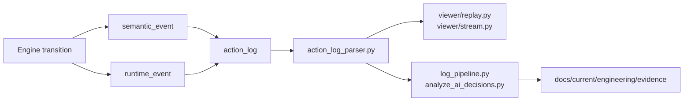
```mermaid
flowchart LR
  Engine["Engine transition"]
  Semantic["semantic_event"]
  RuntimeEvent["runtime_event"]
  ActionLog["action_log"]
  Parser["action_log_parser.py"]
  Replay["viewer/replay.py<br/>viewer/stream.py"]
  Analysis["log_pipeline.py<br/>analyze_ai_decisions.py"]
  Evidence["docs/current/engineering/evidence"]

  Engine --> Semantic
  Engine --> RuntimeEvent
  Semantic --> ActionLog
  RuntimeEvent --> ActionLog
  ActionLog --> Parser
  Parser --> Replay
  Parser --> Analysis
  Analysis --> Evidence
```

이 흐름은 QA와 AI 개선에 중요하다.

- replay는 사람이 게임을 다시 보는 용도다.
- analysis는 어떤 선택이 좋았는지 나빴는지 통계로 보는 용도다.
- live UI는 replay를 근거로 빈 상태를 채우면 안 된다. live UI는 Redis에 저장된 최신 ViewCommit을 믿어야 한다.

## 21. End Condition Flow

```mermaid
flowchart TD
  Check["game.end.evaluate"]
  F["승점 기준<br/>f_threshold"]
  Monopoly["독점 기준<br/>monopolies_to_trigger_end"]
  Tiles["타일 수 기준<br/>tiles_to_trigger_end"]
  Alive["생존자 수 기준<br/>alive_players_at_most"]
  Bankrupt["파산"]
  Continue["게임 계속"]
  End["게임 종료"]

  Check --> F
  Check --> Monopoly
  Check --> Tiles
  Check --> Alive
  Check --> Bankrupt
  F -->|"충족"| End
  Monopoly -->|"충족"| End
  Tiles -->|"충족"| End
  Alive -->|"충족"| End
  Bankrupt -->|"지불 불가/탈락 처리"| Alive
  F -->|"미충족"| Continue
  Monopoly -->|"미충족"| Continue
  Tiles -->|"미충족"| Continue
  Alive -->|"미충족"| Continue
```

종료 조건은 하나만 있는 것이 아니다. 돈, 타일, 승점, 독점, 생존자 수가 모두 게임 종료에 연결될 수 있다.

## 22. Common Failure Modes

```mermaid
flowchart TD
  Bad["흔한 오류"]
  W["날씨 pending인데 draft 시작"]
  D["draft 이벤트가 turn_stage를 오염"]
  R["RoundEndCardFlip이 턴 중 실행"]
  P["prompt resume_token 불일치"]
  S["동시 응답을 한 명씩 커밋"]
  A["알 수 없는 action type 실행"]
  F["프론트가 raw event로 규칙 재추론"]

  Bad --> W
  Bad --> D
  Bad --> R
  Bad --> P
  Bad --> S
  Bad --> A
  Bad --> F
```

각 오류의 의미:

| 오류 | 왜 위험한가 |
| --- | --- |
| 날씨 pending인데 draft 시작 | 라운드 준비 순서가 깨짐 |
| draft가 turn_stage 변경 | 아직 특정 플레이어 턴이 아닌데 턴 UI가 오염됨 |
| 라운드 카드 플립이 턴 중 실행 | 다음 라운드 준비가 너무 빨리 시작됨 |
| resume_token 불일치 | 오래된 선택이나 중복 선택이 현재 게임을 망가뜨림 |
| 동시 응답을 한 명씩 커밋 | 공정성과 재시도 안정성이 깨짐 |
| 알 수 없는 action type 실행 | 담당 모듈이 없는 규칙 분기가 생김 |
| 프론트가 규칙 재추론 | 엔진과 화면이 서로 다른 게임을 보여줄 수 있음 |

## 23. File-To-Concept Map

### Engine

| 파일/디렉터리 | 개념 |
| --- | --- |
| `engine/engine.py` | 게임 진행 최종 권한 |
| `engine/state.py` | 게임 상태 구조 |
| `engine/game_rules.py` | 규칙 파라미터 구조 |
| `engine/ruleset.json` | 현재 룰 숫자/메타 설정 |
| `engine/runtime_modules/` | round/turn/sequence/simultaneous 실행 단위 |
| `engine/runtime_modules/catalog.py` | module이 어느 frame에 들어갈 수 있는지 catalog |
| `engine/effect_handlers.py` | 돈/이동/카드/효과 실제 처리 |
| `engine/tile_effects.py` | 타일 효과 |
| `engine/event_system.py` | semantic event dispatch |
| `engine/policy/decision/*` | AI 선택 타입별 판단 |
| `engine/policy_hooks.py` | AI decision trace hook |
| `engine/log_pipeline.py` | simulation log 분석 |

### Backend

| 파일/디렉터리 | 개념 |
| --- | --- |
| `apps/server/src/app.py` | FastAPI 앱 |
| `apps/server/src/routes/sessions.py` | 세션 REST API |
| `apps/server/src/routes/rooms.py` | 방 REST API |
| `apps/server/src/routes/prompts.py` | prompt/decision API |
| `apps/server/src/routes/stream.py` | WebSocket stream |
| `apps/server/src/services/runtime_service.py` | 엔진 전이 실행 |
| `apps/server/src/services/prompt_service.py` | prompt 저장/조회 |
| `apps/server/src/services/decision_gateway.py` | 선택 제출 검증 |
| `apps/server/src/services/stream_service.py` | ViewCommit 발행 |
| `apps/server/src/domain/view_state/*` | UI용 상태 투영 |
| `apps/server/src/domain/runtime_semantic_guard.py` | runtime stream guard |
| `apps/server/src/workers/*` | timeout/wakeup worker |

### Frontend

| 파일/디렉터리 | 개념 |
| --- | --- |
| `apps/web/src/App.tsx` | 앱 최상위 route/state 연결 |
| `apps/web/src/infra/ws/StreamClient.ts` | WebSocket client |
| `apps/web/src/domain/store/gameStreamReducer.ts` | stream state reducer |
| `apps/web/src/domain/selectors/*` | 화면별 데이터 선택 |
| `apps/web/src/features/lobby/LobbyView.tsx` | 로비 |
| `apps/web/src/features/board/BoardPanel.tsx` | 보드 |
| `apps/web/src/features/prompt/PromptOverlay.tsx` | 선택창 |
| `apps/web/src/features/stage/*` | 현재 턴/관전자 패널 |
| `apps/web/src/features/theater/*` | 사건 연출/로그 |
| `apps/web/src/features/players/*` | 플레이어 상태 |

## 24. Reading Order For New Contributors

```mermaid
flowchart TD
  A["이 문서"]
  B["docs/current/Game-Rules.md"]
  C["docs/current/runtime/end-to-end-contract.md"]
  D["docs/current/runtime/round-action-control-matrix.md"]
  E["engine/engine.md"]
  F["engine/runtime_modules/catalog.py"]
  G["apps/server/README.md"]
  H["docs/current/api/online-game-api-spec.md"]
  I["apps/web/README.md"]

  A --> B --> C --> D --> E --> F --> G --> H --> I
```

추천:

- 기획/QA는 1-12장만 읽어도 전체 흐름을 이해할 수 있다.
- 프론트엔드 작업자는 11-14장, 17장, 23장을 더 읽어야 한다.
- 백엔드/엔진 작업자는 15-18장, 22-24장을 반드시 읽어야 한다.

## 25. Maintenance Rule

이 문서는 다음 변경이 있을 때 함께 갱신해야 한다.

- `engine/runtime_modules/catalog.py`에 모듈 추가/삭제
- prompt `request_type` 추가/삭제
- action type 추가/삭제
- 라운드/턴 순서 변경
- 초기 보상/LAP 보상/드래프트/날씨 순서 변경
- 서버 ViewCommit 구조 변경
- 프론트엔드가 소비하는 `view_state` 구조 변경

갱신하지 않으면 비전문가용 문서가 오히려 잘못된 지도가 된다. 이 문서는 보기 좋기 위한 그림이 아니라, 현재 게임 구조를 이해하기 위한 운영 문서다.
