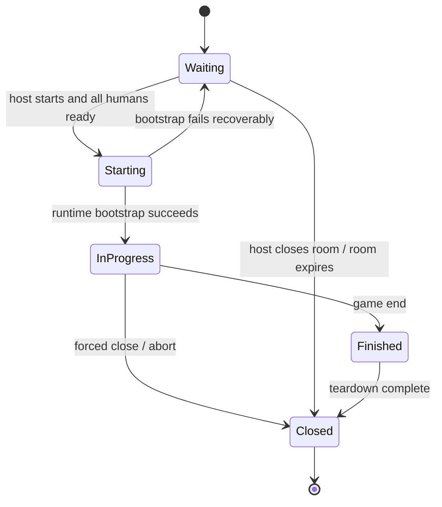

# [PLAN] Room Server / Client / Electron Architecture

Status: ACTIVE  
Updated: 2026-04-16  
Scope: server / web client / desktop client / auth / room lifecycle

## Purpose

This document defines the target architecture for the next multiplayer phase:

- dedicated server and client separation
- human-vs-human friendly room flow
- ready/start custom lobby behavior
- room-scoped authentication and reconnection
- Electron-packaged standalone client

This plan replaces the current assumption that the web app and game server behave like one local tool.

---

## Product Goal

The user-facing experience should become:

1. launch a standalone MRN client
2. enter a server address
3. browse existing rooms or create a new room
4. join a room by room list or room number
5. choose a nickname when entering the room
6. mark ready
7. host starts the match when all required players are ready
8. play the game
9. if disconnected, reconnect back into the room or running match
10. when the game ends, the room disappears and all room/game tokens become invalid

The client should not expose host tokens, join tokens, or local dev bootstrap concepts to regular players.

---

## Benchmark Direction

This design follows commercial lobby patterns rather than the current debug-first bootstrap flow.

Reference patterns:

- Jackbox: room-code-first join flow and low-friction player entry
- Minecraft: explicit server address input / saved server list
- Asmodee / board-game lobbies: host-owned table, seat occupancy, ready/start flow
- party games such as Pummel Party / Party Animals: custom room + ready + host start

The important benchmark behaviors are:

- connect to a server first
- join a room, not a raw runtime session
- show a clear room identity
- treat ready state as first-class room state
- hide implementation tokens from normal players

---

## Current Problem Summary

Today the project is still structurally centered around a single `session` object:

- the web client directly creates sessions
- the web client directly receives `host_token` / `join_tokens`
- the lobby UI exposes debug/bootstrap concepts
- HTTP and WS assume same-origin relative paths
- there is no proper room lifecycle above gameplay runtime
- the browser app is the only supported client shell

This is fine for development, but it is not a good shape for real human-vs-human multiplayer.

---

## Design Principles

1. A room is a social object. A game session is an execution object.
2. The client should be server-address driven, not same-origin driven.
3. Authentication should be room-scoped and short-lived.
4. Tokens must die when the room or match dies.
5. The Electron app is a shell around the same renderer contract, not a second gameplay UI.
6. Existing game runtime and selector investment should be reused whenever possible.
7. Debug/bootstrap affordances should move behind developer-only mode, not remain the default UX.

---

## Core Domain Split

### Room

A room exists before gameplay starts and owns lobby behavior.

Required fields:

- `room_no: int`
- `room_title: str`
- `status: waiting | starting | in_progress | finished | closed`
- `host_seat: int`
- `visibility: public | private`
- `created_at`
- `server_name` or server-local metadata as needed
- `member_tokens`
- `seats`
- `ready_by_seat`
- `active_session_id: str | None`

### Game Session

A game session is created from a room when the host presses start.

Required fields:

- `session_id`
- `room_no`
- `status`
- `runtime status`
- `resolved parameters`
- `stream buffer`
- `session-scoped tokens or token claims`

### Seat

A seat must become room-aware before it becomes gameplay-aware.

Required fields:

- `seat`
- `seat_type: human | ai`
- `player_id | None`
- `nickname`
- `connected`
- `ready`
- `participant_client`
- `participant_config`

### Tokens

Two token scopes are recommended:

- `room_member_token`
  - issued on room create/join
  - used for room resume, ready toggle, lobby membership validation
- `game_session_token`
  - issued or activated on game start
  - used for gameplay websocket authorization and prompt submission

The implementation may internally reuse one token structure with claims, but the external contract should still behave as if room and gameplay permissions are separate phases.

---

## Room Number And Room Title Rules

### Room Number

- server-global monotonic integer
- never reused
- persists across room deletion and server restart if persistence is enabled
- deletion of room does not decrement the counter

### Room Title

- required on room creation
- unique among active rooms on the same server
- case-insensitive uniqueness is recommended
- once the room is deleted, the title may be reused

Recommended room identity shown to users:

- primary: room title
- secondary: `#room_no`

Example:

- `Moonlight Draft #1042`

---

## Room Lifecycle

### Waiting

- players may join
- players may leave
- humans may toggle ready
- AI seats are implicitly ready
- host may edit room-local settings if allowed

### Starting

- room state is locked for seat topology changes
- runtime session is being created
- gameplay tokens are activated

### In Progress

- no new seat joins
- reconnection is allowed for existing room members
- gameplay stream is active

### Finished / Closed

- room no longer appears in room search
- tokens become invalid immediately
- client should return to server lobby

---

## Server Responsibilities

The dedicated server should own the following surfaces.

### 1. Server Bootstrap

- health/version endpoint
- server name / message-of-the-day / optional region label
- room list query

### 2. Room Service

- create room
- enforce title uniqueness
- allocate room number
- manage room membership
- manage ready state
- validate host start
- remove room on game end

### 3. Session Runtime Service

- create gameplay runtime from a room
- keep existing prompt/runtime/stream pipeline where possible
- publish room-level state transitions

### 4. Auth Service

- mint room membership tokens
- validate room resume
- validate gameplay stream access
- revoke tokens on room deletion or game end

### 5. Stream Service

- room lobby updates
- gameplay stream updates
- reconnect / replay handling

---

## Recommended Server API Shape

### Server bootstrap

- `GET /api/v1/server/info`
- `GET /api/v1/server/capabilities`

### Room lifecycle

- `POST /api/v1/rooms`
  - includes host nickname
- `GET /api/v1/rooms`
- `GET /api/v1/rooms/{room_no}`
- `POST /api/v1/rooms/{room_no}/join`
  - includes nickname
- `POST /api/v1/rooms/{room_no}/leave`
- `POST /api/v1/rooms/{room_no}/ready`
- `POST /api/v1/rooms/{room_no}/start`
- `GET /api/v1/rooms/{room_no}/resume`

### Gameplay bootstrap

- `GET /api/v1/rooms/{room_no}/session`
- `GET /api/v1/rooms/{room_no}/runtime-status`
- `GET /api/v1/rooms/{room_no}/replay`

### WebSocket

Two valid patterns exist.

Pattern A: separate channels

- `WS /api/v1/rooms/{room_no}/lobby-stream`
- `WS /api/v1/rooms/{room_no}/game-stream`

Pattern B: single room-rooted stream with phase switching

- `WS /api/v1/rooms/{room_no}/stream`

Recommended choice:

- use Pattern B first
- keep the internal runtime stream service as session-based
- adapt the route layer so the external contract remains room-based

This minimizes rewrite cost while still giving the client a clean room-centered model.

---

## Auth And Reconnection Policy

### Client storage

Allowed:

- in-memory state
- `sessionStorage`
- temporary cookie if necessary

Not recommended as canonical state:

- long-lived persistent local token cache for active game access

### Token invalidation rules

Tokens must become invalid when:

- room does not exist
- room has finished and been closed
- member is removed from room
- server explicitly rotates room membership
- gameplay session is no longer active

### Reconnection flow

1. client boots
2. user enters server address
3. client restores known room membership from session storage
4. client calls `GET /rooms/{room_no}/resume`
5. if valid, re-enter room or running game
6. if invalid, delete token locally and show normal lobby UI

The important product rule is:

- a stale token should fail cleanly and disappear
- the user should not be forced to manually clear broken auth state

---

## Client Architecture

The current browser client should be refactored into four layers.

### 1. Shell layer

Responsibilities:

- server address selection
- recent servers
- top-level route selection
- desktop-specific affordances when running in Electron

### 2. Transport layer

Current files to evolve:

- `apps/web/src/infra/http/sessionApi.ts`
- `apps/web/src/infra/ws/StreamClient.ts`

Target behavior:

- base URL injection
- no same-origin assumption
- room-based endpoints
- auth headers/query handling from room/session token state

### 3. Room domain layer

New responsibility:

- room list
- room details
- ready state
- membership state
- host controls

This should not be mixed directly into gameplay renderer state.

### 4. Game domain layer

Mostly existing systems, preserved:

- stream reducer
- selectors
- prompt overlay
- board renderer
- replay/resume handling

The gameplay UI should receive:

- room context
- gameplay token
- stream endpoint

without needing to know how room creation or join happened.

---

## Lobby UX Specification

### First screen: Connect to server

Show:

- server address field
- connect button
- recent servers
- optional server alias labels

Do not show:

- raw session ids
- host tokens
- join tokens
- developer bootstrap buttons

### Server lobby

Show:

- room list
- create room CTA
- join by room number
- refresh
- search by room title / room number

Each room row should show:

- room title
- room number
- occupancy
- status
- whether the game is already in progress

### Room lobby

Show:

- room title and room number
- seat cards
- nickname for occupied human seats
- ready badges
- AI always-ready badge
- host badge
- start button for host only
- leave room button

Behavior:

- human players must provide a nickname before room join completes
- human players press ready
- AI seats remain ready at all times
- host start becomes enabled only when every required human seat is ready

### Nickname rules

- nickname is chosen during room create or room join
- nickname belongs to room membership state, not only renderer-local state
- nickname must be present in room payloads, gameplay bootstrap payloads, and player view state
- the player strip and in-game player cards should show nickname as the primary text
- seat labels such as `P1`, `P2` remain secondary metadata
- reconnect should restore the same nickname for the same room membership
- when a room disappears, the local nickname/token pair for that room is discarded

---

## Electron Client Architecture

The standalone client should be an Electron shell around the same renderer product.

### Target structure

Recommended app layout:

- `apps/web`
  - renderer application
- `apps/desktop`
  - `main`
  - `preload`
  - packaging config

### Main process responsibilities

- native window creation
- app menu
- external link handling
- saved server profile storage
- optional auto-update integration later

### Preload responsibilities

- expose safe IPC only
- get/set recent servers
- expose app version / platform info
- optionally expose deep-link room join handler later

### Renderer responsibilities

- all MRN UI
- server connect flow
- room lobby
- gameplay UI

### Security baseline

- `contextIsolation = true`
- `nodeIntegration = false`
- no arbitrary shell execution from renderer
- token state remains in renderer session state unless explicitly needed elsewhere

### Packaging strategy

Phase 1:

- Electron dev shell for local testing
- packaged desktop build for macOS and Windows

Phase 2:

- installers
- app icon / metadata polish
- auto-update if needed

Important rule:

- Electron should not secretly boot an embedded game server
- it is a dedicated client for remote or LAN servers

---

## Persistence Strategy

### Persist on server

- room number counter
- active waiting rooms
- resumable in-progress room/session mapping if restart policy allows it
- optional recent finished-room audit log

### Persist on client

- recent servers
- last joined room number per server
- temporary room token
- temporary game token

Client persistence must be revocable by server state:

- if room is gone, client storage for that room is deleted

---

## Migration Plan

### Phase 0. Contract and naming cleanup

- introduce `room` terminology in docs and API plan
- keep current `session` implementation internal

### Phase 1. Server room domain

- add room models and room store
- add monotonic room number allocator
- add room title uniqueness checks
- add ready-state model
- add nickname ownership to human room membership

### Phase 2. Room APIs

- implement `/rooms` endpoints
- keep old `/sessions` temporarily for compatibility

### Phase 3. Client transport split

- make HTTP/WS clients accept explicit server base URL
- remove relative-path assumption

### Phase 4. Room-first lobby UI

- replace current debug lobby UX with room create/join/ready/start flow
- hide host/join token concepts from normal users
- require nickname input for room create/join
- render nickname as the primary player identity label

### Phase 5. Runtime bridge

- start gameplay runtime from room start
- map room membership to gameplay token issuance
- support reconnect from room context

### Phase 6. Electron shell

- create desktop app
- wire recent server storage
- ship standalone client builds

### Phase 7. Removal of legacy bootstrap UX

- remove quick-start and direct token UI from default client
- optionally leave a developer-only local test route behind a flag

---

## Validation Plan

### Server tests

- room create with unique title
- room title collision
- room number monotonic behavior
- join / leave / ready / start state transitions
- token invalidation when room closes
- reconnect to waiting room
- reconnect to running game
- invalid token rejection

### Client tests

- server address save / reuse
- room list fetch
- create room flow
- join room flow
- nickname validation and reconnect restore flow
- ready/start flow
- stale token cleanup

### Browser / Electron runtime tests

- two-human local test against one dedicated server
- Electron client reconnect to running room
- game end returns to room/server lobby and clears token state

---

## Recommended Initial Assumptions

These assumptions are recommended unless product requirements change:

- maximum room size remains aligned with current seat limits
- one host per room
- room title uniqueness is active-room-only
- spectators are not part of Phase 1 unless already needed
- gameplay parameters remain host-owned room settings
- AI seats can coexist with human seats, and AI seats are always ready

---

## Out Of Scope For This Phase

- ranked matchmaking
- central account system
- cross-server friend graph
- NAT traversal or peer-to-peer play
- embedded dedicated server inside the Electron client
- mobile client

---

## Definition Of Done

This architecture phase is considered implemented when:

1. a user can launch a standalone MRN desktop client
2. enter a server address
3. create a uniquely named room or join an existing room
4. assign a nickname when entering the room
5. see that nickname reflected in room and gameplay player cards
6. see ready state for all seats
7. start the game when all human players are ready
8. reconnect into the same room or running game after interruption
9. lose token validity immediately when the room or game no longer exists
10. complete a match and return cleanly to lobby state
