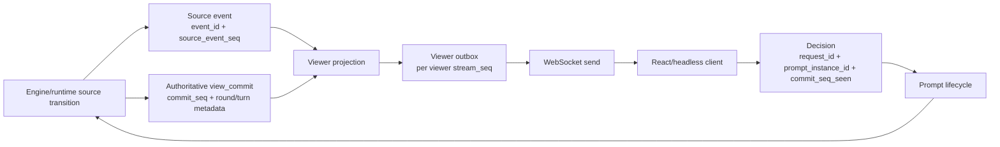

# [PLAN] Runtime Protocol Stability And Identity

> **For agentic workers:** REQUIRED SUB-SKILL: Use `superpowers:subagent-driven-development` when splitting implementation across workers, or `superpowers:executing-plans` when applying this plan sequentially. Track each checklist item in this document as it is completed.

Status: ACTIVE STABILIZATION TRACK
Updated: 2026-05-14
Owner: Engine runtime / WebSocket protocol  
Scope: Runtime identity, sequence contracts, viewer outbox, prompt lifecycle, `view_commit` recovery, Redis debug state, full-stack protocol gates

## Purpose

This plan turns the recent runtime/WebSocket failures and identity-confusion discussion into a concrete implementation path.

The target is not "more logging" in isolation. The target is a protocol where a developer can inspect Redis and answer:

- who acted
- who was targeted
- which viewer was allowed to see which payload
- which prompt was active
- which commit was authoritative
- which decision was accepted, rejected, or stale
- which event and commit sequence established the current state

## Non-Negotiable Constraints

- `source_event_seq`, `stream_seq`, and `commit_seq` stay numeric and monotonic.
- Public player identifiers become UUID-like values.
- UI turn order and display keep `seat_index`, `turn_order_index`, and `P1` to `P4`.
- `view_commit` is the authoritative recovery state.
- Event history is explanation and audit data, not the live state reconstruction source.
- Active prompt state must not expire by TTL.
- Completed debug artifacts are retained in Redis for 3600 seconds during this stabilization phase.

## Architecture Target



## Phase 0 Execution Plan

Phase 0 is the compatibility foundation. It must not change the WebSocket wire schema in a breaking way, and it must not replace engine numeric player indices yet.

Checklist:

- [x] Add protocol ID helpers for `PlayerId`, `SeatId`, `ViewerId`, `EventId`, `RequestId`, and turn labels.
- [x] Add additive session identity fields:
  - `seat_id`
  - `public_player_id`
  - `viewer_id`
  - `seat_index`
  - `turn_order_index`
  - `player_label`
  - `legacy_player_id`
- [x] Preserve old numeric `player_id` and `seat` in auth, prompts, and decisions until the engine adapter is moved.
- [x] Add `round_index`, `turn_index`, and `turn_label` to authoritative `view_commit` payloads.
- [x] Add viewer display metadata to `view_commit.viewer` without changing visibility checks.
- [x] Add source `event_id` to newly published non-commit stream messages.
- [x] Keep Redis debug retention capped at 3600 seconds and make the debug snapshot sufficient for state inspection.
- [x] Add tests that prove:
  - public player identity is UUID-like and not the numeric seat/player value
  - session persistence preserves the new IDs
  - view commits carry turn label metadata and additive public viewer identity
  - source stream messages carry event IDs

Current Phase 0 evidence, 2026-05-13:

| Contract | Current evidence |
| --- | --- |
| Protocol ID helpers | `apps/server/src/domain/protocol_ids.py` defines `new_public_player_id`, `new_seat_id`, `new_viewer_id`, `new_event_id`, `new_request_uuid`, `public_prompt_request_id`, `public_prompt_instance_id`, `prompt_protocol_identity_fields`, `player_label`, and `turn_label`. |
| Additive session identity | `apps/server/tests/test_session_service.py` covers join payloads, public session payloads, auth context, and store-backed reload preserving `public_player_id`, `seat_id`, and `viewer_id`. `test_new_protocol_identity_fields_never_serialize_numeric_player_ids` locks the rule that newly added public identity fields remain string IDs and do not collapse back to numeric `player_id` values. |
| Legacy numeric compatibility | `player_id`, `seat`, `seat_index`, `turn_order_index`, and `legacy_player_id` remain in the join/auth/viewer payloads while public UUID-like IDs are additive. |
| `view_commit` round/turn metadata | `apps/server/src/services/runtime_service.py` builds authoritative commits with `round_index`, `turn_index`, and `turn_label` at both payload and `runtime` levels; frontend contract fields are in `apps/web/src/core/contracts/stream.ts`. |
| Viewer display and public identity metadata | `display_identity_fields()` preserves numeric display compatibility, while `RuntimeService._view_commit_viewer_identity_fields()` enriches player `view_commit.viewer` payloads from `SessionService` with `public_player_id`, `seat_id`, and `viewer_id`. `apps/server/tests/test_runtime_service.py::test_authoritative_view_commit_enriches_viewer_with_session_protocol_identity` proves the string IDs are present without removing numeric bridge fields, and `apps/server/tests/test_visibility_projection.py` proves auth-derived viewer identity is preserved without changing visibility checks. |
| Source event IDs | `apps/server/tests/test_stream_service.py::test_publish_adds_source_event_id` proves non-commit `event` and `prompt` messages get `evt_*` IDs while `view_commit` remains the commit boundary. |
| Redis debug retention | `apps/server/tests/test_redis_realtime_services.py::test_stream_event_index_maps_event_id_to_source_sequence`, `test_stream_store_persists_compact_view_commit_pointer_only`, and `test_game_state_debug_snapshot_uses_one_hour_ttl` cover event index TTL, compact view-commit pointer persistence, and 3600-second debug snapshot TTL. |
| Prompt public identity adapter | `apps/server/tests/test_prompt_service.py::test_create_prompt_attaches_opaque_request_identity`, `test_get_pending_prompt_resolves_public_request_id_alias`, `test_submit_decision_accepts_public_request_id_alias`, `test_mark_prompt_delivered_resolves_public_request_id_alias`, `test_external_decision_result_resolves_public_request_id_alias`, `test_expire_prompt_resolves_public_request_id_alias`, `test_decision_command_carries_prompt_player_identity_fields`, `test_simultaneous_batch_collector_response_carries_prompt_player_identity_fields`, `test_simultaneous_batch_timeout_fallback_uses_collector`, `apps/server/tests/test_batch_collector.py::BatchCollectorTests::test_records_remaining_and_emits_single_batch_complete_command`, `apps/server/tests/test_runtime_service.py::RuntimeServiceTests::test_decision_resume_from_batch_complete_command_accepts_public_response_map`, `apps/server/tests/test_redis_realtime_services.py::test_prompt_service_accepts_public_request_id_with_redis_prompt_store`, `test_prompt_service_expires_public_request_id_with_redis_prompt_store`, and `apps/server/tests/test_sessions_api.py::test_external_ai_decision_callback_accepts_public_player_and_request_identity` prove public prompt IDs are exposed and accepted at the protocol boundary while pending reads, decision command materialization, lifecycle delivery/external-result/expiration writes, and batch completion payloads preserve public player/seat/viewer companions plus ordered public expected-player companions alongside the legacy numeric routing id. Internal prompt storage still resolves to the legacy request key. |

Residual Phase 0 boundaries:

- `stable_prompt_request_id()` intentionally keeps legacy semantic request IDs as the canonical storage/resume key until module-boundary resume parsing is removed. Prompt payloads, lifecycle records, decisions, and `decision_requested` events now expose additive opaque companions: `legacy_request_id`, `public_request_id`, and `public_prompt_instance_id`.
- Pending prompt reads, decision submission, prompt delivery marking, prompt expiration, and external decision-result recording accept `public_request_id` as a protocol alias at the `PromptService` boundary, then normalize back to the legacy request key before pending lookup, lifecycle writes, decision storage, and command append. This is an adapter step, not a canonical storage-key migration.
- Module decision commands now carry explicit `prompt_instance_id`, and runtime resume sequence matching consumes that field without parsing legacy request-id suffixes for prompt instance recovery. Batch-complete producer payloads now include ordered `expected_public_player_ids`, and resume materialization accepts public-only `responses_by_public_player_id` input by resolving public player IDs through `SessionService` and materializing the numeric bridge map for the engine. Runtime and `PromptService` no longer derive batch identity from `batch:*:pN` request-id suffixes. This removes the prompt-instance and server-side batch-id semantic `request_id` dependencies. The engine still owns numeric actor indexes because `state.players`, `SimultaneousPromptBatchContinuation.participant_player_ids`, `responses_by_player_id`, and resupply commit logic are internal engine state structures, not public protocol identity fields.
- Runtime prompt sequence seeding now consumes explicit `prompt_instance_id` from the current decision resume and previous checkpoint debug fields without falling back to legacy request-id parsing. This keeps opaque prompt request IDs from resetting or over-advancing the module prompt sequence during recovery.
- Active batch prompt enrichment now requires explicit `batch_id` plus submitted `player_id` to find the active continuation when exact request-id equality does not match. Opaque submitted `request_id` values can still receive resume/module metadata, but runtime no longer parses `batch:*:pN` suffixes as a fallback.
- `prompt_instance_id` remains numeric as the compatibility lifecycle key. `public_prompt_instance_id` is the opaque protocol companion.
- Viewer outbox migration remains out of scope for Phase 0.

Out of scope for Phase 0:

- viewer outbox migration
- replacing numeric prompt validation
- replacing numeric engine actor/target IDs
- removing numeric `prompt_instance_id` before the opaque companion is the canonical storage/resume key
- changing frontend rendering behavior

Phase 0 success means the new fields are available everywhere needed for debugging and future migrations, while existing live games still use the current numeric decision path.

## Problem 1. Identifier Roles Are Mixed

### Cause

The current protocol still lets player, seat, viewer, actor, and target collapse into similar numeric values. In the server join path, a joined seat can become the numeric `player_id`. In the frontend stream contract, `viewer.player_id?: number` and `seat?: number` coexist. This creates exactly the class of bugs we have been seeing: code can confuse "P3's turn", "viewer P3", "seat 3", and "actor id 3" without failing early.

### Fix

Introduce explicit identity roles and keep numeric display data separate.

Server-side concepts:

- `PlayerId`: public UUID-like player identity.
- `SeatId`: stable session seat identity.
- `ViewerId`: WebSocket viewer/connection identity.
- `RequestId`: UUID-like prompt/request identity.
- `EventId`: UUID-like source event identity.
- `CommitSeq`: numeric commit sequence.
- `seat_index`: numeric display seat, 1 to 4.
- `turn_order_index`: numeric turn ordering.
- `player_label`: display label, such as `P1`.
- `engine_player_index`: legacy numeric bridge for engine internals.

Implementation paths:

- Add `apps/server/src/domain/protocol_identity.py`.
- Add `apps/server/src/domain/protocol_ids.py`.
- Update `apps/server/src/domain/session_models.py`.
- Update `apps/server/src/services/session_service.py`.
- Update `apps/server/src/domain/visibility/projector.py`.
- Update `apps/server/src/domain/view_state/player_selector.py`.
- Update `apps/web/src/core/contracts/stream.ts`.
- Update `apps/web/src/domain/selectors/streamSelectors.ts`.

The migration must be additive first. Keep legacy numeric aliases only as compatibility fields until all tests and clients move to the separated identity fields.

### Fixed Shape

```json
{
  "viewer": {
    "viewer_id": "view_5f1c7b4e-5a3e-4702-a5ef-9f94f9d4ff22",
    "seat_id": "seat_6a6d1a3f-1a4d-4ad8-b8fb-9db2994b2a55",
    "player_id": "ply_6847b3ef-095d-4d5a-a17d-7e68a048e46b",
    "seat_index": 3,
    "turn_order_index": 2,
    "player_label": "P3"
  }
}
```

### Residual Problem

The engine still contains numeric assumptions. Rewriting the whole engine identity model first is too broad and would slow the stabilization work.

### Residual Fix Plan

Keep a strict adapter boundary. Engine modules can use `engine_player_index`, but no WebSocket payload or Redis debug snapshot should expose it as public identity. Add a test that fails if new protocol fields serialize `player_id` as a number.

Residual status, 2026-05-14: the additive public identity fields are now guarded by
`apps/server/tests/test_session_service.py::test_new_protocol_identity_fields_never_serialize_numeric_player_ids`.
Player `view_commit.viewer` payloads are also enriched from session identity by
`apps/server/tests/test_runtime_service.py::test_authoritative_view_commit_enriches_viewer_with_session_protocol_identity`.
This does not close the full protocol `player_id` migration: numeric `player_id`, `seat`, and
`legacy_player_id` remain intentional compatibility aliases until the frontend and decision submit path
move to the string public identity contract.

## Problem 2. Numeric Sequences Are Doing Too Much

### Cause

Numeric sequence values are correct for ordering and stale checks, but they are poor object identities. When request identity, event identity, replay ordering, and commit ordering are all inferred from sequence-like values, debugging becomes fragile and client/server validation becomes ambiguous.

### Fix

Keep numeric sequences for ordering and add UUID-like IDs for objects.

- `source_event_seq`: numeric source event order.
- `stream_seq`: numeric viewer stream order.
- `commit_seq`: numeric authoritative commit order.
- `event_id`: UUID-like event identity.
- `request_id`: canonical legacy prompt/resume key during migration.
- `legacy_request_id`: explicit copy of the legacy prompt/resume key for diagnostics and clients that need to distinguish it from opaque protocol identity.
- `public_request_id`: UUID-like prompt/request protocol identity.
- `prompt_instance_id`: canonical numeric lifecycle key during migration.
- `public_prompt_instance_id`: UUID-like lifecycle protocol identity.

Redis should store ID maps so opaque IDs can be resolved during debugging:

- event id to session, source sequence, event code, actor, target, commit sequence
- request id to session, prompt kind, target player, prompt instance, required commit sequence

Implementation paths:

- `apps/server/src/domain/protocol_ids.py`
- `apps/server/src/services/runtime_service.py`
- `apps/server/src/services/stream_service.py`
- `apps/server/src/services/prompt_service.py`
- `apps/server/src/services/realtime_persistence.py`
- `apps/web/src/core/contracts/stream.ts`
- `apps/web/src/headless/HeadlessGameClient.ts`

### Fixed Shape

Source event:

```json
{
  "event_id": "evt_f4dc9a2b-96d2-4304-b6b7-9fb13a83c3fd",
  "source_event_seq": 381,
  "event_code": "rent_paid",
  "actor": {
    "player_id": "ply_6847b3ef-095d-4d5a-a17d-7e68a048e46b",
    "seat_index": 3,
    "player_label": "P3"
  },
  "target": {
    "player_id": "ply_2470a9b8-67ad-4aae-8e6a-8cfc1eaa02e8",
    "seat_index": 1,
    "player_label": "P1"
  }
}
```

View commit metadata:

```json
{
  "type": "view_commit",
  "seq": 940,
  "payload": {
    "commit_seq": 57,
    "source_event_seq": 381,
    "round_index": 2,
    "turn_index": 5,
    "turn_label": "R2-T5"
  }
}
```

### Residual Problem

Existing fixtures may assert semantic request-id strings. Opaque UUID request IDs will break those assumptions.

### Residual Fix Plan

Tests should assert against explicit fields and Redis ID maps, not encoded request strings. Keep temporary legacy request labels only for debug display if needed.

## Problem 3. Current WebSocket Delivery Is Hard To Audit Per Viewer

### Cause

The current shape is close to:

1. publish source/global message
2. put it on subscriber queues
3. project for viewer during send

That makes live delivery possible, but Redis cannot directly prove what each viewer should have received. It also makes hidden-payload bugs harder to detect after the fact.

### Fix

Introduce viewer outboxes.

New logical flow:

1. Runtime creates a source event once.
2. Server projects that event for each viewer scope.
3. Server writes projected messages to viewer-specific outboxes.
4. WebSocket sender reads from that viewer's outbox.

Viewer scopes:

- `spectator`
- `seat:{seat_id}`
- `admin`

Public events still have one source event. They are written as projected messages to each relevant viewer outbox. Private prompts and decision acks are written only to the target seat outbox.

Implementation paths:

- Add `apps/server/src/services/viewer_outbox_service.py`.
- Update `apps/server/src/services/realtime_persistence.py`.
- Update `apps/server/src/services/stream_service.py`.
- Update `apps/server/src/routes/stream.py`.
- Update `apps/server/src/domain/visibility/projector.py`.

Use the existing Redis key helper for physical keys. The logical layout is:

```text
game:{session_id}:stream:source_events
game:{session_id}:outbox:spectator
game:{session_id}:outbox:seat:{seat_id}
game:{session_id}:outbox:admin
game:{session_id}:outbox_index
```

### Fixed Shape

```json
{
  "stream_seq": 129,
  "source_event_seq": 381,
  "event_id": "evt_f4dc9a2b-96d2-4304-b6b7-9fb13a83c3fd",
  "viewer_id": "view_5f1c7b4e-5a3e-4702-a5ef-9f94f9d4ff22",
  "viewer_scope": "seat:seat_6a6d1a3f-1a4d-4ad8-b8fb-9db2994b2a55",
  "message": {
    "type": "view_commit",
    "seq": 129,
    "payload": {}
  }
}
```

### Residual Problem

Outboxes increase Redis writes. With four players and one spectator, one public source event can become five outbox writes.

### Residual Fix Plan

Start with `dual` mode. Keep source event entries compact, store only projected messages needed for active viewers, and apply one-hour cleanup after completion. Measure before optimizing. Do not remove outbox auditing just to reduce writes blindly.

## Problem 4. Prompt Lifecycle Is Not Explicit Enough

### Cause

The current prompt service mainly distinguishes pending, resolved, and submitted decisions. It does not persist a complete lifecycle. Timeout and stale paths can make it unclear whether the prompt was delivered, whether the decision was received, whether it was rejected as stale, and whether the prompt was resolved or expired.

### Fix

Introduce a prompt lifecycle model.

States:

- `created`
- `delivered`
- `decision_received`
- `accepted`
- `rejected`
- `stale`
- `resolved`
- `expired`

Stored fields:

- `request_id`
- `legacy_request_id`
- `public_request_id`
- `prompt_instance_id`
- `public_prompt_instance_id`
- `resume_token`
- `view_commit_seq_required`
- `view_commit_seq_seen`
- target `player_id`
- target `seat_id`
- target `seat_index`
- delivered viewer IDs
- decision summary
- final resolution summary

Active prompts must not use cleanup TTL. Completed, rejected, stale, resolved, and expired records get the 3600 second debug-retention TTL.

Implementation paths:

- Add `apps/server/src/domain/prompt_lifecycle.py`.
- Update `apps/server/src/services/prompt_service.py`.
- Update `apps/server/src/services/realtime_persistence.py`.
- Update `apps/server/src/services/prompt_timeout_worker.py`.
- Update `apps/server/src/routes/stream.py`.
- Update `apps/web/src/domain/stream/decisionProtocol.ts`.
- Update `apps/web/src/headless/HeadlessGameClient.ts`.

### Fixed Shape

```json
{
  "request_id": "batch:simul:resupply:1:4:mod:resupply:1:p0",
  "legacy_request_id": "batch:simul:resupply:1:4:mod:resupply:1:p0",
  "public_request_id": "req_ef011e6a-8dd8-4324-80aa-d64c471716c1",
  "prompt_instance_id": 31,
  "public_prompt_instance_id": "pin_86c058fb-9cd5-4f1a-b278-3877621570e4",
  "state": "delivered",
  "target": {
    "player_id": "ply_6847b3ef-095d-4d5a-a17d-7e68a048e46b",
    "seat_id": "seat_6a6d1a3f-1a4d-4ad8-b8fb-9db2994b2a55",
    "seat_index": 3
  },
  "view_commit_seq_required": 57,
  "resume_token": "rsm_3a05a0f2-29b2-430f-a14e-920fc09567aa",
  "delivered_to_viewer_ids": [
    "view_5f1c7b4e-5a3e-4702-a5ef-9f94f9d4ff22"
  ]
}
```

### Residual Problem

Some prompts can involve multiple players or multi-step decisions. A single lifecycle state is insufficient for batched prompts.

### Residual Fix Plan

Represent multi-player prompts as a parent prompt instance with child participant states. Each child has target identity, delivery, decision, timeout, and final state.

## Problem 5. `view_commit` Recovery Needs A Hard Contract

### Cause

Reconnect and resume become unstable if the frontend treats raw prompt messages or event history as authoritative state. The user can see impossible UI if the prompt stream, event history, and latest commit are not aligned.

### Fix

Make `view_commit` the only authoritative restore surface.

- On connect, resume, heartbeat repair, round start, and turn start, send the latest `view_commit`.
- React and headless clients decide only from `view_state.prompt.active`.
- Raw prompt messages are wake-up hints and audit evidence only.
- Event history is replay/explanation data only.
- `view_commit` must include commit metadata, current round/turn display metadata, active actor, active prompt references, and current player projections.

Implementation paths:

- `apps/server/src/services/runtime_service.py`
- `apps/server/src/domain/view_state/turn_history_selector.py`
- `apps/server/src/domain/view_state/scene_selector.py`
- `apps/server/src/routes/stream.py`
- `apps/web/src/hooks/useGameStream.ts`
- `apps/web/src/domain/stream/decisionProtocol.ts`
- `apps/web/src/headless/HeadlessGameClient.ts`

### Fixed Shape

Reconnect success means:

1. Client receives latest `view_commit`.
2. Client commit sequence catches up monotonically.
3. If a prompt is active for that viewer, it appears in `view_state.prompt.active`.
4. Decision uses the latest `view_commit_seq_seen`.
5. Stale decisions are rejected, recorded, and retried only if the same active prompt still exists.

### Residual Problem

`view_commit` can become too large if debug state is stuffed into it.

### Residual Fix Plan

Keep full debug context in Redis snapshots and ID maps. `view_commit` should include current UI state and compact references, not full stream dumps.

## Problem 6. WebSocket Stability Is Not Gated By The Full Real Path

### Cause

Engine-only simulation does not validate the real browser protocol. Manual browser testing is useful but too slow and inconsistent for the primary stability gate. The full-stack headless path must become the main automated gate.

### Fix

Run four headless seat clients and one spectator through the real REST and WebSocket sequence:

1. `POST /api/v1/sessions`
2. join all seats
3. start session
4. connect seat WebSockets and spectator WebSocket
5. receive `view_commit`
6. read active prompt from commit
7. build legal decision through the shared frontend decision protocol
8. send decision
9. receive `decision_ack`
10. continue until completion or gate failure

Gate checks:

- `runtime_failed = 0`
- `illegal_action = 0`
- stale decision recovery succeeds
- reconnect receives latest `view_commit`
- prompt and `decision_ack` target player only
- spectator receives no hidden payload
- commit sequence is monotonic for every client
- viewer outbox has no missing expected delivery

Implementation paths:

- `apps/web/src/headless/HeadlessGameClient.ts`
- `apps/web/src/headless/fullStackProtocolHarness.ts`
- `apps/web/src/headless/runFullStackProtocolGate.ts`
- `apps/web/src/headless/HeadlessGameClient.spec.ts`
- `apps/web/src/headless/fullStackProtocolHarness.spec.ts`

### Fixed Shape

```bash
cd /Users/sil/Workspace/project-mrn/apps/web
npm test -- src/headless/HeadlessGameClient.spec.ts src/headless/fullStackProtocolHarness.spec.ts
```

```bash
cd /Users/sil/Workspace/project-mrn
docker compose -p project-mrn-protocol -f docker-compose.protocol.yml up -d --build
```

```bash
cd /Users/sil/Workspace/project-mrn/apps/web
npm run rl:protocol-gate -- --profile live --base-url http://127.0.0.1:9091 --seed 20260508 --timeout-ms 180000 --idle-timeout-ms 60000 --raw-prompt-fallback-delay-ms off --reconnect after_start,after_first_commit,after_first_decision,round_boundary,turn_boundary --seat-profiles '1=baseline,2=cash,3=shard,4=score' --out ../../result/protocol_trace.jsonl --replay-out ../../result/rl_replay.jsonl
```

```bash
cd /Users/sil/Workspace/project-mrn
docker compose -p project-mrn-protocol -f docker-compose.protocol.yml down
```

### Residual Problem

One successful game does not prove long-run stability.

### Residual Fix Plan

Run a seed matrix after the single-game gate passes. Failed seeds become regression fixtures with saved source events, prompt lifecycle records, viewer outbox records, and final `view_commit`.

## Problem 7. Runtime State Machine Failures Need Better Diagnostics

### Cause

Previous failures reached `runtime_failed` with insufficient diagnostics. The known risky zones are parent/child frame transition, suspended module state, scheduled actions, `TargetJudicatorModule`, `resolve_mark`, round boundary, and turn boundary.

### Fix

Extend runtime semantic guards and failure logging.

Fail immediately when:

- a running or suspended frame has queued modules but no active module pointer
- active module points to queued, completed, or skipped module
- parent `PlayerTurnModule` is suspended but no runnable child turn frame exists
- scheduled action has invalid target, already resolved id, dead source, dead target, or duplicate idempotency key

Runtime failure diagnostics must include:

- exception class
- `repr(exc)`
- traceback
- session id
- source sequence
- commit sequence
- active frame
- active module
- pending and scheduled action summaries

Implementation paths:

- `apps/server/src/domain/runtime_semantic_guard.py`
- `apps/server/src/services/runtime_service.py`
- `apps/server/tests/test_runtime_semantic_guard.py`
- `apps/server/tests/test_runtime_service.py`
- `apps/server/tests/test_runtime_end_to_end_contract.py`

### Fixed Shape

`runtime_failed` with `error: ""` is invalid. Every runtime failure must produce enough detail to create a reproduction fixture.

### Residual Problem

The state space is large. The first guard set will not cover every possible module interaction.

### Residual Fix Plan

Every new runtime failure must create a fixture. Required fixture families:

- `TargetJudicatorModule` transition
- `resolve_mark`
- round boundary
- turn boundary
- source death
- target death
- immunity
- duplicate scheduled action idempotency

## Problem 8. Redis Debug State Is Not Self-Contained Enough

### Cause

Debugging currently requires combining server logs, browser screenshots, test output, stream messages, and conversation context. That is slow and fragile. Keeping everything forever is also not acceptable because Redis memory can grow without bound.

### Fix

Add compact Redis debug snapshots and one-hour retention for completed artifacts.

Rules:

- Active session state does not expire while the session is live.
- Completed, failed, expired, or archived debug artifacts get TTL 3600 seconds.
- Large raw payloads are not stored unless an explicit debug flag is enabled.
- Redis snapshot should be enough to understand current game state without browser context.

Implementation paths:

- `apps/server/src/services/realtime_persistence.py`
- `apps/server/src/services/runtime_service.py`
- `apps/server/src/services/archive_service.py`
- `apps/server/src/settings.py`
- `apps/server/tests/test_redis_realtime_services.py`
- `apps/server/tests/test_runtime_settings.py`

### Fixed Shape

```json
{
  "session_id": "sess_example",
  "retention_seconds": 3600,
  "runtime": {
    "status": "running",
    "round_index": 2,
    "turn_index": 5,
    "active_player": {
      "player_id": "ply_6847b3ef-095d-4d5a-a17d-7e68a048e46b",
      "seat_index": 3,
      "player_label": "P3"
    }
  },
  "frame": {
    "active_frame_id": "frame_turn_15",
    "active_module_id": "module_move",
    "suspended_parent_frame_id": "frame_round_2"
  },
  "sequences": {
    "source_event_seq": 381,
    "commit_seq": 57,
    "viewer_outbox_heads": {
      "spectator": 129,
      "seat:seat_6a6d1a3f-1a4d-4ad8-b8fb-9db2994b2a55": 132
    }
  },
  "prompts": {
    "active": [],
    "recent_completed": []
  },
  "id_maps": {
    "recent_event_ids": [],
    "recent_request_ids": []
  }
}
```

### Residual Problem

Snapshots can still grow if they include long lists.

### Residual Fix Plan

Store latest-N summaries plus stream pointers. Full source streams and viewer outboxes remain available until their one-hour TTL expires after archival.

## Implementation Order And Current Status

### Phase 0. Additive Identity And Debug Foundations

- [x] Add `protocol_identity.py` and `protocol_ids.py`.
- [x] Add public UUID player IDs, seat IDs, viewer IDs, event IDs, and request ID helpers without removing legacy aliases.
- [x] Add opaque prompt request and prompt instance companion fields without removing legacy aliases. Current prompt payloads, lifecycle records, decisions, and `decision_requested` events include `legacy_request_id`, `public_request_id`, and `public_prompt_instance_id`.
- [ ] Replace canonical prompt storage/resume keys with opaque IDs. Current Phase 0 intentionally keeps legacy semantic prompt request IDs and numeric `prompt_instance_id` as compatibility keys because batch continuation and resume parsing still read semantics from those fields.
- [x] Add `round_index`, `turn_index`, and `turn_label` to `view_commit`.
- [x] Add Redis event ID maps and prompt lifecycle records that expose recent request IDs for inspection.
- [x] Do not add a dedicated Redis request ID map in this phase. Lifecycle records and inspector debug output now expose enough recent request ID state for diagnosis without adding another Redis index.
- [x] Add one-hour debug retention settings and debug snapshot writing.
- [x] Verify with `apps/server/tests/test_session_service.py`.
- [x] Verify with `apps/server/tests/test_redis_realtime_services.py`.
- [x] Verify with `apps/server/tests/test_runtime_settings.py`.

### Phase 1. Prompt Lifecycle

- [x] Add prompt lifecycle domain model.
- [x] Persist baseline prompt states through created, delivered, accepted, rejected, and expired.
- [x] Complete lifecycle coverage for decision received, stale, and resolved as first-class audited states.
- [x] Prove active prompts do not depend on TTL cleanup in the Redis-backed path.
- [x] Record stale decisions without deleting active prompts.
- [x] Verify baseline lifecycle coverage with `apps/server/tests/test_prompt_service.py`.
- [x] Verify pending prompt delivery repair with `apps/server/tests/test_stream_api.py`.
- [x] Verify frontend decision protocol lifecycle handling with `apps/web/src/domain/stream/decisionProtocol.spec.ts`.

Phase 1 completion note: `PromptService` owns lifecycle state transitions and now records bounded
`state_history` events for `decision_received`, `accepted`, `resolved`, and `stale`. A stale decision
caused by failed command append is audited without deleting the active prompt. Redis-backed active
prompt and lifecycle hashes remain non-TTL authoritative state; only debug artifacts use the one-hour
retention window.

### Phase 2. Strict `view_commit` Recovery

- [x] Ensure latest `view_commit` is sent on connect and resume repair.
- [x] Prove latest `view_commit` on heartbeat repair, round start, and turn start.
- [x] Treat raw prompt messages as wake-up hints only.
- [x] Make React and headless clients decide only from active prompt state in `view_commit`.
- [x] Verify with `apps/server/tests/test_runtime_end_to_end_contract.py`.
- [x] Verify with `apps/web/src/headless/HeadlessGameClient.spec.ts`.
- [x] Verify with `apps/web/src/hooks/useGameStream.spec.ts`.

Phase 2 completion note: `stream_ws` now checks the latest cached `view_commit` during heartbeat
delivery and sends it before the heartbeat when the client has not seen that commit. Runtime
round-start and turn-start snapshot guardrails remain ordered after latest-commit emission.
Raw `prompt` WebSocket messages remain wake-up hints only; the headless client waits for
`view_commit.view_state.prompt.active` and builds decisions from that authoritative active prompt.
The React selector path continues to ignore raw prompt/event payloads for active-prompt state.

### Phase 3. Viewer Outbox Dual-Write

- [x] Add Redis viewer outbox debug/index persistence.
- [x] Record projected delivery scopes while keeping the old publish path active.
- [x] Add outbox audit checks for target-only prompt and ack delivery.
- [x] Add spectator hidden payload tests.
- [x] Add viewer-aware WebSocket read mode behind `MRN_STREAM_OUTBOX_MODE`.
- [x] Verify with `apps/server/tests/test_stream_service.py`.
- [x] Verify with `apps/server/tests/test_stream_api.py`.
- [x] Verify with `apps/server/tests/test_visibility_projection.py`.

Phase 3 completion note: `MRN_STREAM_OUTBOX_MODE=read` now binds viewer identity to each
WebSocket subscriber queue and projects messages before queue insertion. Private prompts and
targeted `decision_ack` messages are therefore filtered before they become readable by a
non-target subscriber queue. The server default moved to `read` after Phase 4, Phase 5,
and Phase 6 evidence passed. `dual` remains as rollback/parity mode and keeps the old raw
queue plus send-time projection path. `off` keeps legacy delivery and disables Redis
viewer-outbox debug/index writes.

### Phase 4. Full-Stack Protocol Gate

- [x] Extend the headless protocol gate to assert identity, outbox, prompt lifecycle, reconnect, stale decision, and spectator privacy conditions.
- [x] Run one live game with four headless seats and one spectator.
- [x] Run a seed matrix after the one-game gate passes.
- [x] Review failed seeds for regression-fixture promotion. No accepted-matrix seed failed; the only prior incomplete run was a time-budget failure, not a seed-specific game defect.

Phase 4 progress note: `fullStackProtocolHarness` now emits `protocolEvidence` for seat/spectator
topology, completed view-commit delivery, prompt lifecycle trace coverage, decision/ack counts,
stale-decision recovery, reconnect recovery, spectator privacy leaks, identity violations, monotonic
commit failures, and client error counts. The live runner writes this as `protocol_evidence` in the
JSON summary. The gate can now require the expected seat count, require a spectator websocket, and
fail when a run has accepted decisions without matching `view_commit` active prompt, `decision_sent`,
or accepted `decision_ack` trace evidence.

Phase 4 live evidence, 2026-05-13:

- Run root: `tmp/rl/full-stack-protocol/phase4-onegame-read-20260513-235502`
- Mode: `MRN_STREAM_OUTBOX_MODE=read`
- Topology: `seatClientCount=4`, `spectatorClientCount=1`, `completedViewCommitClientCount=5`
- Recovery/privacy: `staleRecoveryCount=4`, `unrecoveredStaleAckCount=0`,
  `forcedReconnectCount=25`, `reconnectRecoveryCount=25`, `reconnectRecoveryPendingCount=0`,
  `spectatorPromptLeakCount=0`, `spectatorDecisionAckLeakCount=0`
- Protocol failures: `identityViolationCount=0`, `nonMonotonicCommitCount=0`,
  `semanticCommitRegressionCount=0`, `runtimeRecoveryRequiredCount=0`, `errorMessageCount=0`

Phase 4 seed-matrix evidence, 2026-05-14:

- Accepted run root: `tmp/rl/full-stack-protocol/phase4-seed-matrix-read-20260514-000107`
- Mode/topology: `MRN_STREAM_OUTBOX_MODE=read`, `games=5`, `concurrency=5`, four seats plus one spectator per game
- Budget: `timeout-ms=300000`, `idle-timeout-ms=60000`, raw prompt fallback disabled
- Result: all five games reached `runtime_status=completed`; durations ranged from `55867ms` to `251916ms`
- Protocol failures: every game reported zero identity violations, monotonic commit failures, semantic commit regressions,
  unrecovered stale acks, pending reconnect recoveries, spectator prompt leaks, spectator decision-ack leaks, runtime
  recovery requirements, and client error messages.
- Regression fixture promotion: no failed seed existed in the accepted matrix. The earlier run
  `tmp/rl/full-stack-protocol/phase4-seed-matrix-read-20260513-235645` used a 180-second hard cap and timed out while
  still progressing (`runtime_status=running_elsewhere`, no protocol/privacy/runtime failures), so it documents the
  matrix time budget rather than a seed-specific game defect.

### Phase 5. Flip WebSocket Read Path To Outbox

- [x] Add `MRN_STREAM_OUTBOX_MODE=off|dual|read`.
- [x] Keep `dual` as default until parity is proven, then flip the server default to `read`.
- [x] Switch live gate to `read`.
- [x] Remove legacy send-time projection from the `read` subscriber sender only after repeated stability is demonstrated across the seed matrix.

Phase 5 repeated read-mode evidence, 2026-05-14:

- Accepted run root: `tmp/rl/full-stack-protocol/phase5-repeat-read-20260514`
- Command shape: `games=5`, `concurrency=5`, `seed-base=2026051420`, four seats plus one spectator per game,
  forced reconnect points `after_start,after_first_prompt,after_first_decision,round_boundary`,
  raw prompt fallback disabled.
- Result: all five games completed successfully. Durations ranged from `87730ms` to `260381ms`, and final
  commit heads ranged from `70` to `191`.
- Recovery/privacy: every game reported `forcedReconnectCount=20`, `reconnectRecoveryCount=20`,
  `reconnectRecoveryPendingCount=0`, and zero spectator prompt or decision-ack leaks.
- Protocol failures: every game reported zero identity violations, non-monotonic commits, semantic commit
  regressions, unrecovered stale acks, runtime recovery requirements, client error messages, and failure messages.
- Code follow-up: the server default is now `MRN_STREAM_OUTBOX_MODE=read`, while `dual` and `off` remain
  explicit rollback modes. In `read` mode, the WebSocket sender delivers the preprojected subscriber queue
  message instead of reprojecting at send time; `dual` and `off` keep send-time projection.

### Phase 6. Browser-Based Profile Validation

- [x] Apply per-player policy profiles to a real browser session.
- [x] Verify that visible UI matches the same identity, prompt lifecycle, turn history, and recovery behavior as the headless gate.
- [x] Fix UI-only bugs after the protocol gate is green. No UI-only defect was reproduced in the accepted Phase 6 run; the only fixes were test-harness setup corrections for browser server URL storage and opening the History tab before asserting turn-history DOM.

Phase 6 browser-profile evidence, 2026-05-14:

- Existing browser regression checks:
  - `cd apps/web && npm run e2e:human-runtime`: 18 passed.
  - `cd apps/web && npm run e2e:parity`: 7 passed.
- Live run root: `tmp/rl/full-stack-protocol/phase6-browser-profile-20260514-003211`
- Command: `MRN_API_BASE_URL=http://127.0.0.1:9091 MRN_WEB_BASE_URL=http://127.0.0.1:9000 MRN_LIVE_PROFILE_SEED=2026051401 MRN_LIVE_PROFILE_BOUNDED=1 MRN_LIVE_PROFILE_TIMEOUT_MS=300000 MRN_LIVE_PROFILE_IDLE_MS=60000 npm run e2e:live-profile-browser`
- Session: `sess_T5uwfrJQWYfer74vMCzP8IcC`
- Policies: `baseline:P1`, `cash-focus:P2`, `shard-focus:P3`, `conservative:P4`
- Result: `ok=true`, `commit_seq=23`, `duration_ms=5646`, `failures=[]`
- Browser evidence: board visible, active character strip visible, four player cards visible, turn history visible with four events, private prompt overlay hidden, console errors 0, page errors 0.
- Client evidence: every seat reached completed runtime view commits, sent at least one policy decision, forced one reconnect, recovered reconnect with `reconnectRecoveryPendingCount=0`, and reported zero identity violations, non-monotonic commits, semantic commit regressions, spectator prompt leaks, spectator decision-ack leaks, decision send failures, stale ack leaks, and client errors.

## Release And Rollback

Use additive compatibility until all gates pass.

- `MRN_STREAM_OUTBOX_MODE=off`: legacy path only, without Redis viewer-outbox debug/index writes.
- `MRN_STREAM_OUTBOX_MODE=dual`: write old stream and viewer outbox; send from legacy path with send-time projection.
- `MRN_STREAM_OUTBOX_MODE=read`: current server default; project into viewer-aware WebSocket queues before delivery
  and send the queued message without a second projection pass.

Rollback means switching the environment flag back to `off` or `dual`. Do not delete source events or prompt lifecycle records during rollback.

## Acceptance Criteria

- [ ] Migrate protocol `player_id` payload fields from numeric legacy aliases to string IDs. Current completed state adds string public player, seat, viewer, event, and request identifiers while intentionally keeping numeric `player_id` aliases for compatibility. `SessionService.resolve_protocol_player_id()` now provides the first server-side migration adapter by resolving public string identity fields back to the internal numeric seat id at one boundary. `SessionService.protocol_identity_fields()` now centralizes additive public identity enrichment for downstream payloads. The WebSocket decision route and the external-AI HTTP decision callback accept those string identity fields and normalize them before calling `PromptService`; prompt boundary payloads, `decision_requested` events, `decision_ack` payloads, normal decision commands, simultaneous batch collector responses, batch completion `responses_by_public_player_id` payloads, and timeout fallback responses now carry the public identity fields alongside numeric compatibility aliases. Runtime fanout events with direct `player_id` now include the same public identity fields, fanout events with `acting_player_id` now include actor-prefixed public identity fields, top-level `*_player_id` related-player fields now include prefixed public identity fields, and top-level `*_player_ids` lists plus `winner_ids` now include public identity companion lists. Fanout `snapshot.players`, `snapshot.board.marker_owner_player_id`, `snapshot.board.tiles[].owner_player_id`, and `snapshot.board.tiles[].pawn_player_ids` now also get public identity companions while retaining numeric display aliases. Prompt batch continuation maps and resume-token maps now include public-player, seat, and viewer companion fields while retaining numeric routing maps as compatibility aliases. Batch-complete resume materialization can now consume public response maps as input and build the numeric engine bridge internally. Prompt sequence seeding and server-side batch continuation no longer parse legacy request-id suffixes for prompt instance or batch identity recovery. Remaining work is to remove the engine-side numeric batch response application contract.
- [x] UI labels still show `P1` to `P4` through `seat_index` and `player_label`.
- [x] `source_event_seq`, `stream_seq`, and `commit_seq` are numeric and monotonic.
- [x] Every prompt has `request_id`, `prompt_instance_id`, `resume_token`, target identity, lifecycle state, and required commit sequence.
- [x] Active prompts do not disappear through TTL.
- [x] Redis debug records for completed or failed sessions expire after 3600 seconds.
- [x] Redis shows source event heads, viewer outbox heads, prompt lifecycle, active runtime frame, active module, and latest commit without browser logs.
- [x] Reconnect receives the latest `view_commit`.
- [x] Prompt and `decision_ack` are delivered only to the target player viewer outbox.
- [x] Spectators receive no hidden prompt payload.
- [x] Runtime failures include non-empty diagnostic detail.
- [x] Full-stack live gate passes with four headless players and one spectator.

Acceptance evidence status, 2026-05-14:

- `apps/server/tests/test_session_service.py` verifies `seat_index` and `player_label` stay aligned with `P1` through `P4`.
- `apps/server/tests/test_session_service.py::test_new_protocol_identity_fields_never_serialize_numeric_player_ids`
  verifies that `public_player_id`, `seat_id`, and `viewer_id` serialize as string IDs, while numeric
  `player_id` and `legacy_player_id` remain only as compatibility fields.
- `apps/server/tests/test_session_service.py::test_resolve_protocol_player_id_accepts_public_identity_fields`
  verifies that the server can resolve public string identity fields for both human and AI seats back to
  the internal numeric seat id without requiring each route to implement its own conversion.
- `apps/server/tests/test_stream_api.py::test_seat_decision_accepts_public_player_identity_with_ack`
  verifies that the WebSocket decision route accepts a public string player identity, normalizes it to the
  authenticated internal seat id, and returns public identity fields plus the compatibility `player_id` in
  the ack payload.
- `apps/server/tests/test_sessions_api.py::test_external_ai_decision_callback_accepts_public_player_identity`
  verifies that the external-AI HTTP decision callback accepts a public string player identity, normalizes it
  to the internal seat id, and returns public identity fields plus the compatibility `player_id` in the ack payload.
- `apps/server/tests/test_session_service.py::test_protocol_identity_fields_returns_public_identity_for_internal_seat`
  verifies that server-side enrichment for downstream payloads is owned by `SessionService`, not duplicated in
  runtime or route handlers.
- `apps/server/tests/test_runtime_service.py::test_runtime_prompt_boundary_can_publish_after_view_commit_guardrail`
  verifies that runtime prompt boundary payloads and their paired `decision_requested` events include the
  same public identity fields while keeping numeric compatibility aliases.
- `apps/server/tests/test_protocol_ids.py::test_prompt_protocol_identity_fields_are_stable_opaque_companions`
  verifies that prompt legacy request IDs now get stable opaque request and prompt-instance companions.
- `apps/server/tests/test_prompt_service.py::test_create_prompt_adds_opaque_identity_companions_to_lifecycle`
  verifies that prompt creation and lifecycle payloads expose `legacy_request_id`, `public_request_id`, and
  `public_prompt_instance_id` without replacing the canonical storage key.
- `apps/server/tests/test_prompt_sequence.py::PromptSequenceTests::test_seed_does_not_parse_legacy_request_id_without_explicit_prompt_instance`
  and `apps/server/tests/test_runtime_service.py::RuntimeServiceTests::test_prompt_instance_from_resume_does_not_parse_legacy_request_id`
  verify that prompt sequence recovery and bridge advancement no longer parse legacy request-id suffixes when
  explicit prompt instance metadata is missing.
- `apps/server/tests/test_runtime_service.py::test_runtime_prompt_boundary_enriches_active_simultaneous_batch_contract`
  and `test_runtime_prompt_boundary_enriches_checkpoint_payload_batch_contract` verify that prompt batch
  continuation maps include public-player, seat, and viewer companion fields next to numeric compatibility maps.
- `apps/server/tests/test_batch_collector.py::BatchCollectorTests::test_records_remaining_and_emits_single_batch_complete_command`
  verifies that the emitted `batch_complete` command keeps numeric `responses_by_player_id` and
  `expected_player_ids` while adding `responses_by_public_player_id` and ordered `expected_public_player_ids`
  when collected responses include public player identity.
- `apps/server/tests/test_runtime_service.py::test_decision_resume_from_batch_complete_command_uses_collected_response`
  `test_decision_resume_from_batch_complete_command_accepts_public_response_map`, and
  `test_public_batch_complete_resume_applies_to_internal_engine_batch` verify that runtime resume materialization
  preserves public response companions, can consume public-only response maps, and then resolves them into the
  engine's internal numeric actor-index bridge before applying collected batch responses.
- `apps/server/tests/test_runtime_service.py::test_fanout_event_payload_adds_public_identity_for_direct_player`
  verifies that runtime fanout events with direct `player_id` include public identity fields while preserving
  the numeric compatibility alias.
- `apps/server/tests/test_runtime_service.py::test_fanout_event_payload_adds_actor_public_identity_for_acting_player`
  verifies that runtime fanout events with `acting_player_id` include actor-prefixed public identity fields while
  preserving the numeric actor alias.
- `apps/server/tests/test_runtime_service.py::test_fanout_event_payload_adds_prefixed_identity_for_related_players`
  verifies that top-level fanout event fields such as `payer_player_id` and `owner_player_id` include prefixed
  public identity fields without adding redundant numeric legacy aliases.
- `apps/server/tests/test_runtime_service.py::test_fanout_event_payload_adds_public_identity_lists_for_player_id_lists`
  verifies that top-level `*_player_ids` lists and the legacy `winner_ids` list include public identity companion
  lists while preserving the original numeric lists.
- `apps/server/tests/test_redis_realtime_services.py` verifies Redis stream/view-commit sequence persistence, monotonic command offsets, non-monotonic view-commit rejection, stale previous-commit rejection, and cached next-commit sequencing.
- `apps/server/tests/test_prompt_service.py`, `apps/server/tests/test_prompt_module_continuation.py`, and `apps/server/tests/test_stream_api.py` verify prompt lifecycle states, active prompt persistence, resume tokens, required commit sequence handling, reconnect/resume repair, and target-scoped prompt delivery.
- `apps/server/tests/test_stream_service.py`, `apps/server/tests/test_visibility_projection.py`, and `apps/server/tests/test_stream_api.py::test_spectator_does_not_receive_prompt_or_decision_ack_for_seat` verify private prompt and `decision_ack` projection boundaries.
- `apps/server/tests/test_redis_state_inspector.py::test_inspector_flags_runtime_failure_without_losing_debug_context` verifies failed runtime diagnostics include non-empty exception class and representation.
- Phase 4, Phase 5, and Phase 6 live evidence in this document verifies read-mode reconnect recovery, spectator privacy, monotonic commits, client error absence, repeated seed-matrix stability, and a real browser spectator/profile path against the live stack.
- `apps/server/tests/test_runtime_settings.py` verifies `read` is the server runtime default and `apps/server/tests/test_stream_api.py::test_read_outbox_mode_sender_uses_preprojected_subscriber_queue` verifies the `read` WebSocket sender does not call send-time projection for subscriber-queue delivery.

Redis debug acceptance evidence, 2026-05-14:

- `apps/server/tests/test_redis_realtime_services.py::test_game_state_debug_snapshot_uses_one_hour_ttl` locks the debug snapshot TTL at 3600 seconds.
- `apps/server/tests/test_redis_realtime_services.py::test_prompt_debug_index_tracks_session_prompt_state_with_one_hour_ttl` keeps prompt debug index retention bounded while the active prompt hashes remain non-TTL state.
- `apps/server/tests/test_redis_state_inspector.py::test_inspector_reports_consistent_active_prompt_state` now verifies inspector output can show source event heads, viewer outbox heads, active prompt lifecycle, active runtime frame/module fields, latest commit/source-event sequence, and one-hour debug retention from Redis state without browser logs.
