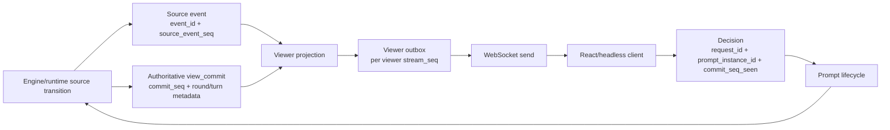

# [PLAN] Runtime Protocol Stability And Identity

> **For agentic workers:** REQUIRED SUB-SKILL: Use `superpowers:subagent-driven-development` when splitting implementation across workers, or `superpowers:executing-plans` when applying this plan sequentially. Track each checklist item in this document as it is completed.

Status: ACTIVE STABILIZATION TRACK
Updated: 2026-05-13
Owner: Engine runtime / WebSocket protocol  
Scope: Runtime identity, sequence contracts, viewer outbox, prompt lifecycle, `view_commit` recovery, Redis debug state, full-stack protocol gates

## Purpose

This plan turns the recent runtime/WebSocket failures and identity-confusion discussion into a concrete implementation path.

The target is not "more logging" in isolation. The target is a protocol where a developer can inspect Redis and answer:

- who acted
- who was targeted
- which viewer was allowed to see which payload
- which prompt was active
- which commit was authoritative
- which decision was accepted, rejected, or stale
- which event and commit sequence established the current state

## Non-Negotiable Constraints

- `source_event_seq`, `stream_seq`, and `commit_seq` stay numeric and monotonic.
- Public player identifiers become UUID-like values.
- UI turn order and display keep `seat_index`, `turn_order_index`, and `P1` to `P4`.
- `view_commit` is the authoritative recovery state.
- Event history is explanation and audit data, not the live state reconstruction source.
- Active prompt state must not expire by TTL.
- Completed debug artifacts are retained in Redis for 3600 seconds during this stabilization phase.

## Architecture Target



## Phase 0 Execution Plan

Phase 0 is the compatibility foundation. It must not change the WebSocket wire schema in a breaking way, and it must not replace engine numeric player indices yet.

Checklist:

- [x] Add protocol ID helpers for `PlayerId`, `SeatId`, `ViewerId`, `EventId`, `RequestId`, and turn labels.
- [x] Add additive session identity fields:
  - `seat_id`
  - `public_player_id`
  - `viewer_id`
  - `seat_index`
  - `turn_order_index`
  - `player_label`
  - `legacy_player_id`
- [x] Preserve old numeric `player_id` and `seat` in auth, prompts, and decisions until the engine adapter is moved.
- [x] Add `round_index`, `turn_index`, and `turn_label` to authoritative `view_commit` payloads.
- [x] Add viewer display metadata to `view_commit.viewer` without changing visibility checks.
- [x] Add source `event_id` to newly published non-commit stream messages.
- [x] Keep Redis debug retention capped at 3600 seconds and make the debug snapshot sufficient for state inspection.
- [x] Add tests that prove:
  - public player identity is UUID-like and not the numeric seat/player value
  - session persistence preserves the new IDs
  - view commits carry turn label metadata
  - source stream messages carry event IDs

Current Phase 0 evidence, 2026-05-13:

| Contract | Current evidence |
| --- | --- |
| Protocol ID helpers | `apps/server/src/domain/protocol_ids.py` defines `new_public_player_id`, `new_seat_id`, `new_viewer_id`, `new_event_id`, `new_request_uuid`, `player_label`, and `turn_label`. |
| Additive session identity | `apps/server/tests/test_session_service.py` covers join payloads, public session payloads, auth context, and store-backed reload preserving `public_player_id`, `seat_id`, and `viewer_id`. |
| Legacy numeric compatibility | `player_id`, `seat`, `seat_index`, `turn_order_index`, and `legacy_player_id` remain in the join/auth/viewer payloads while public UUID-like IDs are additive. |
| `view_commit` round/turn metadata | `apps/server/src/services/runtime_service.py` builds authoritative commits with `round_index`, `turn_index`, and `turn_label` at both payload and `runtime` levels; frontend contract fields are in `apps/web/src/core/contracts/stream.ts`. |
| Viewer display metadata | `display_identity_fields()` populates seat display fields; `apps/server/tests/test_visibility_projection.py` proves auth-derived viewer identity is preserved without changing visibility checks. |
| Source event IDs | `apps/server/tests/test_stream_service.py::test_publish_adds_source_event_id` proves non-commit `event` and `prompt` messages get `evt_*` IDs while `view_commit` remains the commit boundary. |
| Redis debug retention | `apps/server/tests/test_redis_realtime_services.py::test_stream_event_index_maps_event_id_to_source_sequence`, `test_stream_store_persists_compact_view_commit_pointer_only`, and `test_game_state_debug_snapshot_uses_one_hour_ttl` cover event index TTL, compact view-commit pointer persistence, and 3600-second debug snapshot TTL. |

Residual Phase 0 boundaries:

- `stable_prompt_request_id()` intentionally keeps legacy semantic request IDs unless module-boundary identity is available. `new_request_uuid()` exists for the next migration step, but prompt request IDs are not globally opaque UUIDs yet.
- `prompt_instance_id` remains numeric by design in Phase 0.
- Viewer outbox migration remains out of scope for Phase 0.

Out of scope for Phase 0:

- viewer outbox migration
- replacing numeric prompt validation
- replacing numeric engine actor/target IDs
- changing `prompt_instance_id` from numeric to UUID
- changing frontend rendering behavior

Phase 0 success means the new fields are available everywhere needed for debugging and future migrations, while existing live games still use the current numeric decision path.

## Problem 1. Identifier Roles Are Mixed

### Cause

The current protocol still lets player, seat, viewer, actor, and target collapse into similar numeric values. In the server join path, a joined seat can become the numeric `player_id`. In the frontend stream contract, `viewer.player_id?: number` and `seat?: number` coexist. This creates exactly the class of bugs we have been seeing: code can confuse "P3's turn", "viewer P3", "seat 3", and "actor id 3" without failing early.

### Fix

Introduce explicit identity roles and keep numeric display data separate.

Server-side concepts:

- `PlayerId`: public UUID-like player identity.
- `SeatId`: stable session seat identity.
- `ViewerId`: WebSocket viewer/connection identity.
- `RequestId`: UUID-like prompt/request identity.
- `EventId`: UUID-like source event identity.
- `CommitSeq`: numeric commit sequence.
- `seat_index`: numeric display seat, 1 to 4.
- `turn_order_index`: numeric turn ordering.
- `player_label`: display label, such as `P1`.
- `engine_player_index`: legacy numeric bridge for engine internals.

Implementation paths:

- Add `apps/server/src/domain/protocol_identity.py`.
- Add `apps/server/src/domain/protocol_ids.py`.
- Update `apps/server/src/domain/session_models.py`.
- Update `apps/server/src/services/session_service.py`.
- Update `apps/server/src/domain/visibility/projector.py`.
- Update `apps/server/src/domain/view_state/player_selector.py`.
- Update `apps/web/src/core/contracts/stream.ts`.
- Update `apps/web/src/domain/selectors/streamSelectors.ts`.

The migration must be additive first. Keep legacy numeric aliases only as compatibility fields until all tests and clients move to the separated identity fields.

### Fixed Shape

```json
{
  "viewer": {
    "viewer_id": "view_5f1c7b4e-5a3e-4702-a5ef-9f94f9d4ff22",
    "seat_id": "seat_6a6d1a3f-1a4d-4ad8-b8fb-9db2994b2a55",
    "player_id": "ply_6847b3ef-095d-4d5a-a17d-7e68a048e46b",
    "seat_index": 3,
    "turn_order_index": 2,
    "player_label": "P3"
  }
}
```

### Residual Problem

The engine still contains numeric assumptions. Rewriting the whole engine identity model first is too broad and would slow the stabilization work.

### Residual Fix Plan

Keep a strict adapter boundary. Engine modules can use `engine_player_index`, but no WebSocket payload or Redis debug snapshot should expose it as public identity. Add a test that fails if new protocol fields serialize `player_id` as a number.

## Problem 2. Numeric Sequences Are Doing Too Much

### Cause

Numeric sequence values are correct for ordering and stale checks, but they are poor object identities. When request identity, event identity, replay ordering, and commit ordering are all inferred from sequence-like values, debugging becomes fragile and client/server validation becomes ambiguous.

### Fix

Keep numeric sequences for ordering and add UUID-like IDs for objects.

- `source_event_seq`: numeric source event order.
- `stream_seq`: numeric viewer stream order.
- `commit_seq`: numeric authoritative commit order.
- `event_id`: UUID-like event identity.
- `request_id`: UUID-like prompt/request identity.
- `prompt_instance_id`: UUID-like lifecycle identity.

Redis should store ID maps so opaque IDs can be resolved during debugging:

- event id to session, source sequence, event code, actor, target, commit sequence
- request id to session, prompt kind, target player, prompt instance, required commit sequence

Implementation paths:

- `apps/server/src/domain/protocol_ids.py`
- `apps/server/src/services/runtime_service.py`
- `apps/server/src/services/stream_service.py`
- `apps/server/src/services/prompt_service.py`
- `apps/server/src/services/realtime_persistence.py`
- `apps/web/src/core/contracts/stream.ts`
- `apps/web/src/headless/HeadlessGameClient.ts`

### Fixed Shape

Source event:

```json
{
  "event_id": "evt_f4dc9a2b-96d2-4304-b6b7-9fb13a83c3fd",
  "source_event_seq": 381,
  "event_code": "rent_paid",
  "actor": {
    "player_id": "ply_6847b3ef-095d-4d5a-a17d-7e68a048e46b",
    "seat_index": 3,
    "player_label": "P3"
  },
  "target": {
    "player_id": "ply_2470a9b8-67ad-4aae-8e6a-8cfc1eaa02e8",
    "seat_index": 1,
    "player_label": "P1"
  }
}
```

View commit metadata:

```json
{
  "type": "view_commit",
  "seq": 940,
  "payload": {
    "commit_seq": 57,
    "source_event_seq": 381,
    "round_index": 2,
    "turn_index": 5,
    "turn_label": "R2-T5"
  }
}
```

### Residual Problem

Existing fixtures may assert semantic request-id strings. Opaque UUID request IDs will break those assumptions.

### Residual Fix Plan

Tests should assert against explicit fields and Redis ID maps, not encoded request strings. Keep temporary legacy request labels only for debug display if needed.

## Problem 3. Current WebSocket Delivery Is Hard To Audit Per Viewer

### Cause

The current shape is close to:

1. publish source/global message
2. put it on subscriber queues
3. project for viewer during send

That makes live delivery possible, but Redis cannot directly prove what each viewer should have received. It also makes hidden-payload bugs harder to detect after the fact.

### Fix

Introduce viewer outboxes.

New logical flow:

1. Runtime creates a source event once.
2. Server projects that event for each viewer scope.
3. Server writes projected messages to viewer-specific outboxes.
4. WebSocket sender reads from that viewer's outbox.

Viewer scopes:

- `spectator`
- `seat:{seat_id}`
- `admin`

Public events still have one source event. They are written as projected messages to each relevant viewer outbox. Private prompts and decision acks are written only to the target seat outbox.

Implementation paths:

- Add `apps/server/src/services/viewer_outbox_service.py`.
- Update `apps/server/src/services/realtime_persistence.py`.
- Update `apps/server/src/services/stream_service.py`.
- Update `apps/server/src/routes/stream.py`.
- Update `apps/server/src/domain/visibility/projector.py`.

Use the existing Redis key helper for physical keys. The logical layout is:

```text
game:{session_id}:stream:source_events
game:{session_id}:outbox:spectator
game:{session_id}:outbox:seat:{seat_id}
game:{session_id}:outbox:admin
game:{session_id}:outbox_index
```

### Fixed Shape

```json
{
  "stream_seq": 129,
  "source_event_seq": 381,
  "event_id": "evt_f4dc9a2b-96d2-4304-b6b7-9fb13a83c3fd",
  "viewer_id": "view_5f1c7b4e-5a3e-4702-a5ef-9f94f9d4ff22",
  "viewer_scope": "seat:seat_6a6d1a3f-1a4d-4ad8-b8fb-9db2994b2a55",
  "message": {
    "type": "view_commit",
    "seq": 129,
    "payload": {}
  }
}
```

### Residual Problem

Outboxes increase Redis writes. With four players and one spectator, one public source event can become five outbox writes.

### Residual Fix Plan

Start with `dual` mode. Keep source event entries compact, store only projected messages needed for active viewers, and apply one-hour cleanup after completion. Measure before optimizing. Do not remove outbox auditing just to reduce writes blindly.

## Problem 4. Prompt Lifecycle Is Not Explicit Enough

### Cause

The current prompt service mainly distinguishes pending, resolved, and submitted decisions. It does not persist a complete lifecycle. Timeout and stale paths can make it unclear whether the prompt was delivered, whether the decision was received, whether it was rejected as stale, and whether the prompt was resolved or expired.

### Fix

Introduce a prompt lifecycle model.

States:

- `created`
- `delivered`
- `decision_received`
- `accepted`
- `rejected`
- `stale`
- `resolved`
- `expired`

Stored fields:

- `request_id`
- `prompt_instance_id`
- `resume_token`
- `view_commit_seq_required`
- `view_commit_seq_seen`
- target `player_id`
- target `seat_id`
- target `seat_index`
- delivered viewer IDs
- decision summary
- final resolution summary

Active prompts must not use cleanup TTL. Completed, rejected, stale, resolved, and expired records get the 3600 second debug-retention TTL.

Implementation paths:

- Add `apps/server/src/domain/prompt_lifecycle.py`.
- Update `apps/server/src/services/prompt_service.py`.
- Update `apps/server/src/services/realtime_persistence.py`.
- Update `apps/server/src/services/prompt_timeout_worker.py`.
- Update `apps/server/src/routes/stream.py`.
- Update `apps/web/src/domain/stream/decisionProtocol.ts`.
- Update `apps/web/src/headless/HeadlessGameClient.ts`.

### Fixed Shape

```json
{
  "request_id": "req_ef011e6a-8dd8-4324-80aa-d64c471716c1",
  "prompt_instance_id": "pin_86c058fb-9cd5-4f1a-b278-3877621570e4",
  "state": "delivered",
  "target": {
    "player_id": "ply_6847b3ef-095d-4d5a-a17d-7e68a048e46b",
    "seat_id": "seat_6a6d1a3f-1a4d-4ad8-b8fb-9db2994b2a55",
    "seat_index": 3
  },
  "view_commit_seq_required": 57,
  "resume_token": "rsm_3a05a0f2-29b2-430f-a14e-920fc09567aa",
  "delivered_to_viewer_ids": [
    "view_5f1c7b4e-5a3e-4702-a5ef-9f94f9d4ff22"
  ]
}
```

### Residual Problem

Some prompts can involve multiple players or multi-step decisions. A single lifecycle state is insufficient for batched prompts.

### Residual Fix Plan

Represent multi-player prompts as a parent prompt instance with child participant states. Each child has target identity, delivery, decision, timeout, and final state.

## Problem 5. `view_commit` Recovery Needs A Hard Contract

### Cause

Reconnect and resume become unstable if the frontend treats raw prompt messages or event history as authoritative state. The user can see impossible UI if the prompt stream, event history, and latest commit are not aligned.

### Fix

Make `view_commit` the only authoritative restore surface.

- On connect, resume, heartbeat repair, round start, and turn start, send the latest `view_commit`.
- React and headless clients decide only from `view_state.prompt.active`.
- Raw prompt messages are wake-up hints and audit evidence only.
- Event history is replay/explanation data only.
- `view_commit` must include commit metadata, current round/turn display metadata, active actor, active prompt references, and current player projections.

Implementation paths:

- `apps/server/src/services/runtime_service.py`
- `apps/server/src/domain/view_state/turn_history_selector.py`
- `apps/server/src/domain/view_state/scene_selector.py`
- `apps/server/src/routes/stream.py`
- `apps/web/src/hooks/useGameStream.ts`
- `apps/web/src/domain/stream/decisionProtocol.ts`
- `apps/web/src/headless/HeadlessGameClient.ts`

### Fixed Shape

Reconnect success means:

1. Client receives latest `view_commit`.
2. Client commit sequence catches up monotonically.
3. If a prompt is active for that viewer, it appears in `view_state.prompt.active`.
4. Decision uses the latest `view_commit_seq_seen`.
5. Stale decisions are rejected, recorded, and retried only if the same active prompt still exists.

### Residual Problem

`view_commit` can become too large if debug state is stuffed into it.

### Residual Fix Plan

Keep full debug context in Redis snapshots and ID maps. `view_commit` should include current UI state and compact references, not full stream dumps.

## Problem 6. WebSocket Stability Is Not Gated By The Full Real Path

### Cause

Engine-only simulation does not validate the real browser protocol. Manual browser testing is useful but too slow and inconsistent for the primary stability gate. The full-stack headless path must become the main automated gate.

### Fix

Run four headless seat clients and one spectator through the real REST and WebSocket sequence:

1. `POST /api/v1/sessions`
2. join all seats
3. start session
4. connect seat WebSockets and spectator WebSocket
5. receive `view_commit`
6. read active prompt from commit
7. build legal decision through the shared frontend decision protocol
8. send decision
9. receive `decision_ack`
10. continue until completion or gate failure

Gate checks:

- `runtime_failed = 0`
- `illegal_action = 0`
- stale decision recovery succeeds
- reconnect receives latest `view_commit`
- prompt and `decision_ack` target player only
- spectator receives no hidden payload
- commit sequence is monotonic for every client
- viewer outbox has no missing expected delivery

Implementation paths:

- `apps/web/src/headless/HeadlessGameClient.ts`
- `apps/web/src/headless/fullStackProtocolHarness.ts`
- `apps/web/src/headless/runFullStackProtocolGate.ts`
- `apps/web/src/headless/HeadlessGameClient.spec.ts`
- `apps/web/src/headless/fullStackProtocolHarness.spec.ts`

### Fixed Shape

```bash
cd /Users/sil/Workspace/project-mrn/apps/web
npm test -- src/headless/HeadlessGameClient.spec.ts src/headless/fullStackProtocolHarness.spec.ts
```

```bash
cd /Users/sil/Workspace/project-mrn
docker compose -p project-mrn-protocol -f docker-compose.protocol.yml up -d --build
```

```bash
cd /Users/sil/Workspace/project-mrn/apps/web
npm run rl:protocol-gate -- --profile live --base-url http://127.0.0.1:9091 --seed 20260508 --timeout-ms 180000 --idle-timeout-ms 60000 --raw-prompt-fallback-delay-ms off --reconnect after_start,after_first_commit,after_first_decision,round_boundary,turn_boundary --seat-profiles '1=baseline,2=cash,3=shard,4=score' --out ../../result/protocol_trace.jsonl --replay-out ../../result/rl_replay.jsonl
```

```bash
cd /Users/sil/Workspace/project-mrn
docker compose -p project-mrn-protocol -f docker-compose.protocol.yml down
```

### Residual Problem

One successful game does not prove long-run stability.

### Residual Fix Plan

Run a seed matrix after the single-game gate passes. Failed seeds become regression fixtures with saved source events, prompt lifecycle records, viewer outbox records, and final `view_commit`.

## Problem 7. Runtime State Machine Failures Need Better Diagnostics

### Cause

Previous failures reached `runtime_failed` with insufficient diagnostics. The known risky zones are parent/child frame transition, suspended module state, scheduled actions, `TargetJudicatorModule`, `resolve_mark`, round boundary, and turn boundary.

### Fix

Extend runtime semantic guards and failure logging.

Fail immediately when:

- a running or suspended frame has queued modules but no active module pointer
- active module points to queued, completed, or skipped module
- parent `PlayerTurnModule` is suspended but no runnable child turn frame exists
- scheduled action has invalid target, already resolved id, dead source, dead target, or duplicate idempotency key

Runtime failure diagnostics must include:

- exception class
- `repr(exc)`
- traceback
- session id
- source sequence
- commit sequence
- active frame
- active module
- pending and scheduled action summaries

Implementation paths:

- `apps/server/src/domain/runtime_semantic_guard.py`
- `apps/server/src/services/runtime_service.py`
- `apps/server/tests/test_runtime_semantic_guard.py`
- `apps/server/tests/test_runtime_service.py`
- `apps/server/tests/test_runtime_end_to_end_contract.py`

### Fixed Shape

`runtime_failed` with `error: ""` is invalid. Every runtime failure must produce enough detail to create a reproduction fixture.

### Residual Problem

The state space is large. The first guard set will not cover every possible module interaction.

### Residual Fix Plan

Every new runtime failure must create a fixture. Required fixture families:

- `TargetJudicatorModule` transition
- `resolve_mark`
- round boundary
- turn boundary
- source death
- target death
- immunity
- duplicate scheduled action idempotency

## Problem 8. Redis Debug State Is Not Self-Contained Enough

### Cause

Debugging currently requires combining server logs, browser screenshots, test output, stream messages, and conversation context. That is slow and fragile. Keeping everything forever is also not acceptable because Redis memory can grow without bound.

### Fix

Add compact Redis debug snapshots and one-hour retention for completed artifacts.

Rules:

- Active session state does not expire while the session is live.
- Completed, failed, expired, or archived debug artifacts get TTL 3600 seconds.
- Large raw payloads are not stored unless an explicit debug flag is enabled.
- Redis snapshot should be enough to understand current game state without browser context.

Implementation paths:

- `apps/server/src/services/realtime_persistence.py`
- `apps/server/src/services/runtime_service.py`
- `apps/server/src/services/archive_service.py`
- `apps/server/src/settings.py`
- `apps/server/tests/test_redis_realtime_services.py`
- `apps/server/tests/test_runtime_settings.py`

### Fixed Shape

```json
{
  "session_id": "sess_example",
  "retention_seconds": 3600,
  "runtime": {
    "status": "running",
    "round_index": 2,
    "turn_index": 5,
    "active_player": {
      "player_id": "ply_6847b3ef-095d-4d5a-a17d-7e68a048e46b",
      "seat_index": 3,
      "player_label": "P3"
    }
  },
  "frame": {
    "active_frame_id": "frame_turn_15",
    "active_module_id": "module_move",
    "suspended_parent_frame_id": "frame_round_2"
  },
  "sequences": {
    "source_event_seq": 381,
    "commit_seq": 57,
    "viewer_outbox_heads": {
      "spectator": 129,
      "seat:seat_6a6d1a3f-1a4d-4ad8-b8fb-9db2994b2a55": 132
    }
  },
  "prompts": {
    "active": [],
    "recent_completed": []
  },
  "id_maps": {
    "recent_event_ids": [],
    "recent_request_ids": []
  }
}
```

### Residual Problem

Snapshots can still grow if they include long lists.

### Residual Fix Plan

Store latest-N summaries plus stream pointers. Full source streams and viewer outboxes remain available until their one-hour TTL expires after archival.

## Implementation Order

### Phase 0. Additive Identity And Debug Foundations

- [ ] Add `protocol_identity.py` and `protocol_ids.py`.
- [ ] Add public UUID player IDs, seat IDs, viewer IDs, event IDs, request IDs, and prompt instance IDs without removing legacy aliases.
- [ ] Add `round_index`, `turn_index`, and `turn_label` to `view_commit`.
- [ ] Add Redis ID maps for events and requests.
- [ ] Add one-hour debug retention settings and debug snapshot writing.
- [ ] Verify with `apps/server/tests/test_session_service.py`.
- [ ] Verify with `apps/server/tests/test_redis_realtime_services.py`.
- [ ] Verify with `apps/server/tests/test_runtime_settings.py`.

### Phase 1. Prompt Lifecycle

- [ ] Add prompt lifecycle domain model.
- [ ] Persist prompt states through created, delivered, decision received, accepted, rejected, stale, resolved, and expired.
- [ ] Stop using TTL for active prompt cleanup.
- [ ] Record stale decisions without deleting active prompts.
- [ ] Verify with `apps/server/tests/test_prompt_service.py`.
- [ ] Verify with `apps/server/tests/test_stream_api.py`.
- [ ] Verify with `apps/web/src/domain/stream/decisionProtocol.spec.ts`.

### Phase 2. Strict `view_commit` Recovery

- [ ] Ensure latest `view_commit` is sent on connect, resume, heartbeat repair, round start, and turn start.
- [ ] Treat raw prompt messages as wake-up hints only.
- [ ] Make React and headless clients decide only from active prompt state in `view_commit`.
- [ ] Verify with `apps/server/tests/test_runtime_end_to_end_contract.py`.
- [ ] Verify with `apps/web/src/headless/HeadlessGameClient.spec.ts`.
- [ ] Verify with `apps/web/src/hooks/useGameStream.spec.ts`.

### Phase 3. Viewer Outbox Dual-Write

- [ ] Add viewer outbox persistence.
- [ ] Project messages into viewer outboxes while keeping the old publish path active.
- [ ] Add outbox audit checks for target-only prompt and ack delivery.
- [ ] Add spectator hidden payload tests.
- [ ] Verify with `apps/server/tests/test_stream_service.py`.
- [ ] Verify with `apps/server/tests/test_stream_api.py`.
- [ ] Verify with `apps/server/tests/test_visibility_projection.py`.

### Phase 4. Full-Stack Protocol Gate

- [ ] Extend the headless protocol gate to assert identity, outbox, prompt lifecycle, reconnect, stale decision, and spectator privacy conditions.
- [ ] Run one live game with four headless seats and one spectator.
- [ ] Run a seed matrix after the one-game gate passes.
- [ ] Promote failed seeds into regression fixtures.

### Phase 5. Flip WebSocket Read Path To Outbox

- [ ] Add `MRN_STREAM_OUTBOX_MODE=off|dual|read`.
- [ ] Keep `dual` as default until parity is proven.
- [ ] Switch live gate to `read`.
- [ ] Remove legacy send-time projection only after stability is demonstrated across the seed matrix.

### Phase 6. Browser-Based Profile Validation

- [ ] Apply per-player policy profiles to a real browser session.
- [ ] Verify that visible UI matches the same identity, prompt lifecycle, turn history, and recovery behavior as the headless gate.
- [ ] Fix UI-only bugs after the protocol gate is green.

## Release And Rollback

Use additive compatibility until all gates pass.

- `MRN_STREAM_OUTBOX_MODE=off`: legacy path only.
- `MRN_STREAM_OUTBOX_MODE=dual`: write old stream and viewer outbox; send from legacy path.
- `MRN_STREAM_OUTBOX_MODE=read`: send from viewer outbox.

Rollback means switching the environment flag back to `off` or `dual`. Do not delete source events or prompt lifecycle records during rollback.

## Acceptance Criteria

- [ ] New protocol `player_id` fields are string IDs, not numbers.
- [ ] UI labels still show `P1` to `P4` through `seat_index` and `player_label`.
- [ ] `source_event_seq`, `stream_seq`, and `commit_seq` are numeric and monotonic.
- [ ] Every prompt has `request_id`, `prompt_instance_id`, `resume_token`, target identity, lifecycle state, and required commit sequence.
- [ ] Active prompts do not disappear through TTL.
- [ ] Redis debug records for completed or failed sessions expire after 3600 seconds.
- [ ] Redis shows source event heads, viewer outbox heads, prompt lifecycle, active runtime frame, active module, and latest commit without browser logs.
- [ ] Reconnect receives the latest `view_commit`.
- [ ] Prompt and `decision_ack` are delivered only to the target player viewer outbox.
- [ ] Spectators receive no hidden prompt payload.
- [ ] Runtime failures include non-empty diagnostic detail.
- [ ] Full-stack live gate passes with four headless players and one spectator.
