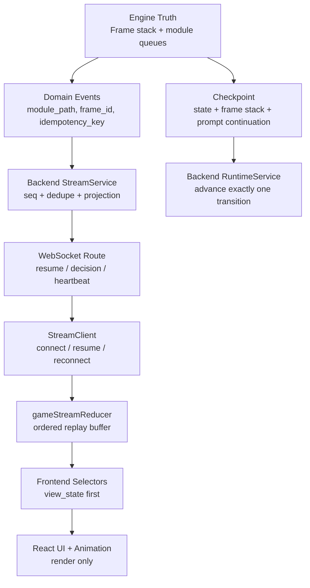
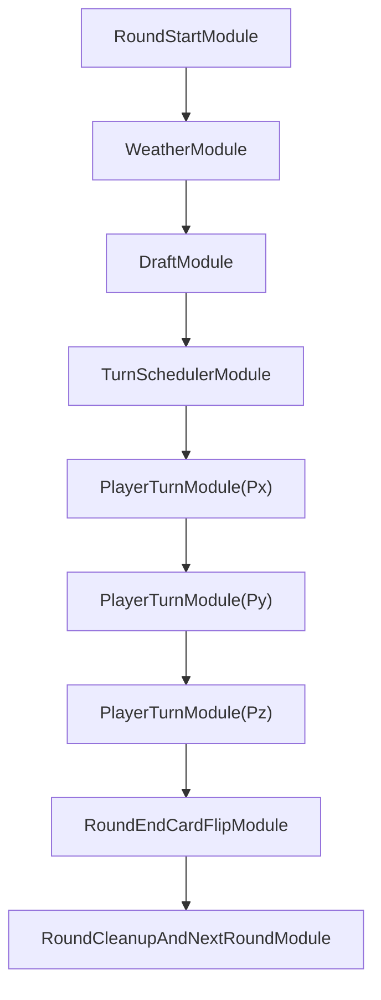
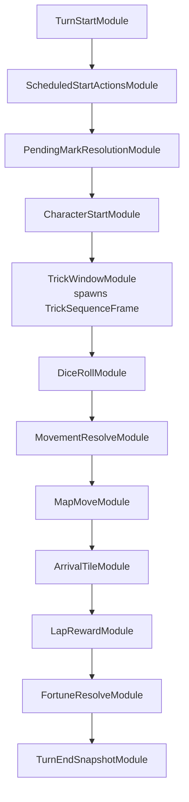
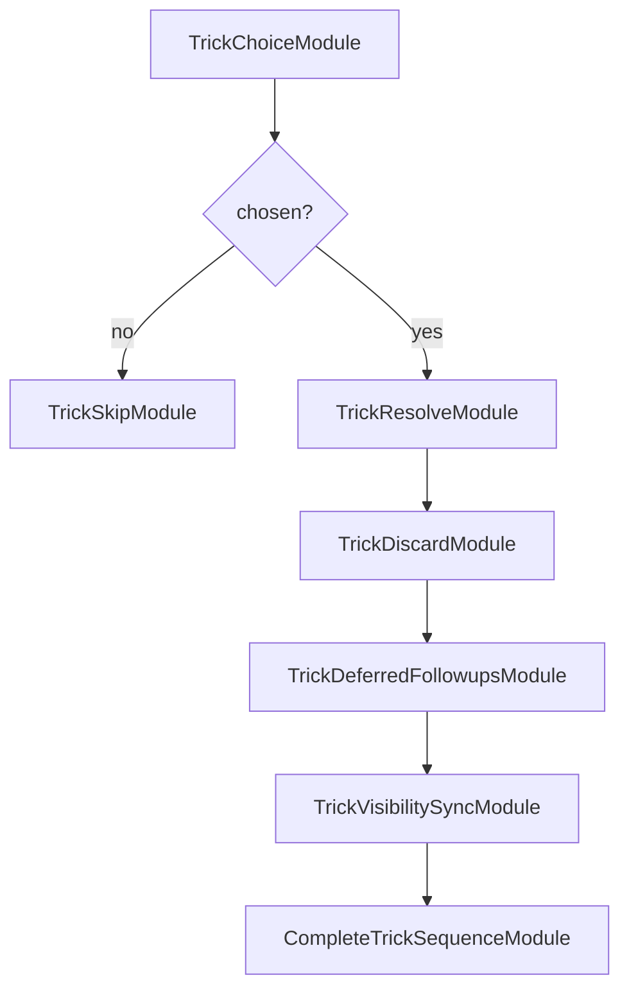

# Modular Game Runtime Draft#1

> **For agentic workers:** REQUIRED SUB-SKILL: Use superpowers:subagent-driven-development (recommended) or superpowers:executing-plans to implement this plan task-by-task. Steps use checkbox (`- [ ]`) syntax for tracking.

**Goal:** Replace the implicit flag-driven turn runtime with an explicit module/frame runtime where round work, turn work, trick sequences, prompts, modifiers, backend projection, WebSocket replay, and frontend rendering share one ordered structure.

**Architecture:** The engine owns truth through `RoundFrame`, `TurnFrame`, and nested `SequenceFrame` queues. The backend persists and publishes frame/module progress without inventing gameplay truth. The frontend renders backend-projected state keyed by module/frame identity, while animation remains decorative.

**Tech Stack:** Python legacy engine (`GPT/engine.py`), FastAPI backend services, `StreamService`/WebSocket transport, React/TypeScript frontend selectors and reducers, JSON Schema runtime contracts.

---

## 1. Design Position

The expected architecture is not "one large engine function checks pending flags and guesses what comes next."

The expected architecture is:

```text
current_frame.queue.pop_front().run(context)
```

Each module performs one bounded job, emits explicit events, mutates state through a controlled context, and then uses queue operations to add the next work. The next step should be visible in persisted runtime state.

Current source map:

- Engine dispatcher: `GPT/engine.py::run_next_transition`
- Current turn body: `GPT/engine.py::_take_turn`
- Current trick subflow: `GPT/engine.py::_use_trick_phase`
- Backend transition runner: `apps/server/src/services/runtime_service.py::_run_engine_transition_once_sync`
- Backend stream/projection: `apps/server/src/services/stream_service.py::publish`
- WebSocket route: `apps/server/src/routes/stream.py::stream_ws`
- Frontend stream client: `apps/web/src/infra/ws/StreamClient.ts`
- Frontend stream reducer: `apps/web/src/domain/store/gameStreamReducer.ts`
- Frontend selectors: `apps/web/src/domain/selectors/streamSelectors.ts`, `apps/web/src/domain/selectors/promptSelectors.ts`

## 2. Non-Negotiable Invariants

1. Round modules and turn modules are different frame levels.
2. Draft exists only as a round module and cannot be scheduled inside a turn frame.
3. Card flip exists only as a round-end module after every scheduled player turn frame has completed.
4. Doctrine/researcher marker transfer is an immediate turn-internal effect, not round-end card flip.
5. "Has marker" effects observe the new marker owner immediately after marker transfer.
6. Trick is a nested sequence frame, not a boolean return value from a turn function.
7. Prompts suspend the exact current module and resume only with the matching continuation token.
8. Backend never derives or advances gameplay truth from stream order alone.
9. WebSocket replay never triggers engine work; it only replays already-published messages.
10. Frontend selectors prefer backend `view_state` and module metadata over localized display text.

## 3. Runtime Layers



## 4. Engine Frame Model

### 4.1 GameRuntimeState

Persist this in the engine checkpoint, not only in backend metadata.

```python
GameRuntimeState = {
    "round_index": int,
    "turn_index": int,
    "frame_stack": list[FrameState],
    "module_journal": list[ModuleJournalEntry],
    "active_prompt": PromptContinuation | None,
    "scheduled_turn_injections": dict[str, list[ModuleRef]],
    "modifier_registry": ModifierRegistryState,
}
```

### 4.2 FrameState

```python
FrameState = {
    "frame_id": "round:3" | "turn:3:p2" | "seq:trick:3:p2:1",
    "frame_type": "round" | "turn" | "sequence",
    "owner_player_id": int | None,
    "parent_frame_id": str | None,
    "module_queue": list[ModuleRef],
    "completed_module_ids": list[str],
    "status": "running" | "suspended" | "completed",
}
```

Frame types:

- `RoundFrame`: first layer. Owns weather, draft, turn scheduling, player turn modules, round-end card flip.
- `TurnFrame`: second layer. Owns one player's turn modules.
- `SequenceFrame`: nested layer. Owns special sub-sequences such as trick resolution, fortune follow-up, prompt batches, purchase chains, and zone chains.

### 4.3 ModuleRef

```python
ModuleRef = {
    "module_id": "mod:round:3:draft" | "mod:turn:3:p2:dice",
    "module_type": str,
    "phase": str,
    "owner_player_id": int | None,
    "payload": dict,
    "modifiers": list[ModifierRef],
    "idempotency_key": str,
    "status": "queued" | "running" | "completed" | "skipped",
}
```

`idempotency_key` must be stable across replay/hydration. It is the primary dedupe key for backend stream publication and module journal records.

### 4.4 ModuleResult

Every module returns a typed result:

```python
ModuleResult = {
    "events": list[DomainEvent],
    "mutations": list[StateMutation],
    "queue_ops": list[QueueOp],
    "modifier_ops": list[ModifierOp],
    "prompt": PromptRequest | None,
    "status": "completed" | "suspended" | "failed",
}
```

Allowed queue operations:

- `push_front(frame_id, module)`
- `push_back(frame_id, module)`
- `insert_after(frame_id, anchor_module_id, module)`
- `replace_current(frame_id, modules)`
- `spawn_child_frame(parent_frame_id, frame)`
- `complete_frame(frame_id)`

No module may mutate another frame's queue directly. It must use a queue operation so the journal can record causality.

## 5. RoundFrame Design

Round setup is the first-layer queue. It is rebuilt once per round and persisted.



### 5.1 RoundStartModule

Responsibilities:

- Increment or initialize round identity.
- Reset round-scoped temporary effects.
- Emit `round_start`.
- Initialize `prompt_sequence` or equivalent prompt identity for this round.

Safety rule:

- It may only run when no `RoundFrame` is active.

### 5.2 WeatherModule

Responsibilities:

- Draw or select one weather card.
- Move used weather to discard/graveyard.
- Apply weather effects through one effect handler path.
- Emit `weather_reveal`.

Safety rule:

- Weather application must be single-sourced. There must not be one direct engine implementation and another handler implementation with different semantics.

### 5.3 DraftModule

Responsibilities:

- Resolve character draft based on current marker owner.
- Request human/AI choices as needed.
- Commit `draft_pick` and `final_character_choice`.
- Produce the final drafted-character map used by turn scheduling.

Safety rule:

- `DraftModule` has idempotency key `round:{round_index}:draft`.
- It cannot appear in `TurnFrame` or `SequenceFrame`.
- Reconnect/replay may republish previous draft events, but must not execute draft logic again.

### 5.4 TurnSchedulerModule

Responsibilities:

- Build the round's actor order from final drafted characters and priority rules.
- Append one `PlayerTurnModule` per scheduled actor to the current `RoundFrame`.
- Append `RoundEndCardFlipModule`.

Safety rule:

- Turn order is immutable once emitted for the round, except explicit death/skip rules. If a player dies, their `PlayerTurnModule` resolves as skipped/completed; the round queue is not rebuilt.

### 5.5 PlayerTurnModule

Responsibilities:

- Spawn a `TurnFrame` for the actor.
- Run the nested `TurnFrame` to completion.
- Complete itself only after the nested `TurnFrame` emits `turn_end_snapshot`.

Safety rule:

- A `PlayerTurnModule` cannot complete while its child `TurnFrame` is running or suspended.

### 5.6 RoundEndCardFlipModule

Responsibilities:

- Run only after every `PlayerTurnModule` in the round frame has completed.
- Resolve round-end card flip.
- Emit `marker_flip` or the canonical card-flip event.

Safety rule:

- This module is the only legal place for card flip.
- It must reject execution if any player turn module in the current round is not completed.

### 5.7 RoundCleanupAndNextRoundModule

Responsibilities:

- Increment completed-round count.
- Archive round-scoped modifiers and journals.
- Enqueue the next `RoundFrame` unless end rules finish the game.

## 6. TurnFrame Design

Each player's turn is a second-layer queue. The default shape should be explicit enough that the runtime can show "where we are" without guessing from event text.



### 6.1 TurnStartModule

Responsibilities:

- Emit `turn_start`.
- Handle skipped-turn state as a normal module result.
- Initialize turn-local modifier scopes.

Safety rule:

- Even skipped turns must complete through `TurnEndSnapshotModule`.

### 6.2 ScheduledStartActionsModule

Responsibilities:

- Pull scheduled actions for this player and phase.
- Insert them at the front of the current `TurnFrame` after itself.

Safety rule:

- Scheduled actions must carry `target_frame_id` or a resolvable phase key. They cannot be placed in a global untyped pending queue.

### 6.3 PendingMarkResolutionModule

Responsibilities:

- Resolve previously queued marks.
- If the mark target is valid and has the named drafted character, insert `MarkEffectActivationModule` at the front of the target player's active or next `TurnFrame`.
- If the target turn frame has not been spawned yet, store the insertion in `scheduled_turn_injections`.

Safety rule:

- Mark resolution and marker ownership are separate concepts. This module does not perform round-end card flip.

### 6.4 CharacterStartModule

Responsibilities:

- Apply the current actor's character start ability.
- For doctrine/researcher style marker transfer, execute `ImmediateMarkerTransferModule` inside the current turn.
- Emit `marker_transferred` immediately when ownership changes.
- Activate "has marker" effects for the new owner from this point onward.

Safety rule:

- Immediate marker transfer does not imply card flip.
- The module must update marker owner before any subsequent module checks "has marker".

### 6.5 TargetJudicatorModule

This is not always present in the default queue. Character modules add it when they need targeting.

Responsibilities:

- Normalize target candidates.
- Check whether the target player has the required drafted character.
- Insert target effects into the appropriate turn frame by calling the frame queue API.
- Attach modifiers when the target effect modifies another module instead of inserting a direct action.

Examples:

- Pabal-style effect adds a modifier to `DiceRollModule`.
- Guesthouse-style effect adds a modifier to `MapMoveModule`, and that modifier propagates to `ArrivalTileModule` and `LapRewardModule`.

### 6.6 TrickWindowModule

Responsibilities:

- Emit `trick_window_open`.
- Spawn `TrickSequenceFrame` if a trick is chosen.
- After the child frame completes, emit `trick_window_closed`.
- Continue to `DiceRollModule`.

Safety rule:

- Trick use never "eats" the rest of the turn. It only suspends the parent turn while the child sequence runs.

### 6.7 TrickSequenceFrame



Responsibilities:

- Keep all trick-local work inside one child frame.
- Queue deferred supply threshold actions inside the child frame or as explicit parent-frame insertions.
- Return to the parent `TurnFrame` only after visibility sync and deferred follow-ups are complete.

Safety rule:

- `TrickSequenceFrame` status is visible in checkpoint and stream metadata. Backend/frontend never infer trick state from "trick_used" alone.

### 6.8 DiceRollModule

Responsibilities:

- Resolve movement decision prompt if needed.
- Apply dice modifiers.
- Emit `dice_roll`.

Modifier examples:

- Weather extra dice.
- Pabal-style dice modifier.
- Fortune-inserted extra roll.

### 6.9 MovementResolveModule

Responsibilities:

- Combine dice, cards, modifier results, and movement policy.
- Produce a movement facts object.

Safety rule:

- This module computes movement value but does not move the pawn.

### 6.10 MapMoveModule

Responsibilities:

- Move the pawn.
- Apply map movement modifiers.
- Propagate relevant modifiers to arrival and lap modules.
- Emit `player_move`.

### 6.11 ArrivalTileModule

Responsibilities:

- Resolve tile landing.
- Queue purchase, rent, zone-chain, or other follow-up sequence frames.
- Emit `landing_resolved`.

Safety rule:

- Follow-ups are child sequence frames or explicit queue insertions, not anonymous global pending actions.

### 6.12 LapRewardModule

Responsibilities:

- Resolve lap rewards when movement crosses the lap boundary.
- Apply propagated modifiers.
- Request reward choice prompt if needed.

### 6.13 FortuneResolveModule

Responsibilities:

- Resolve fortune card effects when arrival or tile rules trigger them.
- If fortune grants an extra chance to roll and arrive, insert `RollAndArriveSequenceFrame` after itself.

Example:

```text
FortuneResolveModule
  queue_op: spawn_child_frame(
    RollAndArriveSequenceFrame[
      DiceRollModule,
      MovementResolveModule,
      MapMoveModule,
      ArrivalTileModule
    ]
  )
```

### 6.14 TurnEndSnapshotModule

Responsibilities:

- Resolve end-of-turn windows.
- Emit `turn_end_snapshot`.
- Complete the `TurnFrame`.

Safety rule:

- The parent `PlayerTurnModule` cannot complete until this module completes.

## 7. Modifier Registry

Modifiers are structured data, not ad hoc flags.

```python
Modifier = {
    "modifier_id": str,
    "source_module_id": str,
    "target_module_type": str,
    "scope": "turn" | "round" | "sequence" | "single_use",
    "owner_player_id": int | None,
    "priority": int,
    "payload": dict,
    "propagation": list[str],
    "expires_on": "module_completed" | "turn_completed" | "round_completed",
}
```

Propagation examples:

- Pabal -> `DiceRollModule`
- Guesthouse -> `MapMoveModule` -> `ArrivalTileModule`, `LapRewardModule`
- Weather -> `DiceRollModule` or `MovementResolveModule` depending on the rule

## 8. Prompt/Decision Model

Prompts are module suspension, not side effects detached from engine control flow.

```python
PromptContinuation = {
    "request_id": str,
    "prompt_instance_id": int,
    "frame_id": str,
    "module_id": str,
    "module_type": str,
    "resume_token": str,
    "player_id": int,
    "request_type": str,
    "legal_choices": list[dict],
}
```

Rules:

- Backend stores pending prompts with `resume_token`.
- WebSocket decisions must include `request_id`, `player_id`, `choice_id`, and client sequence.
- Backend validates the prompt before waking the runtime.
- Engine resumes only the suspended module whose `resume_token` matches.
- Stale or duplicate decisions publish `decision_ack(rejected)` and do not advance the engine.

## 9. Backend Runtime Design

### 9.1 RuntimeService

`RuntimeService` should become a single-transition runner over explicit module state:

```text
hydrate checkpoint
apply accepted command if present
engine.advance_one()
persist checkpoint with frame_stack
publish emitted events
return waiting_input / committed / finished
```

Backend responsibilities:

- Own session lifecycle and concurrency locks.
- Hydrate and persist engine checkpoint.
- Forward accepted decisions as commands.
- Publish events and prompts.
- Maintain runtime status.

Backend non-responsibilities:

- Reconstruct turn order.
- Decide whether card flip should happen.
- Infer prompt closure from localized text.

### 9.2 Checkpoint Additions

Add these fields:

```json
{
  "runtime_schema_version": 2,
  "frame_stack": [],
  "module_journal_tail": [],
  "active_prompt": null,
  "latest_module_path": "round:3/turn:p2/seq:trick/mod:resolve",
  "has_active_turn_frame": true,
  "has_active_round_end_module": false
}
```

### 9.3 Command Store

Decision commands should be consumed once by `request_id` and `resume_token`.

```json
{
  "command_type": "decision",
  "request_id": "prompt_...",
  "resume_token": "resume_...",
  "player_id": 2,
  "choice_id": "roll",
  "client_seq": 148,
  "consumer": "runtime:<session_id>"
}
```

## 10. Stream/WebSocket Design

### 10.1 Event Metadata

Every engine event and prompt should carry:

```json
{
  "event_type": "dice_roll",
  "round_index": 3,
  "turn_index": 7,
  "frame_id": "turn:3:p2",
  "module_id": "mod:turn:3:p2:dice",
  "module_type": "DiceRollModule",
  "module_path": "round:3/turn:p2/mod:dice",
  "idempotency_key": "round:3:turn:p2:dice",
  "phase": "movement",
  "acting_player_id": 2
}
```

### 10.2 StreamService

Responsibilities:

- Assign monotonic `seq`.
- Dedupe by `idempotency_key` plus event subtype where applicable.
- Project `view_state` from event history.
- Cache per-viewer projections.

Safety rule:

- Heuristic duplicate suppression may exist for compatibility, but module idempotency is the primary dedupe mechanism.

### 10.3 WebSocket Route

Inbound:

- `resume`: replay messages after `last_seq`.
- `decision`: validate player/session, submit to prompt service.

Outbound:

- `event`
- `prompt`
- `decision_ack`
- `error`
- `heartbeat`

Heartbeat should include:

```json
{
  "latest_seq": 148,
  "runtime_status": "waiting_input",
  "latest_module_path": "round:3/turn:p2/seq:trick/mod:choice"
}
```

Safety rule:

- `resume` must never wake or advance the engine.
- `decision` may wake the runtime only after prompt validation succeeds.

## 11. Frontend Design

### 11.1 Store

The reducer keeps ordered messages and backend projection. It does not infer impossible stage changes.

Required state additions:

```ts
type GameStreamState = {
  lastSeq: number;
  messages: InboundMessage[];
  latestViewState: ViewState | null;
  latestModulePath: string | null;
  pendingBySeq: Record<number, InboundMessage>;
};
```

### 11.2 Selectors

Selector priority:

1. `payload.view_state`
2. canonical event metadata (`module_path`, `module_type`, `phase`)
3. raw structured payload fields
4. localized text only for display labels

Selectors should expose:

- `selectRoundStage`
- `selectTurnFrameStage`
- `selectActiveSequence`
- `selectActivePrompt`
- `selectBoardView`
- `selectAnimationTimeline`

### 11.3 UI/Animation

Rules:

- UI renders frame/module state from `view_state`.
- Animation consumes ordered event timeline.
- Animation completion cannot advance gameplay.
- A card flip animation can render only if the event's `module_type` is `RoundEndCardFlipModule`.
- Trick UI can render "inside trick sequence" only if the active module path contains a `TrickSequenceFrame`.

## 12. Implementation Plan

### Task 1: Define Runtime Module Contracts

**Files:**

- Create: `GPT/runtime_modules/contracts.py`
- Create: `packages/runtime-contracts/schemas/module-event.schema.json`
- Modify: `packages/runtime-contracts/ws/README.md`

- [ ] Define `FrameState`, `ModuleRef`, `ModuleResult`, `QueueOp`, `Modifier`, and `PromptContinuation`.
- [ ] Add JSON Schema examples for `module_path`, `frame_id`, `module_type`, and `idempotency_key`.
- [ ] Add tests proving event payloads require canonical module metadata.

### Task 2: Add Engine Module Runner Beside Legacy Flow

**Files:**

- Create: `GPT/runtime_modules/runner.py`
- Create: `GPT/runtime_modules/journal.py`
- Modify: `GPT/state.py`
- Test: `GPT/test_runtime_module_runner.py`

- [ ] Implement a runner that executes exactly one module transition.
- [ ] Persist frame stack and module journal in checkpoint payload.
- [ ] Add tests for queue order, child frame completion, prompt suspension, and idempotency.

### Task 3: Port Round Modules

**Files:**

- Create: `GPT/runtime_modules/round_modules.py`
- Modify: `GPT/engine.py`
- Test: `GPT/test_round_module_runtime.py`

- [ ] Implement `RoundStartModule`, `WeatherModule`, `DraftModule`, `TurnSchedulerModule`, `PlayerTurnModule`, `RoundEndCardFlipModule`, and `RoundCleanupAndNextRoundModule`.
- [ ] Prove draft runs once per round even after hydrate/replay.
- [ ] Prove card flip cannot execute before all player turn modules complete.

### Task 4: Port Turn Modules

**Files:**

- Create: `GPT/runtime_modules/turn_modules.py`
- Create: `GPT/runtime_modules/sequence_modules.py`
- Test: `GPT/test_turn_module_runtime.py`

- [ ] Implement turn start, scheduled start actions, pending mark resolution, character start, trick window, dice, movement, arrival, fortune, lap reward, and turn end modules.
- [ ] Prove trick sequence returns to movement.
- [ ] Prove skipped/dead turns still complete through the intended end path.

### Task 5: Port Prompt Continuation

**Files:**

- Modify: `apps/server/src/services/decision_gateway.py`
- Modify: `apps/server/src/services/prompt_service.py`
- Modify: `apps/server/src/services/runtime_service.py`
- Test: `apps/server/tests/test_runtime_module_prompt_continuation.py`

- [ ] Store `resume_token`, `frame_id`, and `module_id` with every prompt.
- [ ] Reject stale decisions.
- [ ] Resume exactly the suspended module after accepted decisions.

### Task 6: Update Backend Projection

**Files:**

- Modify: `apps/server/src/domain/view_state/turn_selector.py`
- Modify: `apps/server/src/domain/view_state/scene_selector.py`
- Modify: `apps/server/src/domain/view_state/prompt_selector.py`
- Test: `apps/server/tests/test_view_state_module_projection.py`

- [ ] Project `round_stage`, `turn_stage`, and `active_sequence` from module metadata.
- [ ] Stop deriving gameplay stage from localized labels when module metadata exists.

### Task 7: Update WebSocket Replay Contracts

**Files:**

- Modify: `apps/server/src/services/stream_service.py`
- Modify: `apps/server/src/routes/stream.py`
- Modify: `packages/runtime-contracts/ws/README.md`
- Test: `apps/server/tests/test_stream_module_replay.py`

- [ ] Dedupe by idempotency key.
- [ ] Include latest module path in heartbeat.
- [ ] Prove resume replays but never advances engine.

### Task 8: Update Frontend Store and Selectors

**Files:**

- Modify: `apps/web/src/domain/store/gameStreamReducer.ts`
- Modify: `apps/web/src/domain/selectors/streamSelectors.ts`
- Modify: `apps/web/src/domain/selectors/promptSelectors.ts`
- Test: `apps/web/src/domain/selectors/streamSelectors.spec.ts`
- Test: `apps/web/src/domain/selectors/promptSelectors.spec.ts`

- [ ] Preserve latest projected `view_state`.
- [ ] Render module-stage state from backend projection.
- [ ] Prove duplicate/replayed draft events do not reopen draft UI.
- [ ] Prove card flip UI appears only from `RoundEndCardFlipModule`.

## 13. Migration Strategy

Use a compatibility adapter first.

1. Add module metadata to legacy events without changing behavior.
2. Persist a read-only synthetic frame path from the current legacy transition.
3. Add backend/frontend selectors that prefer module metadata when present.
4. Port round modules behind a runtime flag.
5. Port turn modules behind the same flag.
6. Remove legacy `pending_turn_completion` only after module tests cover all current cases.

This avoids a single large rewrite while still moving toward the real architecture.
