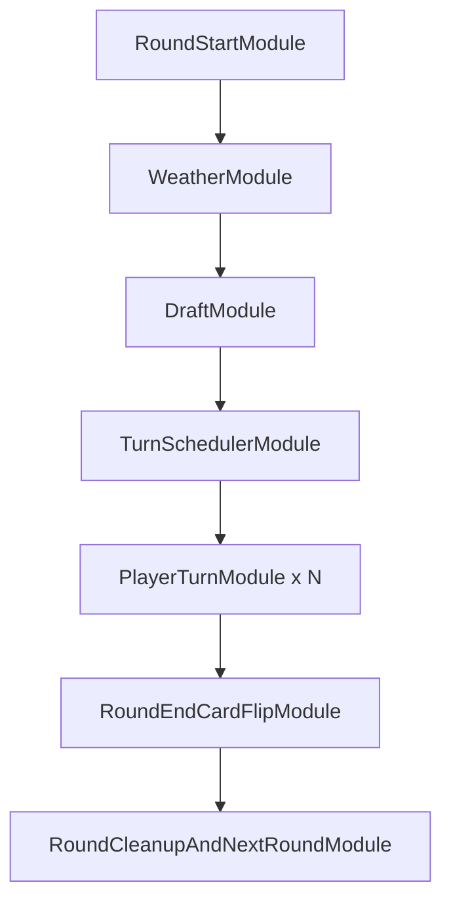
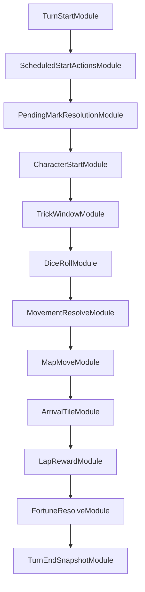
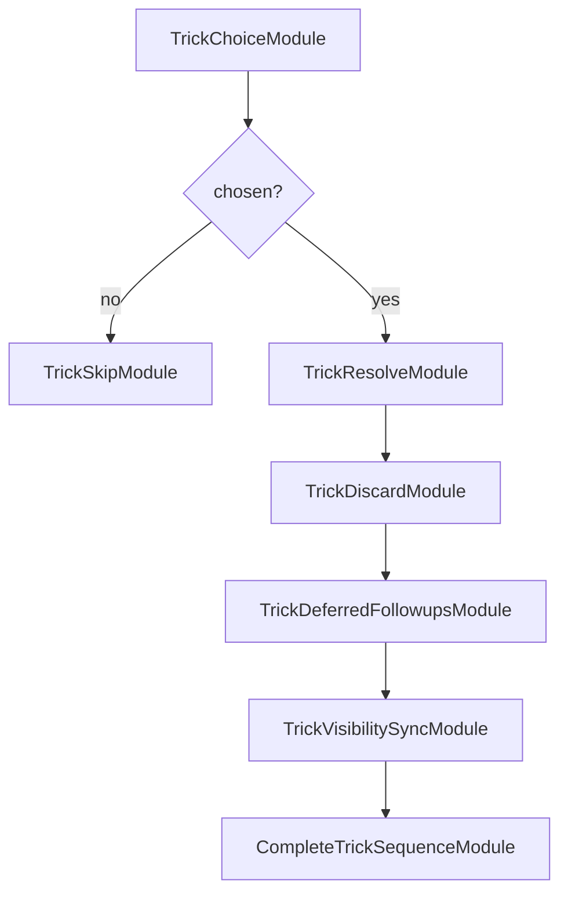

# Modular Game Runtime Migration Part 2 - Module Contracts And Boundaries

> **For agentic workers:** REQUIRED SUB-SKILL: Use `superpowers:executing-plans` or `superpowers:subagent-driven-development` before implementing this migration. This document is Part 2 of 3 and defines module responsibilities, boundaries, and I/O contracts. Read Part 1 first and Part 3 for implementation tasks.

**Goal:** Define the exact module contracts needed to move from implicit runtime flags to explicit round, turn, and sequence frames.

**Architecture:** Modules run inside persisted frames, mutate game state through `ModuleContext`, emit domain events with causality metadata, and modify future work only through typed `QueueOp` and `ModifierOp`.

**Tech Stack:** Python dataclasses for engine contracts, backend JSON-compatible payloads, TypeScript selectors consuming additive `runtime_module` and `view_state.runtime` projection fields.

---

## 2-1. Shared Contract: GameRuntimeState

`GameRuntimeState` is stored inside engine checkpoint payloads for module sessions.

```python
@dataclass(slots=True)
class GameRuntimeState:
    schema_version: int
    runner_kind: Literal["legacy", "module"]
    round_index: int
    turn_index: int
    frame_stack: list[FrameState]
    module_journal: list[ModuleJournalEntry]
    active_prompt: PromptContinuation | None
    scheduled_turn_injections: dict[str, list[ModuleRef]]
    modifier_registry: ModifierRegistryState
```

Boundary:

1. Engine owns this state.
2. Backend persists and mirrors it but does not edit queues.
3. Frontend sees projected summaries, not raw mutable queues.

## 2-2. Shared Contract: FrameState

```python
@dataclass(slots=True)
class FrameState:
    frame_id: str
    frame_type: Literal["round", "turn", "sequence"]
    owner_player_id: int | None
    parent_frame_id: str | None
    module_queue: list[ModuleRef]
    active_module_id: str | None
    completed_module_ids: list[str]
    status: Literal["running", "suspended", "completed", "failed"]
    created_by_module_id: str | None
```

Frame rules:

1. `RoundFrame` has no parent.
2. `TurnFrame` parent is a `PlayerTurnModule` in `RoundFrame`.
3. `SequenceFrame` parent is a module in `TurnFrame` or another `SequenceFrame`.
4. A suspended child frame suspends its parent frame.
5. A completed frame cannot receive new queue operations.

## 2-3. Shared Contract: ModuleRef

```python
@dataclass(slots=True)
class ModuleRef:
    module_id: str
    module_type: str
    phase: str
    owner_player_id: int | None
    payload: dict[str, Any]
    modifiers: list[str]
    idempotency_key: str
    status: Literal["queued", "running", "suspended", "completed", "skipped", "failed"]
```

Module id rules:

1. Round modules use `mod:round:{round}:...`.
2. Turn modules use `mod:turn:{round}:p{player}:...`.
3. Sequence modules use `mod:seq:{kind}:{round}:p{player}:{ordinal}:...`.
4. Legacy metadata may use `legacy:` prefix during M1-M3.
5. `idempotency_key` must be stable across hydration and replay.

## 2-4. Shared Contract: ModuleContext

`ModuleContext` is the only way a module touches runtime services.

```python
@dataclass(slots=True)
class ModuleContext:
    state: GameState
    runtime: GameRuntimeState
    frame: FrameState
    module: ModuleRef
    policy: DecisionPolicy
    event_bus: EventDispatcher
    rng: random.Random
    emit: Callable[[DomainEvent], None]
    queue: FrameQueueApi
    modifiers: ModifierRegistry
    prompts: PromptApi
```

Boundary:

1. Modules may mutate `GameState` for gameplay facts they own.
2. Modules may not call backend services.
3. Modules may not mutate `frame_stack` directly.
4. Prompts are requested through `PromptApi`, which creates a `PromptContinuation`.

## 2-5. Shared Contract: ModuleResult

```python
@dataclass(slots=True)
class ModuleResult:
    status: Literal["completed", "suspended", "failed"]
    events: list[DomainEvent]
    queue_ops: list[QueueOp]
    modifier_ops: list[ModifierOp]
    prompt: PromptRequest | None
    error: ModuleError | None
```

Result rules:

1. `completed` means the runner may mark the module complete and advance the frame.
2. `suspended` requires a prompt or child frame.
3. `failed` stores failure in the journal and returns runtime status `failed`.
4. Queue and modifier operations are applied by the runner after the module returns.

## 2-6. Shared Contract: QueueOp

```python
QueueOp = TypedDict("QueueOp", {
    "op": Literal["push_front", "push_back", "insert_after", "replace_current", "spawn_child_frame", "complete_frame"],
    "target_frame_id": str,
    "anchor_module_id": NotRequired[str],
    "module": NotRequired[ModuleRef],
    "modules": NotRequired[list[ModuleRef]],
    "frame": NotRequired[FrameState],
})
```

Validation:

1. `target_frame_id` must exist and be running or suspended.
2. `DraftModule` is allowed only in `RoundFrame`.
3. `RoundEndCardFlipModule` is allowed only in `RoundFrame`.
4. `TurnEndSnapshotModule` is allowed only in `TurnFrame`.
5. Child frame `parent_frame_id` must equal the active module's frame.
6. Completed frames reject all queue ops except idempotent duplicate `complete_frame`.

## 2-7. Shared Contract: Modifier

```python
@dataclass(slots=True)
class Modifier:
    modifier_id: str
    source_module_id: str
    target_module_type: str
    scope: Literal["single_use", "sequence", "turn", "round"]
    owner_player_id: int | None
    priority: int
    payload: dict[str, Any]
    propagation: list[str]
    expires_on: Literal["module_completed", "sequence_completed", "turn_completed", "round_completed"]
```

Modifier examples:

1. Courier/Pabal dice modifier targets `DiceRollModule`.
2. Guesthouse-style modifier targets `MapMoveModule` and propagates to `ArrivalTileModule` and `LapRewardModule`.
3. Weather modifiers may target `DiceRollModule`, `MovementResolveModule`, or `ArrivalTileModule`.
4. Trick rent modifiers target purchase/rent/landing submodules and expire at turn end or after one use.

## 2-8. Shared Contract: PromptContinuation

```python
@dataclass(slots=True)
class PromptContinuation:
    request_id: str
    prompt_instance_id: int
    resume_token: str
    frame_id: str
    module_id: str
    module_type: str
    player_id: int
    request_type: str
    legal_choices: list[dict[str, Any]]
    public_context: dict[str, Any]
    expires_at_ms: int | None
```

Prompt rules:

1. Backend prompt service indexes the active prompt; it is not the source of truth.
2. A decision must include `request_id`, `player_id`, `choice_id`, and client sequence.
3. Backend validates request/player/choice before waking runtime.
4. Engine validates `resume_token`, `frame_id`, and `module_id` before applying the choice.
5. Duplicate or stale decisions emit rejected `decision_ack` and do not advance gameplay.

## 2-9. Shared Contract: DomainEvent Metadata

Every module-originated event carries additive metadata:

```python
runtime_module = {
    "schema_version": 1,
    "runner_kind": "module",
    "frame_id": "turn:3:p2",
    "frame_type": "turn",
    "module_id": "mod:turn:3:p2:dice",
    "module_type": "DiceRollModule",
    "module_status": "completed",
    "module_path": ["round:3", "turn:3:p2", "mod:turn:3:p2:dice"],
    "idempotency_key": "session:s1:round:3:turn:p2:dice"
}
```

Top-level event payload should also include:

1. `idempotency_key`
2. `round_index`
3. `turn_index`
4. `player_id` when applicable
5. `public_phase`
6. `event_type`

## 2-10. RoundFrame Module Set



These modules are first-layer work. They cannot be inserted into `TurnFrame` or `SequenceFrame` except `PlayerTurnModule` owning a child `TurnFrame`.

## 2-11. RoundStartModule

Role:

1. Initialize one round identity.
2. Reset round-scoped player flags.
3. Reset weather and round-scoped rent modifiers.
4. Emit `round_start`.

Inputs:

1. `round_index`
2. `initial`
3. alive players
4. marker owner and direction
5. active character faces

Outputs:

1. Mutated round temporary flags.
2. `round_start` event.
3. `RoundStartModule` journal entry.

Boundary:

1. Does not draw weather.
2. Does not draft.
3. Does not create player turns.

## 2-12. WeatherModule

Role:

1. Draw/select weather.
2. Move used weather to discard where needed.
3. Apply weather through a single effect-handler path.
4. Emit `weather_reveal`.

Inputs:

1. weather draw/discard piles
2. active character attributes
3. current marker owner for marker-sensitive weather

Outputs:

1. `state.current_weather`
2. `state.current_weather_effects`
3. weather effect mutations
4. `weather_reveal` event

Boundary:

1. Does not run draft.
2. Does not mutate turn queue except through declared weather modifiers.

## 2-13. DraftModule

Role:

1. Draft two character card numbers per alive player.
2. Request `draft_card` decisions when choice is not automatic.
3. Request final character decision.
4. Commit selected character per player.
5. Emit `draft_pick` and `final_character_choice`.

Inputs:

1. marker owner
2. marker direction
3. alive player list
4. active card faces
5. character card deck/order RNG

Outputs:

1. `PlayerState.drafted_cards`
2. `PlayerState.current_character`
3. draft/final choice events
4. active prompt suspension when human input is required

Boundary:

1. Cannot schedule turns directly.
2. Cannot run outside `RoundFrame`.
3. Cannot reopen after completed idempotency key exists for the same round.

## 2-14. TurnSchedulerModule

Role:

1. Sort alive players by final character priority and player id.
2. Write immutable round order for compatibility.
3. Append one `PlayerTurnModule` per actor.
4. Append `RoundEndCardFlipModule`.
5. Append `RoundCleanupAndNextRoundModule`.
6. Emit `round_order`.

Inputs:

1. final selected characters
2. alive players
3. character priority table

Outputs:

1. `state.current_round_order`
2. queued player turn modules
3. `round_order` event

Boundary:

1. Does not execute turns.
2. Does not rebuild order mid-round.
3. Dead actors resolve through their own `PlayerTurnModule` as skipped/completed.

## 2-15. PlayerTurnModule

Role:

1. Spawn one `TurnFrame` for its actor.
2. Suspend while the child frame runs.
3. Complete only after the child `TurnFrame` completes.

Inputs:

1. actor player id
2. round index
3. turn ordinal

Outputs:

1. child `TurnFrame`
2. module completion after `TurnEndSnapshotModule`

Boundary:

1. Does not run turn steps itself.
2. Cannot complete if child frame is running or suspended.

## 2-16. RoundEndCardFlipModule

Role:

1. Resolve final round-end marker management that is still round-end-only.
2. Resolve card face flip.
3. Emit canonical card flip event.

Inputs:

1. completed player turn module list
2. selected doctrine/researcher candidates where rule says round-end handling applies
3. pending marker/card flip state
4. active card faces

Outputs:

1. active card face updates
2. `marker_transferred` only for round-end transfer when applicable
3. card flip event with `module_type=RoundEndCardFlipModule`

Boundary:

1. Must assert all `PlayerTurnModule`s are complete.
2. Must not run inside a turn or sequence.
3. Must not process immediate marker transfer from character start.

## 2-17. RoundCleanupAndNextRoundModule

Role:

1. Increment completed rounds.
2. Expire round-scoped modifiers.
3. Clear round journals beyond retention policy.
4. Check game end.
5. Enqueue next `RoundFrame` when game continues.

Inputs:

1. end-rule result
2. round-scoped modifiers
3. frame/journal state

Outputs:

1. updated `rounds_completed`
2. next `RoundFrame` or `game_end`

Boundary:

1. Does not perform card flip.
2. Does not run next round's weather directly; it only enqueues the next frame.

## 2-18. TurnFrame Module Set



The default queue may skip modules only by explicit module result. For example, a skipped actor still reaches `TurnEndSnapshotModule`.

## 2-19. TurnStartModule

Role:

1. Initialize turn-local modifier scope.
2. Handle `skipped_turn` as structured turn status.
3. Emit `turn_start`.

Inputs:

1. actor player
2. actor character
3. skipped/dead state
4. current position

Outputs:

1. `turn_start`
2. turn-local registry scope
3. optional queue op to bypass to `TurnEndSnapshotModule`

Boundary:

1. Does not resolve marks.
2. Does not apply character ability.

## 2-20. ScheduledStartActionsModule

Role:

1. Materialize scheduled frame-specific actions for actor turn start.
2. Insert converted modules at the front of the current `TurnFrame`.

Inputs:

1. `scheduled_turn_injections`
2. compatibility `scheduled_actions`
3. actor player id
4. phase key `turn_start`

Outputs:

1. queue insertions
2. journal entries for materialized actions

Boundary:

1. Rejects untyped global actions.
2. Does not execute the inserted action itself.

## 2-21. PendingMarkResolutionModule

Role:

1. Resolve marks queued by earlier character targeting.
2. Apply target-turn-first effects before normal character start.
3. Spawn child follow-up sequences when mark effect requires landing/payment/prompt work.

Inputs:

1. `PlayerState.pending_marks`
2. target player's immunity/revealed state
3. source player state

Outputs:

1. `mark_resolved`, `mark_target_missing`, or related events
2. direct state mutations such as tax payment, burden transfer, forced position
3. child sequence frame or queue insertion for forced landing follow-ups

Boundary:

1. Does not perform marker ownership/card face flip.
2. Does not select new mark targets.

## 2-22. CharacterStartModule

Role:

1. Apply actor's character start ability.
2. Request target decisions for target-based characters.
3. Queue target effects into future target turn frames.
4. Add module modifiers for ability effects such as dice changes or purchase discounts.
5. Invoke `ImmediateMarkerTransferModule` when the current character's rule transfers marker immediately.

Inputs:

1. actor character card number and face
2. actor shards/resources
3. active card faces
4. targetable hidden/unrevealed characters

Outputs:

1. target marks or target effect modules
2. modifier ops
3. immediate marker transfer child/inline module result
4. ability events

Boundary:

1. Does not open trick window.
2. Does not emit card flip.
3. Does not resolve target effects immediately unless the rule says immediate.

## 2-23. ImmediateMarkerTransferModule

Role:

1. Move marker ownership immediately inside the actor turn when a character rule does so.
2. Update marker direction when the rule specifies direction.
3. Emit `marker_transferred`.

Inputs:

1. actor player
2. character identity
3. marker direction rule

Outputs:

1. `state.marker_owner_id`
2. `state.marker_draft_clockwise`
3. `marker_transferred` event with `module_type=ImmediateMarkerTransferModule`

Boundary:

1. Must not flip cards.
2. Must complete before the next turn module checks marker owner.

## 2-24. TargetJudicatorModule

Role:

1. Normalize target candidate from prompt result.
2. Determine whether a drafted, unrevealed matching character exists.
3. Insert target effects or modifiers into the correct target turn frame.

Inputs:

1. actor
2. requested target character
3. drafted/final character map
4. revealed/blocked state

Outputs:

1. `TargetEffectActivationModule` insertion
2. direct modifier insertion for effects that alter another module
3. miss/fallback events

Boundary:

1. Is optional and appears only when a character ability needs targeting.
2. Does not execute target effect unless target is current active actor and phase demands immediate insertion at frame front.

## 2-25. TrickWindowModule

Role:

1. Emit `trick_window_open`.
2. Spawn `TrickSequenceFrame` when a trick prompt/choice is needed.
3. Emit `trick_window_closed` after child sequence completion.
4. Continue to dice.

Inputs:

1. actor trick hand
2. per-turn trick usage state
3. hidden/public trick state

Outputs:

1. `trick_window_open`
2. child `TrickSequenceFrame`
3. `trick_window_closed`

Boundary:

1. Trick use never consumes the rest of the turn by boolean return value.
2. Parent turn is suspended while child trick sequence runs.

## 2-26. DiceRollModule

Role:

1. Request movement/dice-card decision when needed.
2. Apply dice count/card/substitution modifiers.
3. Produce dice facts.
4. Emit `dice_roll`.

Inputs:

1. movement decision
2. dice cards
3. weather/character/trick modifiers
4. actor state

Outputs:

1. dice values
2. used card list
3. movement formula
4. `dice_roll` event

Boundary:

1. Does not move the pawn.
2. Does not resolve landing.

## 2-27. MovementResolveModule

Role:

1. Convert dice/card facts and movement modifiers into a movement amount.
2. Record movement metadata.

Inputs:

1. dice facts from `DiceRollModule`
2. runaway/slave-like special movement decisions
3. movement modifiers

Outputs:

1. `MovementFacts`
2. modifier consumption records

Boundary:

1. Does not mutate board position.

## 2-28. MapMoveModule

Role:

1. Move the pawn.
2. Apply movement path modifiers.
3. Detect lap crossing.
4. Emit `player_move`.

Inputs:

1. `MovementFacts`
2. current position
3. board length
4. map movement modifiers

Outputs:

1. updated player position
2. lap-crossing facts
3. `player_move`
4. propagation to `ArrivalTileModule` and `LapRewardModule`

Boundary:

1. Does not resolve tile effects.
2. Does not award lap reward directly.

## 2-29. ArrivalTileModule

Role:

1. Resolve arrival tile class.
2. Start purchase, rent, own-tile, hostile tile, or special tile processing.
3. Spawn child sequences for purchase/rent/payment/zone chains.
4. Emit `landing_resolved`.

Inputs:

1. player position
2. tile state
3. character landing effects
4. weather/trick modifiers

Outputs:

1. tile ownership/resource mutations
2. child sequence frames when prompt/payment/follow-up is required
3. `landing_resolved`

Boundary:

1. Does not process fortune card body; it can route to `FortuneResolveModule`.
2. Does not complete turn.

## 2-30. LapRewardModule

Role:

1. Resolve lap reward choice after path crossing.
2. Apply guesthouse/marker/weather modifiers that affect lap reward.
3. Emit reward event.

Inputs:

1. lap-crossing facts from `MapMoveModule`
2. reward pool state
3. reward choice prompt result

Outputs:

1. cash/shard/score token changes
2. `lap_reward_chosen`

Boundary:

1. Does not move pawn.
2. Does not resolve tile arrival.

## 2-31. FortuneResolveModule

Role:

1. Draw and apply fortune card when fortune tile or rule triggers it.
2. Spawn follow-up sequence for extra roll/arrival, forced trade, forced movement, or special prompt.
3. Emit fortune events.

Inputs:

1. fortune draw/discard piles
2. actor attributes
3. current tile trigger
4. active modifiers

Outputs:

1. fortune card state mutations
2. `fortune_drawn`, `fortune_resolved`, or specialized fortune events
3. child `RollAndArriveSequenceFrame` where applicable

Boundary:

1. Does not perform round cleanup.
2. Does not directly recurse into full turn; it creates an explicit sequence.

## 2-32. TurnEndSnapshotModule

Role:

1. Resolve end-of-turn windows.
2. Expire turn-scoped modifiers.
3. Emit `turn_end_snapshot`.
4. Complete `TurnFrame`.

Inputs:

1. actor state
2. finisher/disruption snapshots
3. accumulated turn facts

Outputs:

1. `turn_end_snapshot`
2. completed turn frame

Boundary:

1. Does not advance round frame by itself; parent `PlayerTurnModule` completes after this.
2. Does not flip cards.

## 2-33. TrickSequenceFrame Modules



Contract:

1. `TrickChoiceModule` requests `trick_to_use` or returns skip.
2. `TrickResolveModule` calls the existing `trick.card.resolve` event-handler path.
3. `TrickDiscardModule` removes the used card and updates public/hidden status.
4. `TrickDeferredFollowupsModule` converts supply thresholds or card follow-ups into modules.
5. `TrickVisibilitySyncModule` restores hidden/public trick invariants.
6. `CompleteTrickSequenceModule` completes the child frame and resumes parent `TrickWindowModule`.

Boundary:

1. Trick sequence owns trick-local prompts and deferrals.
2. Parent `TurnFrame` owns dice/movement after the trick sequence.

## 2-34. RollAndArriveSequenceFrame Modules

Use this when fortune or another rule grants an extra roll-and-arrive opportunity.

Default queue:

1. `DiceRollModule`
2. `MovementResolveModule`
3. `MapMoveModule`
4. `ArrivalTileModule`
5. `LapRewardModule`
6. `FortuneResolveModule`
7. `CompleteSequenceModule`

Boundary:

1. It is not a new player turn.
2. It must not emit a second `turn_start`.
3. It must return to the parent turn sequence before `TurnEndSnapshotModule`.

## 2-35. PurchaseRentPaymentSequenceFrame Modules

Use this for unowned land, owned land, hostile land, swindler takeover, matchmaker purchase, and payment/bankruptcy chains.

Default queue:

1. `TileDecisionModule`
2. `CostModifierModule`
3. `PaymentModule`
4. `OwnershipMutationModule`
5. `BankruptcyResolutionModule`
6. `CompleteSequenceModule`

Boundary:

1. Bankruptcy may end the actor or another player, but it must still return a terminal module result.
2. If game end triggers, the sequence emits explicit game-end status and prevents parent from continuing into illegal modules.

## 2-36. Backend Runtime Boundary

Runtime service contract:

```text
hydrate checkpoint
validate runner_kind
apply accepted command if present
engine.advance_one()
persist checkpoint
publish emitted events
mirror active_prompt to PromptService
return committed / waiting_input / finished / failed
```

Backend may:

1. Persist checkpoint.
2. Publish stream events.
3. Build `view_state`.
4. Validate prompt decisions before waking runtime.

Backend may not:

1. Insert gameplay modules.
2. Advance engine on WebSocket replay.
3. Infer marker/card flip from event names.

## 2-37. Stream And WebSocket Boundary

Stream payload requirements:

1. Ordered by monotonic `seq`.
2. Additive schema changes only unless contract version changes.
3. Duplicate `idempotency_key` returns the original message.
4. Repeated event type with different `module_id` is valid and must publish.

WebSocket inbound:

1. `resume`: replay messages with `seq > last_seq`; no engine work.
2. `decision`: validate and enqueue command; may wake runtime after accepted validation.

WebSocket outbound:

1. `event`
2. `prompt`
3. `decision_ack`
4. `error`
5. `heartbeat`

Heartbeat diagnostic fields:

1. latest `seq`
2. runner kind
3. active frame id
4. active module id
5. active prompt request id when present

## 2-38. Backend View-State Contract

Add `view_state.runtime`:

```json
{
  "runtime": {
    "runner_kind": "module",
    "latest_module_path": ["round:3", "turn:3:p2", "mod:turn:3:p2:dice"],
    "round_stage": "turns",
    "turn_stage": "dice",
    "active_sequence": null,
    "active_prompt_request_id": null,
    "card_flip_legal": false,
    "draft_active": false,
    "trick_sequence_active": false
  }
}
```

Projection priority:

1. Checkpoint active frame/module if available.
2. Event `runtime_module`.
3. Existing stable event fields.
4. Localized text never determines gameplay truth.

## 2-39. Frontend Contract

Selectors must use this priority:

1. `view_state.runtime`
2. `payload.runtime_module`
3. canonical payload ids
4. legacy event fallback for display only

UI rules:

1. Draft UI requires `draft_active=true` or an active draft prompt.
2. Trick UI requires `trick_sequence_active=true`, active trick prompt, or active trick window module.
3. Card flip UI requires `module_type=RoundEndCardFlipModule` or projected legal card-flip event.
4. Replayed old events cannot override newer projected runtime stage.
5. Animation may consume event history but cannot set gameplay stage.

## 2-40. Observability Contract

Every module-runner transition records:

1. `module_started`
2. `module_completed` or `module_suspended`
3. queue ops applied
4. modifier ops applied
5. prompt continuation created/resumed
6. emitted event count
7. checkpoint schema version

Debug log rule:

1. Engine debug log is written only for committed stream events.
2. Failed module validation logs include frame id, module id, op, and reason.
3. Prompt rejection logs include request id and rejection code but not hidden private choices.
