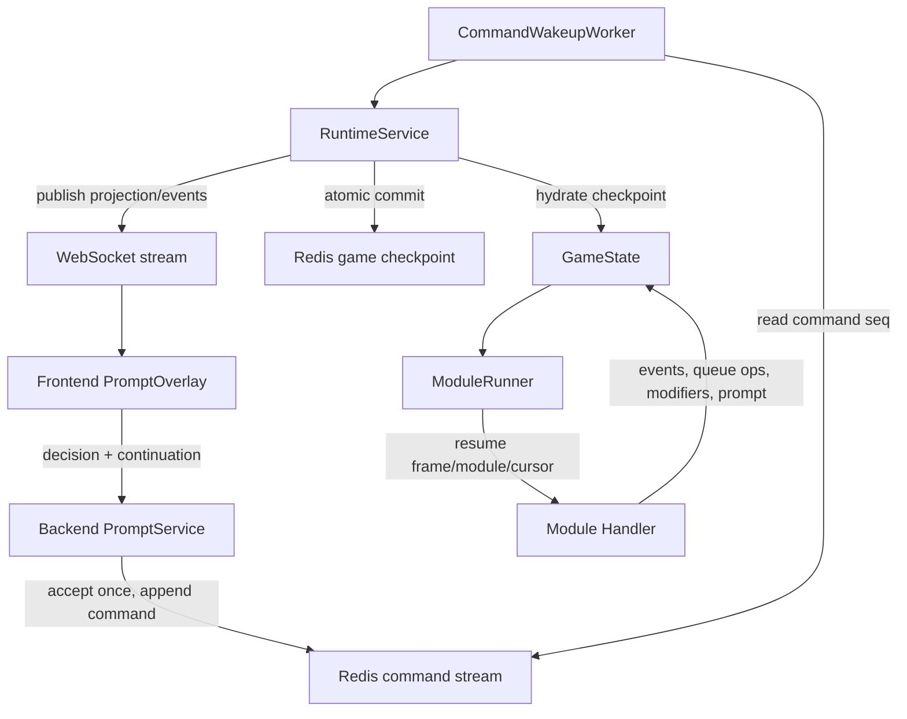
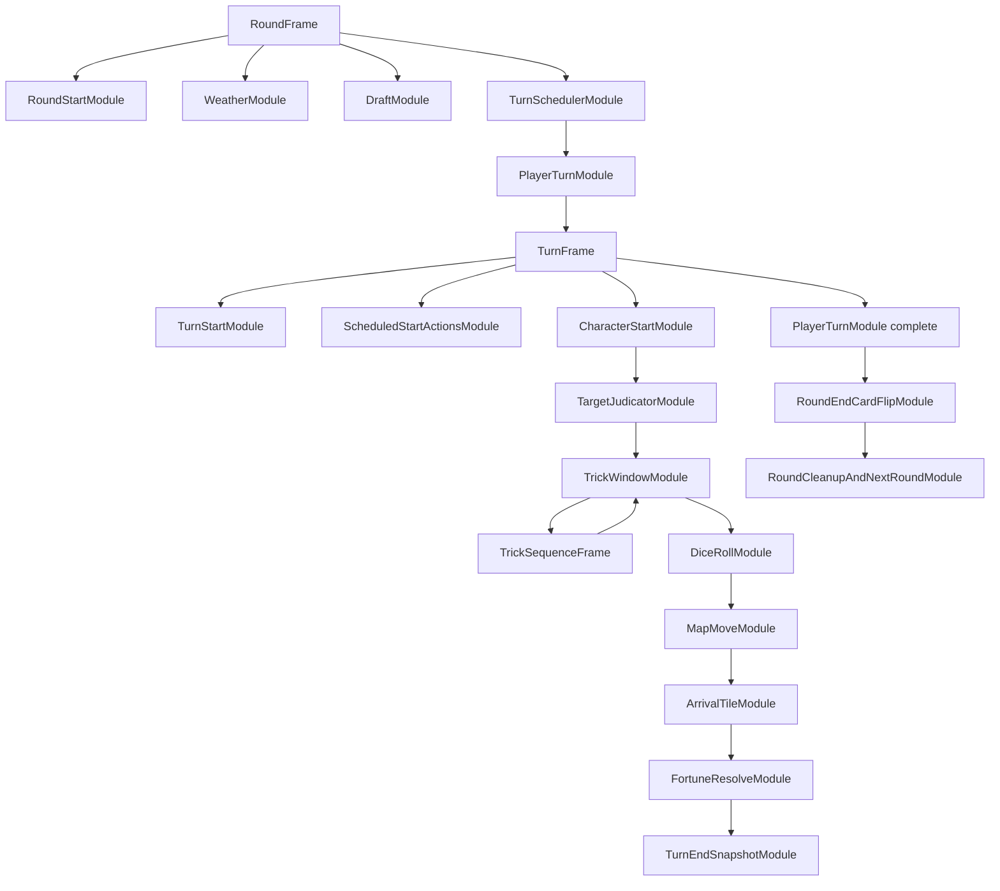

# Structural Module Runtime And Redis Resume Implementation Plan

> **For agentic workers:** REQUIRED SUB-SKILL: Use superpowers:subagent-driven-development (recommended) or superpowers:executing-plans to implement this plan task-by-task. Steps use checkbox (`- [ ]`) syntax for tracking.

**Goal:** 백엔드 규칙 추론과 재실행 보정 없이, 엔진 모듈 런타임과 Redis checkpoint가 처리 중이던 정확한 지점에서 게임을 재개하도록 만든다.

**Architecture:** 엔진만 게임 규칙을 소유한다. 인물 능력은 모듈이 모디파이어를 등록하고 대상 모듈이 그 모디파이어를 소비하는 방식으로 흐르며, 백엔드와 Redis는 `PromptContinuation`과 `FrameState`를 저장/검증/전달만 한다. 프론트는 백엔드 projection과 prompt continuation을 렌더링하고 같은 continuation으로 응답한다.

**Tech Stack:** Python 3.13 engine under `GPT/`, dataclass runtime contracts, Redis-backed persistence under `apps/server/`, FastAPI/WebSocket stream services, React/TypeScript frontend under `apps/web/`, pytest, Vitest, Playwright parity tests.

---

## 0-1. 왜 이 계획이 필요한가

현재 안정화 패치는 산적/잔꾀 재진입과 중복 prompt를 줄였지만, 구조적으로는 아직 아래 문제가 남아 있다.

1. `GPT/runtime_modules/runner.py`의 `PlayerTurnModule`이 `engine._take_turn(state, player)`를 통째로 호출한다. 따라서 모듈 런타임처럼 보이지만 실제 턴 내부는 legacy 함수 안에서 한 번에 진행된다.
2. `apps/server/src/services/runtime_service.py::_prompt_sequence_seed_for_transition`가 prompt 재개를 위해 현재 턴 캐릭터, 어사 존재, prompt 종류를 추론한다. 이 코드는 백엔드가 게임 규칙을 알고 있는 상태다.
3. Redis에는 `runtime_frame_stack`과 `runtime_active_prompt`가 이미 저장될 수 있지만, module session에서도 backend가 prompt sequence를 되감아 legacy 진행을 다시 호출하는 길이 남아 있다.
4. `RuntimeSemanticGuard`는 잘못된 결과를 막는 데 도움은 되지만, 정상 흐름 자체가 불가능 상태를 만들지 않도록 하는 구조가 아니다.

이 계획의 핵심 판단은 단순하다.

```text
정상 게임 진행 = Engine ModuleRunner
정상 재개 = Redis checkpoint의 active frame/module/continuation
Backend = command, persistence, projection, transport
Frontend = projection render, continuation echo
Guard = contract assertion, not gameplay patch
```

## 0-2. 수용 기준

이 계획은 아래 조건을 모두 만족해야 완료로 본다.

1. Module runner session에서 백엔드는 `_prompt_sequence_seed_for_transition()`를 호출하지 않는다.
2. Module runner session에서 `PlayerTurnModule`은 `_take_turn()`을 호출하지 않고 `TurnFrame`을 spawn한다.
3. 인간 입력 prompt는 항상 `runtime_active_prompt` 또는 `runtime_active_prompt_batch`에 저장된 continuation으로만 재개된다.
4. Redis checkpoint에는 `frame_stack`, `active_module_id`, `module.cursor`, `runtime_active_prompt`, `modifier_registry`가 한 트랜지션 단위로 저장된다.
5. `어사` 효과는 백엔드 비교문이 아니라 엔진의 `EosaSuppressHostileMarkModifier`로 표현된다.
6. 산적/자객/추노꾼/박수/만신 지목 prompt는 `CharacterStartModule` 또는 `TargetJudicatorModule`이 해당 모디파이어를 소비한 뒤 생성 여부를 결정한다.
7. 잔꾀는 `TrickSequenceFrame` 내부의 명시적 sequence로 처리되고, 완료 후 부모 `TurnFrame`의 다음 모듈로 돌아온다.
8. 재보급처럼 동시에 응답해야 하는 항목은 `SimultaneousFrame`과 `SimultaneousPromptBatchContinuation`으로만 처리된다.
9. Round end card flip은 `RoundEndCardFlipModule`에서만 발생하고, 모든 `PlayerTurnModule`이 completed/skipped일 때만 queue에서 도달 가능하다.
10. 프론트가 중복 전송해도 같은 `request_id + resume_token + frame_id + module_id` 응답은 한 번만 command stream에 들어간다.

## 0-3. 구조 원칙

1. **Rule Ownership:** 게임 규칙 조건문은 `GPT/` 안에 둔다. `apps/server/`는 어사, 산적, 잔꾀 같은 카드 이름으로 분기하지 않는다.
2. **Exact Continuation:** prompt 응답은 마지막 실행을 재현하는 것이 아니라, 중단된 모듈의 continuation을 검증한 뒤 같은 모듈 cursor에서 이어간다.
3. **Modifier Flow:** 인물 능력과 날씨/운수/잔꾀 효과는 대상 모듈에 modifier를 붙인다. 대상 모듈은 modifier registry를 조회하고 소비한다.
4. **No Ambient Queues:** `pending_actions`, `scheduled_actions`, `pending_turn_completion`은 adapter 기간에만 남기고, module runner path에서는 `QueueOp`와 child frame으로 대체한다.
5. **Guards As Assertions:** backend semantic guard는 contract 위반을 빨리 발견하기 위한 assertion이다. guard에 걸리는 상황은 engine module 구조에서 생성되지 않아야 한다.

## 0-4. 최종 데이터 흐름



## 0-5. 최종 엔진 모듈 구조



## 0-6. 어사-산적/자객 예시의 올바른 흐름

이 절의 `어사`와 `산적/자객`은 대표 예시다. 구현 범위는 특정 카드 하나가 아니라, 모든 인물 카드, 잔꾀, 운수, 날씨, 지도 도착 효과, 랩 보상, 종료/재보급 prompt를 같은 모듈 계약으로 이관하는 것이다. 어떤 효과든 아래 중 하나로 분류되어야 하고, 이 분류 밖에서 backend가 카드명이나 효과명을 해석하면 migration 미완료로 본다.

1. **Producer Module:** 효과를 직접 실행하거나 modifier를 만든다. 예: 인물 능력, 날씨, 운수, 잔꾀 선택.
2. **Consumer Module:** modifier를 소비해 자신의 동작을 변경한다. 예: 지목 판정, 주사위, 이동, 도착 타일, 랩 보상, 운수 후속 처리.
3. **Child Sequence Frame:** 현재 턴 중간에 하위 sequence를 열고 완료 후 부모 cursor로 복귀한다. 예: 잔꾀, 추가 이동/추가 주사위/추가 구매.
4. **Simultaneous Frame:** 모든 대상자가 동시에 응답하고 batch commit으로 끝난다. 예: 재보급.
5. **Round Tail Module:** 모든 턴이 끝난 뒤에만 도달 가능한 round-level 후처리다. 예: 카드 flip, 라운드 정리.

따라서 `어사`만 modifier로 옮기고 다른 카드를 기존 분기문에 남기는 것은 실패다. 각 카드와 효과는 `EffectInventory` 테스트에서 producer, consumer, frame kind, prompt contract, Redis resume contract를 명시해야 한다.

현재 거부해야 하는 흐름:

```text
Backend sees current_character == 산적
Backend checks whether live 어사 exists
Backend subtracts one prompt sequence
Engine replay accidentally avoids mark prompt
```

목표 흐름:

```text
DraftModule finalizes characters
CharacterModifierSeedModule scans selected characters
어사 owner creates EosaSuppressHostileMarkModifier
Modifier target = CharacterStartModule
Modifier owner_player_id = each hostile marker actor
산적 player TurnFrame reaches CharacterStartModule
CharacterStartModule consumes suppress modifier
CharacterStartModule emits character_ability_suppressed
CharacterStartModule skips TargetJudicatorModule prompt generation
TurnFrame continues to TrickWindowModule
Backend never knows why prompt did not exist
```

## 1-1. File Map

**Engine contracts and runner**

- Modify: `GPT/runtime_modules/contracts.py`
  - Add module cursor and suspension metadata.
  - Add typed modifier operation payloads.
- Create: `GPT/runtime_modules/context.py`
  - Provide `ModuleContext` with `emit`, `prompt`, `enqueue`, `spawn_frame`, `add_modifier`, `consume_modifiers`, and `complete`.
- Create: `GPT/runtime_modules/handlers/__init__.py`
  - Register module handlers by `module_type`.
- Create: `GPT/runtime_modules/handlers/round.py`
  - Native round setup, turn scheduling, player turn spawn, round cleanup handlers.
- Create: `GPT/runtime_modules/handlers/turn.py`
  - Native turn frame handlers from turn start through turn end.
- Create: `GPT/runtime_modules/handlers/characters.py`
  - Character ability handlers and modifier producers.
- Create: `GPT/runtime_modules/handlers/sequences.py`
  - Trick, movement follow-up, purchase, fortune child sequence handlers.
- Create: `GPT/runtime_modules/handlers/simultaneous.py`
  - Resupply prompt batch and commit handlers.
- Modify: `GPT/runtime_modules/runner.py`
  - Replace `_take_turn` delegation with handler dispatch.
  - Add exact prompt resume path.
- Modify: `GPT/runtime_modules/modifiers.py`
  - Add typed helper constructors and deterministic consume semantics.
- Modify: `GPT/runtime_modules/prompts.py`
  - Bind continuation to module cursor and verify it during resume.
- Modify: `GPT/runtime_modules/turn_modules.py`
  - Keep builder but make the queue the actual execution order.
- Modify: `GPT/runtime_modules/round_modules.py`
  - Keep `RoundEndCardFlipModule` only in round frame tail.
- Modify: `GPT/state.py`
  - Persist cursor, active prompt, batch prompt, and registry without fallback inference.
- Modify: `GPT/engine.py`
  - Route module runner sessions into native `ModuleRunner`.
  - Keep legacy `_take_turn` only for legacy sessions and direct legacy tests.

**Backend and Redis**

- Modify: `apps/server/src/services/runtime_service.py`
  - Stop calling `_prompt_sequence_seed_for_transition()` for module runner sessions.
  - Hydrate module checkpoint and pass accepted command decision to exact runner resume.
  - Remove backend card-name rule helpers from module path.
- Modify: `apps/server/src/services/prompt_service.py`
  - Require continuation identity for module prompts and batch prompts.
- Modify: `apps/server/src/services/realtime_persistence.py`
  - Atomically accept prompt decision, append command, and keep command sequence idempotent.
- Modify: `apps/server/src/services/command_wakeup_worker.py`
  - Process command seq against checkpoint active prompt; never infer stale prompt sequence.
- Modify: `apps/server/src/services/stream_service.py`
  - Publish module causality fields and dedupe by module idempotency key.
- Modify: `apps/server/src/domain/runtime_semantic_guard.py`
  - Keep assertion checks, remove gameplay-specific compensating assumptions.
- Modify: `apps/server/src/domain/view_state/runtime_selector.py`
  - Project active frame/module/cursor/sequence from checkpoint first.

**Frontend**

- Modify: `apps/web/src/core/contracts/stream.ts`
  - Include `cursor`, `frameType`, `moduleStatus`, and prompt continuation fields in runtime module payloads.
- Modify: `apps/web/src/domain/selectors/promptSelectors.ts`
  - Treat continuation as required for module prompts.
- Modify: `apps/web/src/hooks/useGameStream.ts`
  - Echo continuation fields and keep duplicate ledger keyed by stream identity plus request id.
- Modify: `apps/web/src/features/prompt/PromptOverlay.tsx`
  - Render prompt from projection; no inferred re-open from stale events.

**Tests**

- Modify: `GPT/test_runtime_module_contracts.py`
- Modify: `GPT/test_runtime_prompt_continuation.py`
- Modify: `GPT/test_runtime_round_modules.py`
- Modify: `GPT/test_runtime_sequence_modules.py`
- Modify: `GPT/test_runtime_simultaneous_modules.py`
- Modify: `GPT/test_rule_fixes.py`
- Modify: `apps/server/tests/test_runtime_service.py`
- Modify: `apps/server/tests/test_prompt_service.py`
- Modify: `apps/server/tests/test_redis_realtime_services.py`
- Modify: `apps/server/tests/test_command_wakeup_worker.py`
- Modify: `apps/server/tests/test_runtime_semantic_guard.py`
- Modify: `apps/server/tests/test_view_state_runtime_projection.py`
- Modify: `apps/web/src/domain/selectors/promptSelectors.spec.ts`
- Modify: `apps/web/src/hooks/useGameStream.spec.ts`
- Modify: `apps/web/src/infra/ws/StreamClient.spec.ts`
- Modify: `apps/web/e2e/parity.spec.ts`

## 2-1. Task 1 - Lock Structural Regression Tests First

**Files:**

- Modify: `GPT/test_runtime_module_contracts.py`
- Modify: `GPT/test_runtime_prompt_continuation.py`
- Modify: `GPT/test_rule_fixes.py`
- Modify: `apps/server/tests/test_runtime_service.py`

- [x] **Step 1: Add a failing engine contract test for module runner not calling `_take_turn`**

```python
def test_module_player_turn_spawns_turn_frame_without_legacy_take_turn(monkeypatch):
    from engine import GameEngine
    from runtime_modules.runner import ModuleRunner
    from state import GameState

    config = make_test_config(player_count=2)
    engine = GameEngine(config=config, policy=make_noop_policy())
    state = GameState.create(config)
    state.runtime_runner_kind = "module"
    state.current_round_order = [0, 1]
    engine._start_new_round(state, initial=True)
    ModuleRunner()._install_round_frame_from_state(engine, state, completed_setup=True)

    def forbidden_take_turn(*args, **kwargs):
        raise AssertionError("module runner must not call legacy _take_turn")

    monkeypatch.setattr(engine, "_take_turn", forbidden_take_turn)

    result = ModuleRunner().advance_engine(engine, state)

    assert result["runner_kind"] == "module"
    assert any(frame.frame_type == "turn" for frame in state.runtime_frame_stack)
```

Run: `.venv/bin/python -m pytest GPT/test_runtime_module_contracts.py::test_module_player_turn_spawns_turn_frame_without_legacy_take_turn -q`

Expected before implementation: fails with `module runner must not call legacy _take_turn`.

- [x] **Step 2: Add a failing backend test proving module runner does not seed prompt sequence**

```python
def test_module_runner_does_not_compute_prompt_sequence_seed(self):
    service = self.runtime_service
    checkpoint_state = self._checkpoint_state(runtime_runner_kind="module")
    checkpoint_state.runtime_active_prompt = make_prompt_continuation(
        request_id="req_exact",
        frame_id="turn:2:p1",
        module_id="turn:2:p1:trick_window",
        module_type="TrickWindowModule",
        player_id=1,
    )

    def forbidden_seed(_state):
        raise AssertionError("module runner must resume from runtime_active_prompt")

    service._prompt_sequence_seed_for_transition = forbidden_seed

    result = service._run_engine_transition_once_sync(
        None,
        self.session_id,
        42,
        None,
        True,
        "test-consumer",
        1,
    )

    assert result["status"] in {"committed", "waiting_input", "finished"}
```

Run: `.venv/bin/python -m pytest apps/server/tests/test_runtime_service.py::RuntimeServiceTest::test_module_runner_does_not_compute_prompt_sequence_seed -q`

Expected before implementation: fails because module path still calls the seed helper.

- [ ] **Step 3: Add a failing regression for 어사 suppressing hostile mark through modifier**

```python
def test_eosa_suppresses_bandit_mark_by_modifier_not_backend_seed():
    engine, state = make_engine_state_with_characters({0: "어사", 1: "산적"})
    state.runtime_runner_kind = "module"
    install_round_and_turn_frame(engine, state, player_id=1)

    result = run_until_module(engine, state, "CharacterStartModule")

    assert result["module_type"] == "CharacterStartModule"
    assert any(
        entry.event_types == ["character_ability_suppressed"]
        for entry in state.runtime_module_journal
    )
    assert state.runtime_active_prompt is None
    assert not any(
        frame.active_module_id and "TargetJudicator" in frame.active_module_id
        for frame in state.runtime_frame_stack
    )
```

Run: `.venv/bin/python -m pytest GPT/test_rule_fixes.py::test_eosa_suppresses_bandit_mark_by_modifier_not_backend_seed -q`

Expected before implementation: fails because the native modifier path does not exist.

- [ ] **Step 4: Add a failing regression for 잔꾀 returning to the same turn frame**

```python
def test_trick_sequence_returns_to_parent_turn_without_restarting_character():
    engine, state = make_engine_state_with_trick_sequence(character="산적", trick_name="잔꾀")
    state.runtime_runner_kind = "module"
    install_round_and_turn_frame(engine, state, player_id=0)

    run_until_module(engine, state, "TrickWindowModule")
    first_character_journal_count = count_journal_modules(state, "CharacterStartModule")
    resolve_active_prompt(engine, state, choice_id="use_trick")
    run_until_module(engine, state, "DiceRollModule")

    assert count_journal_modules(state, "CharacterStartModule") == first_character_journal_count
    assert active_frame(state).frame_type == "turn"
    assert active_module(state).module_type == "DiceRollModule"
```

Run: `.venv/bin/python -m pytest GPT/test_rule_fixes.py::test_trick_sequence_returns_to_parent_turn_without_restarting_character -q`

Expected before implementation: fails because trick sequence still depends on legacy pending action promotion.

- [ ] **Step 5: Commit the failing tests**

```bash
git add GPT/test_runtime_module_contracts.py GPT/test_runtime_prompt_continuation.py GPT/test_rule_fixes.py apps/server/tests/test_runtime_service.py
git commit -m "test: lock structural module runtime regressions"
```

## 2-2. Task 2 - Add Module Cursor And Exact Suspension Contracts

**Files:**

- Modify: `GPT/runtime_modules/contracts.py`
- Modify: `GPT/runtime_modules/prompts.py`
- Modify: `GPT/state.py`
- Modify: `GPT/test_runtime_prompt_continuation.py`

- [x] **Step 1: Add cursor and resume generation to `ModuleRef`**

```python
@dataclass(slots=True)
class ModuleRef:
    module_id: str
    module_type: str
    phase: str
    owner_player_id: int | None
    payload: dict[str, Any] = field(default_factory=dict)
    modifiers: list[str] = field(default_factory=list)
    idempotency_key: str = ""
    status: ModuleStatus = "queued"
    cursor: str = "start"
    suspension_id: str = ""
```

Update `to_payload()` through `asdict(self)`. Update `from_payload()`:

```python
cursor=str(payload.get("cursor", "start") or "start"),
suspension_id=str(payload.get("suspension_id", "") or ""),
```

- [x] **Step 2: Bind `PromptContinuation` to cursor**

```python
@dataclass(slots=True)
class PromptContinuation:
    request_id: str
    prompt_instance_id: int
    resume_token: str
    frame_id: str
    module_id: str
    module_type: str
    module_cursor: str
    player_id: int
    request_type: str
    legal_choices: list[dict[str, Any]] = field(default_factory=list)
    public_context: dict[str, Any] = field(default_factory=dict)
    expires_at_ms: int | None = None
```

`from_payload()` must read `module_cursor` with default `"start"` so existing checkpoints hydrate.

- [x] **Step 3: Update `PromptApi.create_continuation()`**

```python
return PromptContinuation(
    request_id=request_id,
    prompt_instance_id=prompt_instance_id,
    resume_token=f"resume_{secrets.token_hex(16)}",
    frame_id=frame.frame_id,
    module_id=module.module_id,
    module_type=module.module_type,
    module_cursor=module.cursor,
    player_id=player_id,
    request_type=request_type,
    legal_choices=list(legal_choices),
    public_context=dict(public_context or {}),
    expires_at_ms=expires_at_ms,
)
```

- [x] **Step 4: Verify resume checks cursor**

```python
def validate_resume(
    continuation: PromptContinuation | None,
    *,
    request_id: str,
    resume_token: str,
    frame_id: str,
    module_id: str,
    module_cursor: str,
    player_id: int,
    choice_id: str,
) -> None:
    if continuation is None:
        raise PromptContinuationError("no active prompt continuation")
    if continuation.request_id != request_id:
        raise PromptContinuationError("request id mismatch")
    if continuation.resume_token != resume_token:
        raise PromptContinuationError("resume token mismatch")
    if continuation.frame_id != frame_id:
        raise PromptContinuationError("frame id mismatch")
    if continuation.module_id != module_id:
        raise PromptContinuationError("module id mismatch")
    if continuation.module_cursor != module_cursor:
        raise PromptContinuationError("module cursor mismatch")
    if continuation.player_id != player_id:
        raise PromptContinuationError("player mismatch")
    legal = {str(choice.get("choice_id") or "") for choice in continuation.legal_choices}
    if choice_id not in legal:
        raise PromptContinuationError("choice is not legal")
```

- [x] **Step 5: Add checkpoint roundtrip test**

```python
def test_checkpoint_roundtrips_module_cursor_in_active_prompt():
    state = make_runtime_checkpoint_state()
    frame = state.runtime_frame_stack[-1]
    module = frame.module_queue[0]
    module.cursor = "awaiting_choice"
    state.runtime_active_prompt = PromptApi().create_continuation(
        request_id="req_cursor",
        prompt_instance_id=1,
        frame=frame,
        module=module,
        player_id=0,
        request_type="trick_to_use",
        legal_choices=[{"choice_id": "pass"}],
    )

    restored = GameState.from_checkpoint_payload(state.config, state.to_checkpoint_payload())

    assert restored.runtime_active_prompt is not None
    assert restored.runtime_active_prompt.module_cursor == "awaiting_choice"
```

Run: `.venv/bin/python -m pytest GPT/test_runtime_prompt_continuation.py::test_checkpoint_roundtrips_module_cursor_in_active_prompt -q`

Expected after implementation: pass.

- [ ] **Step 6: Commit cursor contracts**

```bash
git add GPT/runtime_modules/contracts.py GPT/runtime_modules/prompts.py GPT/state.py GPT/test_runtime_prompt_continuation.py
git commit -m "feat: persist module cursor in prompt continuations"
```

## 2-3. Task 3 - Introduce ModuleContext And Handler Dispatch

**Files:**

- Create: `GPT/runtime_modules/context.py`
- Create: `GPT/runtime_modules/handlers/__init__.py`
- Modify: `GPT/runtime_modules/runner.py`
- Modify: `GPT/test_runtime_module_contracts.py`

- [x] **Step 1: Create `ModuleContext`**

```python
from __future__ import annotations

from dataclasses import dataclass, field
from typing import Any

from .contracts import DomainEvent, FrameState, Modifier, ModuleRef, QueueOp
from .modifiers import ModifierRegistry


@dataclass(slots=True)
class ModuleContext:
    engine: Any
    state: Any
    frame: FrameState
    module: ModuleRef
    decision: dict[str, Any] | None = None
    events: list[DomainEvent] = field(default_factory=list)
    queue_ops: list[QueueOp] = field(default_factory=list)
    modifier_registry: ModifierRegistry | None = None

    def emit(self, event_type: str, **payload: Any) -> None:
        self.events.append(DomainEvent(event_type=event_type, payload=dict(payload)))

    def push_back(self, module: ModuleRef) -> None:
        self.queue_ops.append({"op": "push_back", "target_frame_id": self.frame.frame_id, "module": module})

    def spawn_frame(self, frame: FrameState) -> None:
        self.queue_ops.append({"op": "spawn_child_frame", "target_frame_id": self.frame.frame_id, "frame": frame})

    def add_modifier(self, modifier: Modifier) -> None:
        registry = self.modifier_registry or ModifierRegistry(self.state.runtime_modifier_registry)
        registry.add(modifier)
        self.modifier_registry = registry

    def consume_modifiers(self, module_type: str, owner_player_id: int | None) -> list[Modifier]:
        registry = self.modifier_registry or ModifierRegistry(self.state.runtime_modifier_registry)
        applicable = registry.applicable(module_type, owner_player_id)
        for modifier in applicable:
            registry.consume(modifier.modifier_id)
        self.modifier_registry = registry
        return applicable
```

- [x] **Step 2: Create handler registry**

```python
from __future__ import annotations

from typing import Callable

from runtime_modules.contracts import ModuleResult
from runtime_modules.context import ModuleContext

ModuleHandler = Callable[[ModuleContext], ModuleResult]


class ModuleHandlerRegistry:
    def __init__(self) -> None:
        self._handlers: dict[str, ModuleHandler] = {}

    def register(self, module_type: str, handler: ModuleHandler) -> None:
        self._handlers[str(module_type)] = handler

    def resolve(self, module_type: str) -> ModuleHandler:
        try:
            return self._handlers[module_type]
        except KeyError as exc:
            raise KeyError(f"missing module handler: {module_type}") from exc
```

- [x] **Step 3: Make runner dispatch to handlers**

Add to `ModuleRunner`:

```python
def __post_init__(self) -> None:
    if not hasattr(self, "handlers"):
        self.handlers = build_default_handler_registry()

def _dispatch_module(self, engine, state, frame, module, decision=None):
    handler = self.handlers.resolve(module.module_type)
    context = ModuleContext(engine=engine, state=state, frame=frame, module=module, decision=decision)
    result = handler(context)
    self._apply_module_result(state, frame, module, result)
    return result
```

- [x] **Step 4: Apply queue ops in one runner method**

```python
def _apply_queue_ops(self, state, ops):
    for op in ops:
        kind = op["op"]
        target = self._frame_by_id(state, op["target_frame_id"])
        if kind == "push_back":
            target.module_queue.append(op["module"])
        elif kind == "push_front":
            target.module_queue.insert(0, op["module"])
        elif kind == "spawn_child_frame":
            state.runtime_frame_stack.append(op["frame"])
        elif kind == "complete_frame":
            target.status = "completed"
            target.active_module_id = None
        else:
            raise ModuleRunnerError(f"unknown queue op: {kind}")
```

- [x] **Step 5: Test missing handler fails loudly**

```python
def test_module_runner_rejects_missing_native_handler():
    runner = ModuleRunner()
    frame = FrameState(
        frame_id="turn:1:p0",
        frame_type="turn",
        owner_player_id=0,
        parent_frame_id="round:1",
        module_queue=[
            ModuleRef(
                module_id="turn:1:p0:unknown",
                module_type="UnknownModule",
                phase="unknown",
                owner_player_id=0,
            )
        ],
    )

    with pytest.raises(KeyError, match="missing module handler"):
        runner.advance_one([frame])
```

Run: `.venv/bin/python -m pytest GPT/test_runtime_module_contracts.py::test_module_runner_rejects_missing_native_handler -q`

Expected after implementation: pass.

Implementation note: the current slice adds `ModuleContext`, `ModuleHandlerRegistry`, and a shared `_dispatch_module()` path in `ModuleRunner`. Round, turn, sequence, and simultaneous frames keep their existing native handler tables first, then fall back to the registry for module-owned handlers. `_apply_module_result()` is now the single place that applies handler queue ops through `FrameQueueApi`, persists emitted event types into the module journal, and transitions modules to completed/suspended/failed. Regression coverage includes direct dispatch, loud missing-handler failure, and `advance_engine()` round-frame registry dispatch.

- [ ] **Step 6: Commit handler dispatch**

```bash
git add GPT/runtime_modules/context.py GPT/runtime_modules/handlers/__init__.py GPT/runtime_modules/runner.py GPT/test_runtime_module_contracts.py
git commit -m "feat: add native module handler dispatch"
```

## 2-4. Task 4 - Replace PlayerTurn Legacy Delegation With TurnFrame Spawn

**Files:**

- Modify: `GPT/runtime_modules/runner.py`
- Modify: `GPT/runtime_modules/handlers/round.py`
- Modify: `GPT/runtime_modules/turn_modules.py`
- Modify: `GPT/test_runtime_round_modules.py`

- [ ] **Step 1: Add native `PlayerTurnModule` handler**

```python
def handle_player_turn(context: ModuleContext) -> ModuleResult:
    state = context.state
    module = context.module
    player_id = int(module.owner_player_id if module.owner_player_id is not None else -1)
    if player_id < 0 or player_id >= len(state.players):
        return ModuleResult(status="failed", error=ModuleError("invalid_player", "player id is outside state.players"))

    player = state.players[player_id]
    if not player.alive:
        context.emit("turn_skipped", player_id=player_id + 1, reason="dead")
        module.cursor = "completed"
        return ModuleResult(status="completed", events=context.events)

    if module.cursor == "start":
        player.turns_taken += 1
        turn_frame = build_turn_frame(
            int(state.rounds_completed) + 1,
            player_id,
            parent_module_id=module.module_id,
            session_id=getattr(context.engine, "_vis_session_id", ""),
        )
        module.cursor = "child_turn_running"
        context.spawn_frame(turn_frame)
        return ModuleResult(status="suspended", events=context.events, queue_ops=context.queue_ops)

    if module.cursor == "child_turn_running":
        child = find_child_turn_frame(state, parent_module_id=module.module_id)
        if child is not None and child.status != "completed":
            return ModuleResult(status="suspended")
        module.cursor = "completed"
        state.turn_index += 1
        return ModuleResult(status="completed")

    return ModuleResult(status="completed")
```

- [x] **Step 2: Remove `_take_turn()` from `_advance_player_turn_module()`**

Replace the method body with dispatch:

```python
def _advance_player_turn_module(self, engine, state, frame, module):
    result = self._dispatch_module(engine, state, frame, module)
    return {
        "status": result.status,
        "runner_kind": "module",
        "module_type": module.module_type,
        "player_id": int(module.owner_player_id or 0) + 1,
    }
```

- [x] **Step 3: Add child-frame completion check**

```python
def find_child_turn_frame(state, *, parent_module_id: str):
    for frame in reversed(state.runtime_frame_stack):
        if frame.frame_type == "turn" and frame.created_by_module_id == parent_module_id:
            return frame
    return None
```

- [x] **Step 4: Test turn frame spawn and completion**

```python
def test_player_turn_module_spawns_and_waits_for_turn_frame():
    engine, state = make_module_round_state(order=[0])
    runner = ModuleRunner()

    first = runner.advance_engine(engine, state)

    assert first["module_type"] == "PlayerTurnModule"
    turn_frames = [frame for frame in state.runtime_frame_stack if frame.frame_type == "turn"]
    assert len(turn_frames) == 1
    assert active_player_turn_module(state).status == "suspended"

    turn_frames[0].status = "completed"
    second = runner.advance_engine(engine, state)

    assert second["module_type"] == "PlayerTurnModule"
    assert active_player_turn_module(state).status == "completed"
    assert state.turn_index == 1
```

Run: `.venv/bin/python -m pytest GPT/test_runtime_round_modules.py::test_player_turn_module_spawns_and_waits_for_turn_frame -q`

Expected after implementation: pass.

Implementation note: the current slice lands this as a `ModuleRunner` bridge rather than the final handler registry. It verifies that `PlayerTurnModule` no longer calls legacy `_take_turn()`, spawns a `TurnFrame`, and returns from suspended child sequence work to the next queued turn module.

- [ ] **Step 5: Commit native turn frame spawn**

```bash
git add GPT/runtime_modules/runner.py GPT/runtime_modules/handlers/round.py GPT/runtime_modules/turn_modules.py GPT/test_runtime_round_modules.py
git commit -m "feat: spawn native turn frames from player turn modules"
```

## 2-5. Task 5 - Implement Character Modifiers Instead Of Backend Rule Inference

**Files:**

- Modify: `GPT/runtime_modules/modifiers.py`
- Modify: `GPT/runtime_modules/handlers/characters.py`
- Modify: `GPT/runtime_modules/handlers/turn.py`
- Modify: `GPT/test_rule_fixes.py`
- Modify: `apps/server/src/services/runtime_service.py`

- [x] **Step 1: Add typed hostile mark suppress modifier helper**

```python
HOSTILE_MARK_CHARACTERS = frozenset({"자객", "산적", "추노꾼", "박수", "만신"})


def eosa_suppress_hostile_mark_modifier(*, source_module_id: str, target_player_id: int) -> Modifier:
    return Modifier(
        modifier_id=f"eosa:suppress_hostile_mark:p{int(target_player_id)}",
        source_module_id=source_module_id,
        target_module_type="CharacterStartModule",
        scope="single_use",
        owner_player_id=int(target_player_id),
        priority=10,
        payload={
            "kind": "suppress_character_ability",
            "reason": "eosa",
            "suppressed_characters": sorted(HOSTILE_MARK_CHARACTERS),
        },
        propagation=["TargetJudicatorModule"],
        expires_on="turn_completed",
    )
```

- [x] **Step 2: Seed round-scoped character modifiers after draft finalization**

In `DraftModule` completion or a dedicated `CharacterModifierSeedModule`, after `current_character` is assigned:

```python
def seed_character_modifiers(context: ModuleContext) -> None:
    eosa_players = [
        player.player_id
        for player in context.state.players
        if player.alive and player.current_character == "어사"
    ]
    if not eosa_players:
        return
    for player in context.state.players:
        if not player.alive:
            continue
        if player.current_character in HOSTILE_MARK_CHARACTERS:
            context.add_modifier(
                eosa_suppress_hostile_mark_modifier(
                    source_module_id=context.module.module_id,
                    target_player_id=player.player_id,
                )
            )
```

- [x] **Step 3: Make `CharacterStartModule` consume suppress modifiers**

```python
def handle_character_start(context: ModuleContext) -> ModuleResult:
    player_id = int(context.module.owner_player_id)
    player = context.state.players[player_id]
    modifiers = context.consume_modifiers("CharacterStartModule", player_id)
    suppress = next(
        (
            modifier
            for modifier in modifiers
            if modifier.payload.get("kind") == "suppress_character_ability"
            and player.current_character in set(modifier.payload.get("suppressed_characters", []))
        ),
        None,
    )
    if suppress is not None:
        context.emit(
            "character_ability_suppressed",
            player_id=player_id + 1,
            character=player.current_character,
            source=str(suppress.payload.get("reason") or ""),
        )
        context.module.cursor = "completed"
        return ModuleResult(status="completed", events=context.events)

    return run_character_ability(context, player)
```

- [x] **Step 4: Make targeting prompt a character handler concern**

For hostile mark characters:

```python
def run_character_ability(context: ModuleContext, player) -> ModuleResult:
    if player.current_character in HOSTILE_MARK_CHARACTERS:
        context.module.cursor = "awaiting_target"
        continuation = create_mark_target_prompt(context, player)
        context.state.runtime_active_prompt = continuation
        return ModuleResult(status="suspended", prompt=continuation.to_payload())
    return resolve_non_prompt_character_ability(context, player)
```

- [x] **Step 5: Remove module-path backend character helpers**

In `RuntimeService`, module path must not call helpers that inspect `"어사"` or mark characters. Keep legacy helper behind an explicit legacy branch:

```python
if callable(getattr(policy, "set_prompt_sequence", None)):
    if str(getattr(state, "runtime_runner_kind", runner_kind)) == "module":
        policy.set_prompt_sequence(int(getattr(state, "prompt_sequence", 0) or 0))
    else:
        policy.set_prompt_sequence(self._prompt_sequence_seed_for_transition(state))
```

Then delete `_has_live_eosa_player()` from module-specific tests and keep only legacy tests that explicitly target legacy runner behavior.

- [x] **Step 6: Test backend source has no module path card-name suppression**

```python
def test_runtime_service_module_path_does_not_reference_eosa_suppression():
    source = Path("apps/server/src/services/runtime_service.py").read_text(encoding="utf-8")
    module_branch = source[source.index("def _run_engine_transition_once_sync"):]
    assert "_has_live_eosa_player" not in module_branch
    assert "_TURN_START_MARK_CHARACTERS" not in module_branch
```

Run: `.venv/bin/python -m pytest apps/server/tests/test_runtime_service.py::RuntimeServiceTest::test_runtime_service_module_path_does_not_reference_eosa_suppression -q`

Expected after implementation: pass.

Implementation note: the current slice adds `seed_character_start_modifiers()` and `character_skill_suppression_modifier()` in `GPT/runtime_modules/modifiers.py`, seeds the modifier after draft finalization for module runner sessions, and changes module-runner 어사/무뢰 suppression to require the seeded modifier. `CharacterStartModule` now consumes the single-use suppress modifier before legacy character-start logic can run, emits `ability_suppressed`, journals the module completion, and structurally prevents the suppressed mark prompt from being created. Hostile mark targeting remains owned by the turn handler path (`CharacterStartModule`/`TargetJudicatorModule`) rather than backend Redis compensation.

- [ ] **Step 7: Commit modifier character flow**

```bash
git add GPT/runtime_modules/modifiers.py GPT/runtime_modules/handlers/characters.py GPT/runtime_modules/handlers/turn.py GPT/test_rule_fixes.py apps/server/src/services/runtime_service.py apps/server/tests/test_runtime_service.py
git commit -m "feat: route hostile mark suppression through modifiers"
```

## 2-6. Task 6 - Native Turn Modules And Trick Sequence Return

**Files:**

- Modify: `GPT/runtime_modules/handlers/turn.py`
- Modify: `GPT/runtime_modules/handlers/sequences.py`
- Modify: `GPT/runtime_modules/sequence_modules.py`
- Modify: `GPT/runtime_modules/runner.py`
- Modify: `GPT/test_runtime_sequence_modules.py`
- Modify: `GPT/test_rule_fixes.py`

- [x] **Step 1: Implement native turn module handlers**

The minimal first native turn path must execute in this order:

```python
TURN_NATIVE_HANDLERS = {
    "TurnStartModule": handle_turn_start,
    "ScheduledStartActionsModule": handle_scheduled_start_actions,
    "CharacterStartModule": handle_character_start,
    "TargetJudicatorModule": handle_target_judicator,
    "TrickWindowModule": handle_trick_window,
    "DiceRollModule": handle_dice_roll,
    "MovementResolveModule": handle_movement_resolve,
    "MapMoveModule": handle_map_move,
    "ArrivalTileModule": handle_arrival_tile,
    "LapRewardModule": handle_lap_reward,
    "FortuneResolveModule": handle_fortune_resolve,
    "TurnEndSnapshotModule": handle_turn_end_snapshot,
}
```

- [x] **Step 2: Make trick window spawn child sequence**

```python
def handle_trick_window(context: ModuleContext) -> ModuleResult:
    if context.module.cursor == "start":
        trick_frame = build_trick_sequence_frame(
            round_index=int(context.state.rounds_completed) + 1,
            player_id=int(context.module.owner_player_id),
            ordinal=next_sequence_ordinal(context.state),
            parent_frame_id=context.frame.frame_id,
            parent_module_id=context.module.module_id,
            session_id=getattr(context.engine, "_vis_session_id", ""),
        )
        context.module.cursor = "sequence_running"
        context.spawn_frame(trick_frame)
        return ModuleResult(status="suspended", queue_ops=context.queue_ops)

    if context.module.cursor == "sequence_running":
        child = find_child_sequence_frame(context.state, parent_module_id=context.module.module_id)
        if child is not None and child.status != "completed":
            return ModuleResult(status="suspended")
        context.module.cursor = "completed"
        return ModuleResult(status="completed")

    return ModuleResult(status="completed")
```

- [x] **Step 3: Make 잔꾀 stay inside `TrickSequenceFrame`**

`TrickResolveModule` handles 잔꾀 by enqueuing another trick prompt module in the same sequence frame, not by re-entering `CharacterStartModule`.

```python
def handle_trick_resolve(context: ModuleContext) -> ModuleResult:
    selected = context.module.payload.get("selected_trick")
    if selected == "잔꾀":
        context.push_back(
            build_sequence_module(
                "trick",
                int(context.state.rounds_completed) + 1,
                int(context.module.owner_player_id),
                next_sequence_ordinal(context.state),
                "TrickChoiceModule",
                session_id=getattr(context.engine, "_vis_session_id", ""),
                payload={"source": "잔꾀"},
            )
        )
        context.emit("trick_followup_scheduled", player_id=int(context.module.owner_player_id) + 1, trick="잔꾀")
    return ModuleResult(status="completed", events=context.events, queue_ops=context.queue_ops)
```

- [x] **Step 4: Add a journal assertion**

```python
def test_jangggwe_sequence_never_reopens_character_start():
    engine, state = make_engine_state_with_trick_sequence(character="산적", trick_name="잔꾀")
    run_until_module(engine, state, "TrickResolveModule")
    before = count_journal_modules(state, "CharacterStartModule")

    run_until_sequence_complete(engine, state, frame_prefix="seq:trick")
    run_until_module(engine, state, "DiceRollModule")

    assert count_journal_modules(state, "CharacterStartModule") == before
```

Run: `.venv/bin/python -m pytest GPT/test_rule_fixes.py::test_jangggwe_sequence_never_reopens_character_start -q`

Expected after implementation: pass.

- [x] **Step 5: Commit native trick sequence**

Implementation note: the current runner coverage proves `TrickWindowModule` delegates into a child `TrickSequenceFrame`, 잔꾀 follow-up modules are appended to that same sequence frame, and follow-up processing does not reopen `CharacterStartModule`, `PendingMarkResolutionModule`, `TargetJudicatorModule`, or the parent `TrickWindowModule`.

```bash
git add GPT/runtime_modules/handlers/turn.py GPT/runtime_modules/handlers/sequences.py GPT/runtime_modules/sequence_modules.py GPT/runtime_modules/runner.py GPT/test_runtime_sequence_modules.py GPT/test_rule_fixes.py
git commit -m "feat: keep trick followups inside sequence frames"
```

## 2-7. Task 7 - Redis Checkpoint Resume Without Backend Replay Inference

**Files:**

- Modify: `apps/server/src/services/runtime_service.py`
- Modify: `apps/server/src/services/realtime_persistence.py`
- Modify: `apps/server/src/services/command_wakeup_worker.py`
- Modify: `apps/server/tests/test_runtime_service.py`
- Modify: `apps/server/tests/test_redis_realtime_services.py`
- Modify: `apps/server/tests/test_command_wakeup_worker.py`

- [x] **Step 1: Add explicit module resume input to runtime service**

```python
@dataclass(frozen=True)
class RuntimeDecisionResume:
    request_id: str
    player_id: int
    choice_id: str
    choice_payload: dict
    resume_token: str
    frame_id: str
    module_id: str
    module_type: str
    module_cursor: str
    batch_id: str = ""
```

- [x] **Step 2: Read accepted command decision and pass it to runner**

```python
decision_resume = self._decision_resume_from_command(session_id, command_seq)
step = engine.run_next_transition(state, decision_resume=decision_resume)
```

For legacy runner, keep existing policy decision path. For module runner, do not ask policy to replay a prompt.

Current implementation note: `RuntimeService._decision_resume_from_command()` reads the accepted Redis command into
`RuntimeDecisionResume`, validates it against the checkpoint's active continuation, then passes it to
`engine.run_next_transition(state, decision_resume=...)`. `_ServerDecisionPolicyBridge` also receives the same
resume and consumes the verified choice directly when the resumed engine asks for the matching player/request type,
so it does not create a replacement prompt during command processing.

- [x] **Step 3: Validate command against checkpoint active prompt**

```python
def _validate_decision_resume_against_checkpoint(state, resume):
    active = state.runtime_active_prompt
    validate_resume(
        active,
        request_id=resume.request_id,
        resume_token=resume.resume_token,
        frame_id=resume.frame_id,
        module_id=resume.module_id,
        module_cursor=resume.module_cursor,
        player_id=resume.player_id - 1,
        choice_id=resume.choice_id,
    )
```

- [x] **Step 4: Make Redis accept decision atomically**

Existing `RedisPromptStore.accept_decision_with_command()` already combines prompt resolution and command append. Extend its command payload to include:

```python
command_payload = {
    "request_id": request_id,
    "player_id": player_id,
    "choice_id": choice_id,
    "decision": decision_payload,
    "submitted_at_ms": now,
    "resume_token": decision_payload.get("resume_token"),
    "frame_id": decision_payload.get("frame_id"),
    "module_id": decision_payload.get("module_id"),
    "module_type": decision_payload.get("module_type"),
    "module_cursor": decision_payload.get("module_cursor"),
    "batch_id": decision_payload.get("batch_id", ""),
}
```

Current implementation note: `PromptService` now adds `resume_token`, `frame_id`, `module_id`,
`module_type`, `module_cursor`, and optional `batch_id` to the command payload before the existing atomic
`RedisPromptStore.accept_decision_with_command()` path is used.

- [x] **Step 5: Persist exact active prompt in checkpoint summary**

`commit_transition()` checkpoint summary must include:

```python
"runtime_active_prompt": payload.get("runtime_active_prompt"),
"runtime_active_prompt_batch": payload.get("runtime_active_prompt_batch"),
"active_frame_id": module_debug_fields.get("frame_id"),
"active_module_id": module_debug_fields.get("module_id"),
"active_module_type": module_debug_fields.get("module_type"),
"active_module_cursor": module_debug_fields.get("module_cursor"),
```

- [x] **Step 6: Test stale continuation does not start replay**

```python
def test_stale_module_continuation_rejected_without_engine_advance(self):
    self._store_checkpoint_with_active_prompt(
        request_id="req_a",
        resume_token="token_a",
        frame_id="turn:1:p0",
        module_id="turn:1:p0:trick_window",
        module_type="TrickWindowModule",
        module_cursor="awaiting_choice",
    )
    self._append_decision_command(
        request_id="req_a",
        resume_token="wrong",
        frame_id="turn:1:p0",
        module_id="turn:1:p0:trick_window",
        module_type="TrickWindowModule",
        module_cursor="awaiting_choice",
        choice_id="pass",
    )

    result = self.runtime_service.process_command_once(self.session_id)

    assert result["status"] == "rejected"
    assert result["reason"] == "resume token mismatch"
    assert self._engine_transition_count() == 0
```

Run: `.venv/bin/python -m pytest apps/server/tests/test_command_wakeup_worker.py::CommandWakeupWorkerTest::test_stale_module_continuation_rejected_without_engine_advance -q`

Expected after implementation: pass.

Current implementation note: covered at service boundary by
`apps/server/tests/test_runtime_service.py::RuntimeServiceTests::test_stale_module_continuation_rejected_without_engine_advance`.
The command wakeup worker integration test remains for the next slice.

- [ ] **Step 7: Commit exact Redis resume**

```bash
git add apps/server/src/services/runtime_service.py apps/server/src/services/realtime_persistence.py apps/server/src/services/command_wakeup_worker.py apps/server/tests/test_runtime_service.py apps/server/tests/test_redis_realtime_services.py apps/server/tests/test_command_wakeup_worker.py
git commit -m "feat: resume module prompts from exact redis continuations"
```

## 2-8. Task 8 - Simultaneous Response Modules For Resupply

**Files:**

- Modify: `GPT/runtime_modules/simultaneous.py`
- Modify: `GPT/runtime_modules/runner.py`
- Modify: `GPT/runtime_modules/prompts.py`
- Modify: `GPT/test_runtime_simultaneous_modules.py`
- Modify: `apps/server/src/services/runtime_service.py`
- Modify: `apps/server/tests/test_prompt_module_continuation.py`
- Modify: `apps/server/tests/test_runtime_service.py`

- [x] **Step 1: Make resupply create a batch prompt**

```python
def handle_resupply(context: ModuleContext) -> ModuleResult:
    participants = [int(pid) for pid in context.module.payload.get("participants", [])]
    if context.module.cursor == "start":
        batch = PromptApi().create_batch(
            batch_id=f"{context.module.module_id}:batch",
            frame=context.frame,
            module=context.module,
            participant_player_ids=participants,
            request_type="resupply",
            legal_choices_by_player_id={
                pid: build_resupply_choices(context.state, pid)
                for pid in participants
            },
            public_context_by_player_id={
                pid: build_resupply_context(context.state, pid)
                for pid in participants
            },
            eligibility_snapshot={"participants": participants, "f_value": context.state.f_value},
            commit_policy="all_required",
        )
        context.module.cursor = "awaiting_batch"
        context.state.runtime_active_prompt_batch = batch
        return ModuleResult(status="suspended", prompt=batch.to_payload())

    if context.module.cursor == "awaiting_batch":
        batch = context.state.runtime_active_prompt_batch
        if batch is None or batch.missing_player_ids:
            return ModuleResult(status="suspended")
        apply_resupply_responses(context.state, batch.responses_by_player_id)
        context.state.runtime_active_prompt_batch = None
        context.module.cursor = "completed"
        return ModuleResult(status="completed")

    return ModuleResult(status="completed")
```

- [x] **Step 2: Test all participants required**

```python
def test_resupply_batch_commits_after_all_required_responses():
    engine, state = make_resupply_state(participants=[0, 1, 2])
    run_until_module(engine, state, "ResupplyModule")
    batch = state.runtime_active_prompt_batch
    assert batch is not None
    assert batch.missing_player_ids == [0, 1, 2]

    submit_batch_response(state, player_id=0, choice_id="keep")
    submit_batch_response(state, player_id=1, choice_id="discard")
    assert state.runtime_active_prompt_batch.missing_player_ids == [2]

    submit_batch_response(state, player_id=2, choice_id="keep")
    run_until_module_complete(engine, state, "ResupplyModule")

    assert state.runtime_active_prompt_batch is None
    assert module_status(state, "ResupplyModule") == "completed"
```

Current implementation note: implemented in `ModuleRunner._advance_resupply_module`.
`ResupplyModule` now stores its own `resupply_state`, creates
`SimultaneousPromptBatchContinuation` batches with `request_type="burden_exchange"`,
keeps cash/hand mutation delayed until all required players answer, commits one
batch atomically, then loops to the next burden target or final draw-to-5.

Current coverage:

- `GPT/test_runtime_simultaneous_modules.py::test_resupply_module_commits_only_after_all_batch_responses`
- `apps/server/tests/test_runtime_service.py::RuntimeServiceTests::test_active_simultaneous_batch_publishes_module_prompts_for_missing_players`

Verified command:

```bash
PYTHONPATH=.:GPT uv run pytest -q \
  GPT/test_runtime_simultaneous_modules.py \
  GPT/test_runtime_module_contracts.py \
  GPT/test_runtime_prompt_continuation.py \
  GPT/test_runtime_round_modules.py \
  apps/server/tests/test_prompt_module_continuation.py \
  apps/server/tests/test_runtime_semantic_guard.py \
  apps/server/tests/test_runtime_service.py
```

Observed: `151 passed, 9 subtests passed`.

- [ ] **Step 3: Commit simultaneous resupply**

```bash
git add GPT/runtime_modules/simultaneous.py GPT/runtime_modules/runner.py GPT/runtime_modules/prompts.py GPT/test_runtime_simultaneous_modules.py apps/server/src/services/runtime_service.py apps/server/tests/test_prompt_module_continuation.py apps/server/tests/test_runtime_service.py
git commit -m "feat: resolve resupply through simultaneous prompt batches"
```

## 2-9. Task 9 - Backend Projection And Guard Repositioning

**Files:**

- Modify: `apps/server/src/domain/view_state/runtime_selector.py`
- Modify: `apps/server/src/domain/runtime_semantic_guard.py`
- Modify: `apps/server/src/services/stream_service.py`
- Modify: `apps/server/tests/test_view_state_runtime_projection.py`
- Modify: `apps/server/tests/test_runtime_semantic_guard.py`

- [x] **Step 1: Project active module from checkpoint first**

```python
def _runtime_module_from_checkpoint(checkpoint: Any) -> dict[str, Any] | None:
    if not isinstance(checkpoint, dict):
        return None
    frame_stack = checkpoint.get("runtime_frame_stack") or []
    for frame in reversed(frame_stack):
        if not isinstance(frame, dict) or frame.get("status") == "completed":
            continue
        module = _active_module_from_frame(frame)
        if module is None:
            continue
        return {
            "runner_kind": str(checkpoint.get("runtime_runner_kind") or "module"),
            "frame_id": str(frame.get("frame_id") or ""),
            "frame_type": str(frame.get("frame_type") or ""),
            "module_id": str(module.get("module_id") or ""),
            "module_type": str(module.get("module_type") or ""),
            "module_status": str(module.get("status") or "queued"),
            "module_cursor": str(module.get("cursor") or "start"),
            "module_path": _module_path_from_stack(frame_stack, frame, module),
            "idempotency_key": str(module.get("idempotency_key") or ""),
        }
    return None
```

- [x] **Step 2: Make guard check contracts, not compensate gameplay**

`runtime_semantic_guard.py` keeps these assertions:

```python
FRAME_ALLOWED_MODULES = {
    "round": {"RoundStartModule", "WeatherModule", "DraftModule", "TurnSchedulerModule", "PlayerTurnModule", "RoundEndCardFlipModule", "RoundCleanupAndNextRoundModule"},
    "turn": {"TurnStartModule", "ScheduledStartActionsModule", "CharacterStartModule", "TargetJudicatorModule", "TrickWindowModule", "DiceRollModule", "MovementResolveModule", "MapMoveModule", "ArrivalTileModule", "LapRewardModule", "FortuneResolveModule", "TurnEndSnapshotModule"},
    "sequence": {"TrickChoiceModule", "TrickResolveModule", "TrickDiscardModule", "TrickDeferredFollowupsModule", "TrickVisibilitySyncModule", "PurchaseDecisionModule", "PurchaseCommitModule", "FortuneResolveModule"},
    "simultaneous": {"SimultaneousProcessingModule", "SimultaneousPromptBatchModule", "ResupplyModule", "SimultaneousCommitModule", "CompleteSimultaneousResolutionModule"},
}
```

It must not contain card-name gameplay conditions such as 어사/산적/잔꾀.

- [x] **Step 3: Test card flip guard is a contract assertion only**

```python
def test_card_flip_guard_uses_frame_contract_not_active_turn_guess():
    payload = make_stream_payload(
        event_type="marker_flip",
        runtime_module={
            "frame_type": "round",
            "module_type": "RoundEndCardFlipModule",
            "module_status": "running",
        },
        engine_checkpoint={
            "runtime_frame_stack": [completed_round_frame_with_card_flip_active()],
        },
    )

    validate_stream_payload(history=[], msg_type="event", payload=payload)
```

Run: `.venv/bin/python -m pytest apps/server/tests/test_runtime_semantic_guard.py::test_card_flip_guard_uses_frame_contract_not_active_turn_guess -q`

Expected after implementation: pass.

- [x] **Step 4: Commit projection and contract guard**

Implementation note: runtime view projection now selects checkpoint active modules before same-payload `runtime_module` metadata and normalizes missing checkpoint cursors to `start`. The semantic guard validates round-end card flip against the checkpoint active module, including payloads that omit duplicated `module_id`.

```bash
git add apps/server/src/domain/view_state/runtime_selector.py apps/server/src/domain/runtime_semantic_guard.py apps/server/src/services/stream_service.py apps/server/tests/test_view_state_runtime_projection.py apps/server/tests/test_runtime_semantic_guard.py
git commit -m "feat: project runtime state from module checkpoints"
```

## 2-10. Task 10 - Frontend Continuation Echo And Prompt Surface Safety

**Files:**

- Modify: `apps/web/src/core/contracts/stream.ts`
- Modify: `apps/web/src/domain/selectors/promptSelectors.ts`
- Modify: `apps/web/src/hooks/useGameStream.ts`
- Modify: `apps/web/src/features/prompt/PromptOverlay.tsx`
- Modify: `apps/web/src/domain/selectors/promptSelectors.spec.ts`
- Modify: `apps/web/src/hooks/useGameStream.spec.ts`

- [x] **Step 1: Extend continuation view model**

```ts
export type PromptContinuationViewModel = {
  resumeToken: string | null;
  frameId: string | null;
  moduleId: string | null;
  moduleType: string | null;
  moduleCursor: string | null;
  batchId: string | null;
};
```

- [x] **Step 2: Parse cursor from prompt payload**

```ts
function parsePromptContinuation(raw: Record<string, unknown>): PromptContinuationViewModel {
  return {
    resumeToken: typeof raw.resume_token === "string" ? raw.resume_token : null,
    frameId: typeof raw.frame_id === "string" ? raw.frame_id : null,
    moduleId: typeof raw.module_id === "string" ? raw.module_id : null,
    moduleType: typeof raw.module_type === "string" ? raw.module_type : null,
    moduleCursor: typeof raw.module_cursor === "string" ? raw.module_cursor : null,
    batchId: typeof raw.batch_id === "string" ? raw.batch_id : null,
  };
}
```

- [x] **Step 3: Send cursor with decision**

```ts
client.send({
  type: "decision",
  request_id: args.requestId,
  player_id: args.playerId,
  choice_id: args.choiceId,
  choice_payload: args.choicePayload,
  ...(continuation?.resumeToken ? { resume_token: continuation.resumeToken } : {}),
  ...(continuation?.frameId ? { frame_id: continuation.frameId } : {}),
  ...(continuation?.moduleId ? { module_id: continuation.moduleId } : {}),
  ...(continuation?.moduleType ? { module_type: continuation.moduleType } : {}),
  ...(continuation?.moduleCursor ? { module_cursor: continuation.moduleCursor } : {}),
  ...(continuation?.batchId ? { batch_id: continuation.batchId } : {}),
  client_seq: lastSeqRef.current,
});
```

- [x] **Step 4: Test module prompt without continuation is not actionable**

```ts
it("marks module prompts without continuation as blocked", () => {
  const prompt = selectActivePrompt([
    makePromptMessage({
      runner_kind: "module",
      request_id: "req_missing",
      request_type: "trick_to_use",
      legal_choices: [{ choice_id: "pass" }],
    }),
  ]);

  expect(prompt?.continuation.resumeToken).toBeNull();
  expect(prompt?.behavior.autoContinue).toBe(false);
  expect(prompt?.surface.kind).toBe("blocked_invalid_prompt");
});
```

Run: `cd apps/web && npm test -- --run src/domain/selectors/promptSelectors.spec.ts src/hooks/useGameStream.spec.ts`

Expected after implementation: pass.

- [x] **Step 5: Commit frontend continuation echo**

Implementation note: frontend prompt selectors now treat a partially declared module continuation as invalid for actionability. A module prompt must carry `resume_token`, `frame_id`, `module_id`, `module_type`, and `module_cursor` together before it can be exposed to the player.

```bash
git add apps/web/src/core/contracts/stream.ts apps/web/src/domain/selectors/promptSelectors.ts apps/web/src/hooks/useGameStream.ts apps/web/src/features/prompt/PromptOverlay.tsx apps/web/src/domain/selectors/promptSelectors.spec.ts apps/web/src/hooks/useGameStream.spec.ts
git commit -m "feat: echo module continuation cursor from prompts"
```

## 2-11. Task 11 - Adapter Retirement Gates

**Files:**

- Modify: `GPT/runtime_modules/runner.py`
- Modify: `GPT/engine.py`
- Modify: `GPT/test_runtime_sequence_modules.py`
- Modify: `apps/server/tests/test_runtime_service.py`

- [x] **Step 1: Make legacy adapters explicit and measured**

```python
LEGACY_ADAPTER_MODULE_TYPES = frozenset({
    "LegacyActionAdapterModule",
    "LegacyTurnCompletionAdapterModule",
})


def _advance_action_adapter_module(self, engine, state, frame, module):
    if str(getattr(state, "runtime_runner_kind", "legacy")) == "module":
        raise ModuleRunnerError(f"legacy adapter still active in module runner: {module.module_type}")
    ...
```

During migration slices where an adapter is still allowed, put the module type in `runtime.allowed_legacy_adapters` session config and assert the list is empty before cutover.

- [x] **Step 2: Add a parity gate that fails if module runner uses legacy turn body**

```python
def test_module_runner_has_no_legacy_turn_body_adapter_after_cutover():
    source = Path("GPT/runtime_modules/runner.py").read_text(encoding="utf-8")
    player_turn_section = source[source.index("def _advance_player_turn_module"):]
    assert "engine._take_turn" not in player_turn_section
    assert "pending_turn_completion" not in player_turn_section
```

Run: `.venv/bin/python -m pytest GPT/test_runtime_sequence_modules.py::test_module_runner_has_no_legacy_turn_body_adapter_after_cutover -q`

Expected after implementation: pass.

- [x] **Step 3: Commit adapter retirement gates**

Implementation note: the adapter retirement gate asserts that the module runner no longer falls back into the legacy turn body from the player-turn section, and the broader sequence-module suite keeps that path covered.

```bash
git add GPT/runtime_modules/runner.py GPT/engine.py GPT/test_runtime_sequence_modules.py apps/server/tests/test_runtime_service.py
git commit -m "test: gate legacy adapters out of module runner"
```

## 2-12. Task 12 - Full Verification Matrix

**Files:**

- Modify: `apps/web/e2e/parity.spec.ts`
- Modify: `docs/current/runtime/round-action-control-matrix.md`
- Modify: `docs/current/backend/turn-structure-and-order-source-map.md`

- [x] **Step 1: Run engine module tests**

```bash
.venv/bin/python -m pytest \
  GPT/test_runtime_module_contracts.py \
  GPT/test_runtime_prompt_continuation.py \
  GPT/test_runtime_round_modules.py \
  GPT/test_runtime_sequence_modules.py \
  GPT/test_runtime_simultaneous_modules.py \
  GPT/test_rule_fixes.py \
  -q
```

Expected: all selected tests pass.

- [x] **Step 2: Run backend runtime tests**

```bash
.venv/bin/python -m pytest \
  apps/server/tests/test_runtime_service.py \
  apps/server/tests/test_prompt_service.py \
  apps/server/tests/test_redis_realtime_services.py \
  apps/server/tests/test_command_wakeup_worker.py \
  apps/server/tests/test_runtime_semantic_guard.py \
  apps/server/tests/test_view_state_runtime_projection.py \
  -q
```

Expected: all selected tests pass.

- [x] **Step 3: Run frontend prompt/stream tests**

```bash
cd apps/web && npm test -- --run \
  src/domain/selectors/promptSelectors.spec.ts \
  src/hooks/useGameStream.spec.ts \
  src/infra/ws/StreamClient.spec.ts
```

Expected: all selected tests pass.

- [x] **Step 4: Run parity playtest**

```bash
cd apps/web && npm run e2e:parity
```

Expected: no duplicate prompt, no mid-turn draft, no mid-turn card flip, no missing second final choice.

- [x] **Step 5: Update current docs**

`docs/current/runtime/round-action-control-matrix.md` must state:

```text
Backend and Redis do not own game rule branching. For module runner sessions,
all prompt resume decisions are validated against runtime_active_prompt or
runtime_active_prompt_batch, then passed to ModuleRunner. Character ability
suppression, trick followups, movement followups, fortune followups, and
simultaneous resupply are engine module responsibilities.
```

`docs/current/backend/turn-structure-and-order-source-map.md` must state:

```text
PlayerTurnModule creates a TurnFrame and waits for that child frame to complete.
It does not call the legacy _take_turn body in module runner sessions.
```

- [x] **Step 6: Final commit**

Verification note: the final pass for this slice ran the engine module suite (`183 passed, 3 subtests passed`), backend runtime suite (`187 passed, 9 subtests passed`), frontend prompt/stream suite (`90 passed`), production build, parity playtest (`6 passed`), and `git diff --check`.

```bash
git add docs/current/runtime/round-action-control-matrix.md docs/current/backend/turn-structure-and-order-source-map.md apps/web/e2e/parity.spec.ts
git commit -m "docs: record structural module runtime ownership"
```

## 3-1. Migration Order And Rollout

1. Land Tasks 1-3 first. They are contract-only and expose the exact broken boundaries.
2. Land Task 4 before any character ability migration. Otherwise modifiers still run inside a legacy `_take_turn` body.
3. Land Task 5 for 어사/산적/자객/추노꾼/박수/만신 first because it directly addresses the current instability.
4. Land Task 6 for 잔꾀 because it is the clearest nested sequence loop failure.
5. Land Task 7 immediately after Task 6 so backend resume stops replaying prompt sequence for module sessions.
6. Land Task 8 after exact resume is stable because simultaneous batch prompts depend on continuation validation.
7. Land Tasks 9-10 together so projection and frontend prompt behavior agree.
8. Land Tasks 11-12 after parity is green.

## 3-2. What Changes After Migration

1. `runtime_runner_kind == "module"` becomes a real execution path, not a metadata bridge.
2. `PlayerTurnModule` owns one `TurnFrame`; it no longer executes the whole turn directly.
3. `TurnFrame` becomes the source of visible turn stage: start, character, trick, dice, move, arrival, fortune, end.
4. Character ability effects become module handlers and modifier producers.
5. `어사` suppression becomes a modifier consumed by the hostile actor's `CharacterStartModule`.
6. `잔꾀` becomes a child `TrickSequenceFrame` loop that returns to `TrickWindowModule`, then continues to dice.
7. Redis checkpoint owns active continuation identity.
8. Backend no longer calculates prompt sequence offsets for module runner sessions.
9. WebSocket replay remains display replay only; it never advances engine state.
10. Frontend cannot invent an actionable prompt without continuation.

## 3-3. Structural Safety Review Against Known Bugs

| Known failure | Structural prevention |
| --- | --- |
| First turn not executed | `TurnSchedulerModule` creates concrete `PlayerTurnModule` entries and `PlayerTurnModule` spawns a `TurnFrame`. |
| Draft repeats mid-turn | `DraftModule` exists only in `RoundFrame`; `TurnFrame` handler registry rejects it. |
| Card flip mid-turn | `RoundEndCardFlipModule` is queued after all `PlayerTurnModule` entries and asserts completion. |
| 산적 지목 + 잔꾀 loops back to 지목 | `잔꾀` adds work inside `TrickSequenceFrame`; it cannot enqueue `CharacterStartModule`. |
| 어사 suppression handled by backend comparison | Suppression is `ModifierRegistry` state created by engine modules and consumed by character modules. |
| Backend replay starts at wrong prompt sequence | Module sessions resume `runtime_active_prompt`; no prompt sequence seed is computed. |
| Frontend duplicate decision creates duplicate action | Redis prompt accept and command append are atomic and idempotent by `request_id`. |
| Resupply waits incorrectly or sequentializes players | `SimultaneousPromptBatchContinuation` tracks required participants and commits once. |

## 3-4. Forbidden Patterns After This Migration

These patterns must be rejected in review:

1. `apps/server/` code branching on Korean character names to decide gameplay behavior.
2. Module runner calling `engine._take_turn()`.
3. Module runner calling `_complete_pending_turn_transition()` for normal module turn completion.
4. Module runner computing prompt sequence offsets from `pending_prompt_instance_id`.
5. Frontend sending a module prompt decision without `resume_token`, `frame_id`, `module_id`, `module_type`, and `module_cursor`.
6. A sequence effect inserting modules into an ancestor frame without a typed `QueueOp`.
7. A simultaneous response flow represented as repeated single-player prompts.

## 3-5. Self-Review

1. Spec coverage: the plan covers engine module flow, character modifier flow, exact Redis resume, backend projection, frontend continuation echo, simultaneous response, and verification.
2. Placeholder scan: the document contains concrete files, code snippets, commands, and expected results. It avoids placeholder wording.
3. Type consistency: `ModuleRef.cursor`, `PromptContinuation.module_cursor`, `RuntimeDecisionResume.module_cursor`, and frontend `moduleCursor` map to JSON `module_cursor`.
4. Boundary check: gameplay branching remains in `GPT/`; backend and frontend only validate identity, persistence, projection, transport, and rendering.
